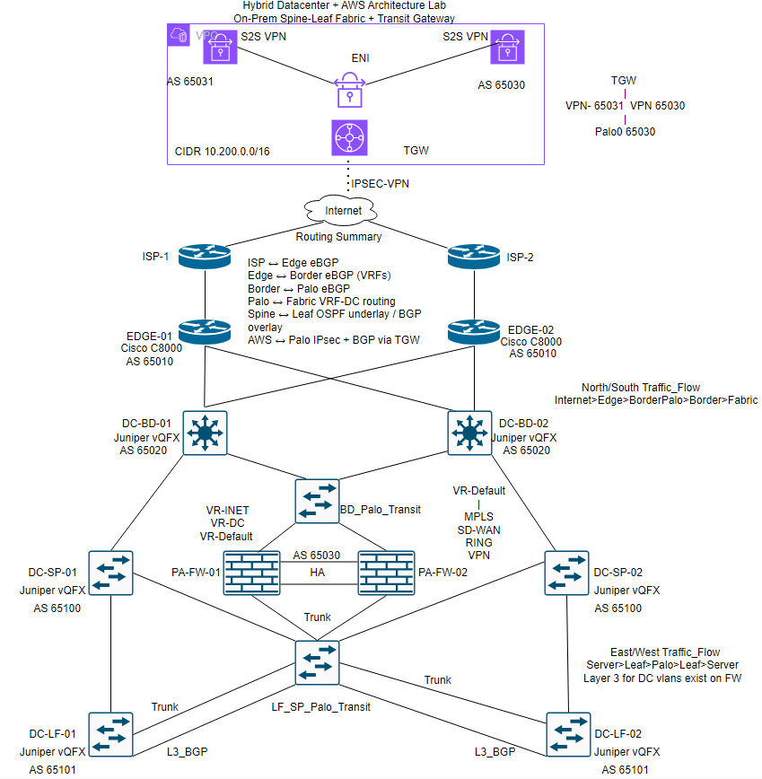

# Hybrid Datacenter + AWS Architecture

This directory documents the high-level architecture for a hybrid
datacenter lab environment connected to AWS using Transit Gateway,
IPsec VPN, and BGP.

## High Level Architecture

The diagram below shows the full hybrid connectivity between the on-prem datacenter and AWS.

## Overview

The environment simulates an enterprise hybrid datacenter including:

- Dual ISP internet edge
- Cisco C8000 edge routers
- Juniper vQFX border and spine/leaf fabric
- Palo Alto firewalls in HA providing L3 gateway and security policy
- AWS VPC connectivity through Transit Gateway using IPsec and BGP

Traffic patterns:

North/South  
Internet → Edge → Border → Palo → Border → Fabric

East/West  
Server → Leaf → Palo → Leaf → Server
