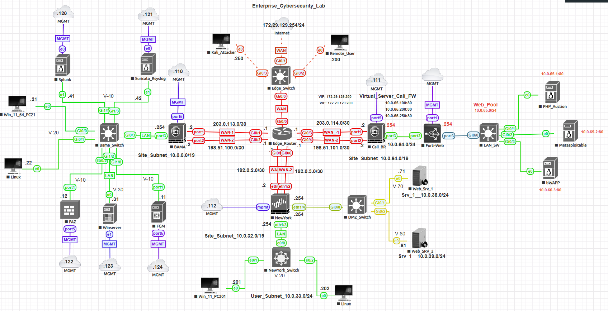
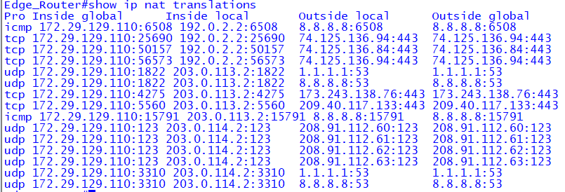
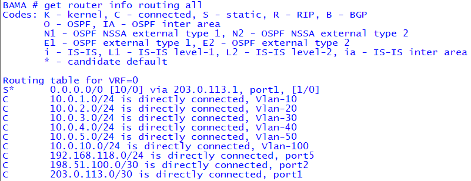
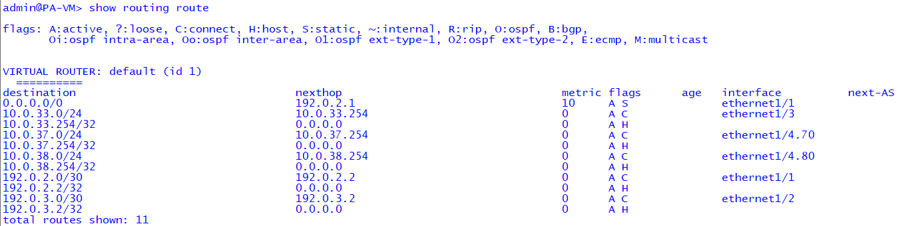
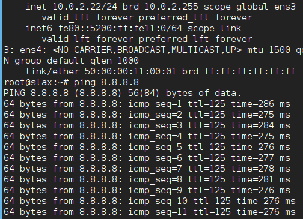

# ECL - Enterprise Cybersecurity Lab

## Overview
The Enterprise Cybersecurity Lab (ECL) is a multi-site, full-spectrum security lab designed to simulate a real-world enterprise network environment. It integrates multi-vendor firewalls, endpoints, servers, logging infrastructure, and security monitoring tools. The lab allows hands-on practice in network security, SOC operations, incident response, and enterprise-level system administration.

**Virtualization Platforms:** EVE-NG and VMware  
**Firewalls:** FortiGate and Palo Alto Networks  
**Lab Focus:** Full Spectrum Security Engineer (Network + SOC + Detection + Logging)

---

## Lab Purpose
The purpose of the ECL is to provide a **centralized lab environment** where multiple security and network technologies can be practiced together without rebuilding separate labs. Key objectives include:

- Practicing firewall policy creation and management with FortiGate and Palo Alto
- Building VLAN-segmented enterprise networks
- Implementing centralized logging and SIEM workflows (Sysmon → Rsyslog → Splunk)
- Detecting and responding to network and endpoint security events
- Hosting vulnerable applications for testing and red team exercises
- Automating backups and configuration versioning across devices

---

## Network & VLAN Architecture

| Site       | Subnet Range     | VLAN / Role                      |
|------------|----------------|----------------------------------|
| **Bama**   | 10.0.0.0/19     | 10: MGMT, 20: User, 30: Servers (AD/Linux), 40: Monitoring, 50: Remote User, 60: Vulnerable Apps, 70–100: Reserved |
| **New York** | 10.0.32.0/19  | 32: MGMT, 33: User, 34–36: Reserved, 37: Web_Srv_1, 38: Web_Srv_2 |
| **Cali**   | 10.0.64.0/19    | 64: MGMT, 65: Virtual_Server_VIP, 66: Vulnerable Apps, 67–73: Reserved |

**OOB Management Subnet:** 192.168.118.0/24

---



## Technology Stack

| Category           | Technology / Tool                  | Role / Purpose |
|-------------------|-----------------------------------|----------------|
| Firewalls          | FortiGate, Palo Alto              | Perimeter & segmentation, policy enforcement, VPN |
| Logging / SIEM     | Splunk, Rsyslog, Sysmon           | Centralized logging, monitoring, detection |
| IDS / IPS          | Suricata                          | Network intrusion detection & alerting |
| Server Infrastructure | Windows Server 2022, Linux VMs | AD domain, DNS/DHCP, monitoring, vulnerable app hosting |
| WAF                | FortiWeb                           | Web application protection & testing |
| Automation & Backup | Linux scripts, Git repo           | Configuration versioning, automated backups |

---

## Skills Demonstrated

- Network architecture & segmentation (VLANs, subnets, routing)
- Firewall policy design (FortiGate & Palo Alto)
- Logging & SIEM pipelines (Sysmon → Rsyslog → Splunk)
- Detection & response (Suricata alerts, Splunk correlation)
- Systems administration (Windows AD, Linux services)
- Automation & backup workflows for enterprise environments

---

## 🧩 Phase 1 – Network Connectivity Verification

This phase validates core routing, NAT, and Internet reachability across the Enterprise Cybersecurity Lab (ECL).  
Each component demonstrates full traffic flow from internal LAN hosts through multiple firewalls and the edge router to the Internet.

---

### 🔹 Verification Summary

| Component | Verification | Result |
|------------|---------------|--------|
| **Edge Router** | Double NAT translation to public network | ✅ Verified |
| **Bama_FW (Fortinet)** | Outbound NAT and routing to Edge Router | ✅ Verified |
| **NY_FW (Palo Alto)** | Dynamic IP-and-Port (DIPP) NAT configured for Trust → Untrust | ✅ Verified |
| **LAN Host** | End-to-end Internet connectivity (ping 8.8.8.8) | ✅ Verified |

---

### 🧩 Technical Verification with Screenshots

#### 🧱 Router NAT Translations
The Cisco Edge Router shows dynamic NAT mappings translating firewall WAN IPs to the public egress IP.
```bash
show ip nat translations
```


---

#### 🔐 Fortinet (Bama_FW) Routing Table
Displays directly connected subnets and the default route toward the Edge Router, confirming next-hop configuration.
```bash
get router info routing-table all
```


---

#### 🔁 Fortinet (Bama_FW) NAT Verification
Active session output proving LAN (10.0.2.x) traffic is translated to WAN (203.0.113.x) before forwarding upstream.
```bash
get system session list | grep 8.8.8.8
```


---

#### 🔄 Palo Alto (NY_FW) Routing Table
Lists connected networks and the default route via 192.0.2.1, confirming reachability through the Edge Router.
```bash
show routing route
```


---

#### 🔧 Palo Alto (NY_FW) NAT Policy
Shows the configured DIPP rule translating internal traffic (10.0.33.x) to 192.0.2.2 on ethernet1/1.
```bash
show running nat-policy
```


---

#### 🌐 LAN PC Internet Connectivity Test
Continuous ping from a LAN host to 8.8.8.8 verifies successful traffic flow through the entire path:  
LAN → Firewall → Router → Internet.


---

## ✅ Phase Outcome
- Dual-stage NAT verified across firewalls and edge router  
- Static and default routes confirmed operational  
- Internet connectivity established from all LAN zones  
- Foundation ready for **Phase 2 – Visibility & Detection** (Active Directory, Syslog, and SIEM integration)

  ---

**Navigation:**  
[🏠 Back to Portfolio Home](../README.md) • [➡️ Phase 2 – Security Visibility & Telemetry](../siem/rsyslog-forwarding-labs/)

_Last updated: 2025-11-12_


