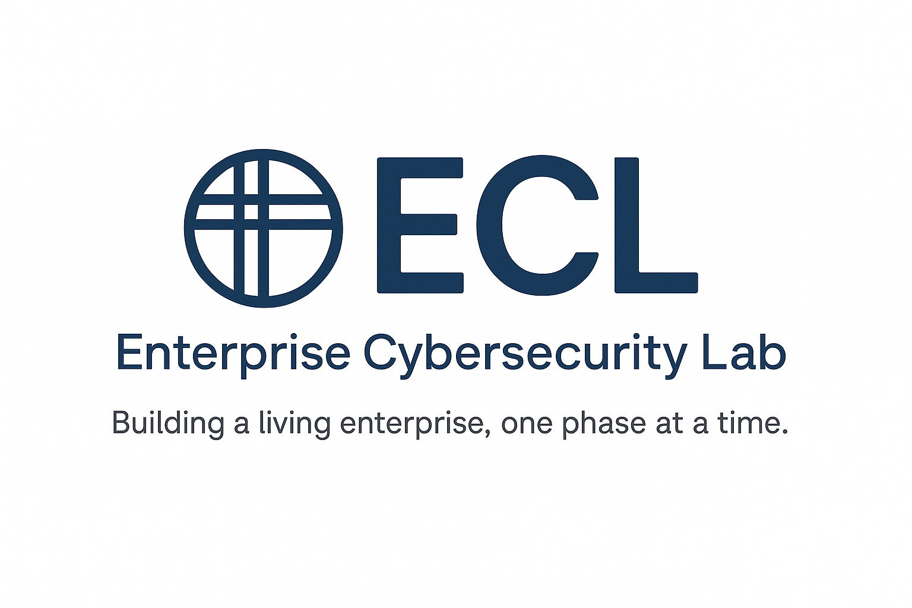

  
   
  <h1>🌐 Enterprise Cybersecurity Lab (ECL)</h1>
  <em>“Building a living enterprise, one phase at a time.”</em>
    

---

## 🧭 Vision & Purpose
The **Enterprise Cybersecurity Lab (ECL)** is a continuously evolving simulation of a real-world enterprise.  
It’s more than a technical lab — it’s a **living environment** designed to explore how organizations **design, secure, monitor, and govern** their IT infrastructures.

The goal of the ECL is to **learn by building** — to understand not only *how* systems connect, but *why* engineers, architects, and security leaders make the decisions they do.  
From routers and firewalls to identity, telemetry, detection, and governance, each phase reflects a new level of maturity in the cybersecurity lifecycle.

> There is no finish line — only continuous learning, experimentation, and growth.  
> Each phase adds depth, realism, and perspective — one step closer to mastering the full enterprise cybersecurity landscape.

---

## ⚙️ Lab Overview
The **Enterprise Cybersecurity Lab (ECL)** integrates multi-vendor firewalls, endpoints, servers, logging infrastructure, and security monitoring tools — allowing hands-on practice in **network security, SOC operations, incident response, and enterprise-level system administration**.

**Virtualization Platforms:** EVE-NG and VMware  
**Firewalls:** FortiGate and Palo Alto Networks  
**Lab Focus:** Full Spectrum Security Engineer (Network + SOC + Detection + Logging)

## 🎯 Lab Purpose
The purpose of the ECL is to provide a **centralized lab environment** where multiple security and network technologies can be practiced together without rebuilding separate labs.  
Key objectives include:

- Practicing firewall policy creation and management with FortiGate and Palo Alto  
- Building VLAN-segmented enterprise networks  
- Implementing centralized logging and SIEM workflows (Sysmon → Rsyslog → Splunk)  
- Detecting and responding to network and endpoint security events  
- Hosting vulnerable applications for testing and red team exercises  
- Automating backups and configuration versioning across devices  

---

## 🌐 Network & VLAN Architecture
| Site | Subnet Range | VLAN / Role |
|------|---------------|--------------|
| **Bama** | 10.0.0.0/19 | 10: MGMT, 20: User, 30: Servers (AD/Linux), 40: Monitoring, 50: Remote User, 60: Vulnerable Apps, 70–100: Reserved |
| **New York** | 10.0.32.0/19 | 32: MGMT, 33: User, 34–36: Reserved, 37: Web_Srv_1, 38: Web_Srv_2 |
| **Cali** | 10.0.64.0/19 | 64: MGMT, 65: Virtual_Server_VIP, 66: Vulnerable Apps, 67–73: Reserved |

**OOB Management Subnet:** 192.168.118.0/24  

---

## 🧰 Technology Stack
| Category | Technology / Tool | Role / Purpose |
|-----------|------------------|----------------|
| Firewalls | FortiGate, Palo Alto | Perimeter & segmentation, policy enforcement, VPN |
| Logging / SIEM | Splunk, Rsyslog, Sysmon | Centralized logging, monitoring, detection |
| IDS / IPS | Suricata | Network intrusion detection & alerting |
| Server Infrastructure | Windows Server 2022, Linux VMs | AD domain, DNS/DHCP, monitoring, vulnerable app hosting |
| WAF | FortiWeb | Web application protection & testing |
| Automation & Backup | Linux scripts, Git repo | Configuration versioning, automated backups |

---

## 🧩 Skills Demonstrated
- Network architecture & segmentation (VLANs, subnets, routing)  
- Firewall policy design (FortiGate & Palo Alto)  
- Logging & SIEM pipelines (Sysmon → Rsyslog → Splunk)  
- Detection & response (Suricata alerts, Splunk correlation)  
- Systems administration (Windows AD, Linux services)  
- Automation & backup workflows for enterprise environments  

---

## 🚀 ECL Project Phases

| Phase | Title | Focus | View |
|:------|:------|:------|:------|
| ✅ **Phase 1** | Network Connectivity Verification | Routing, NAT, and firewall reachability | [View Lab →](phase1/) |
| ✅ **Phase 2** | Security Visibility & Telemetry | Sysmon + Rsyslog + Splunk data pipeline | [View Lab →](siem/rsyslog-forwarding-lab/) |
| 🧩 **Phase 3** | Identity & Trust Integration | AD, DNS, Certificates, SSL Decryption | 📅 Planned |
| 🧠 **Phase 4** | Threat Detection & Response | SOC correlation and detections | 📅 Planned |
| 🧾 **Phase 5** | Governance, Risk & Compliance (GRC) | Risk registers, controls mapping | 📅 Planned |

---

**Navigation:**  
[🏠 Back to Portfolio Home](../README.md)

_Last updated: 2025-11-12_
