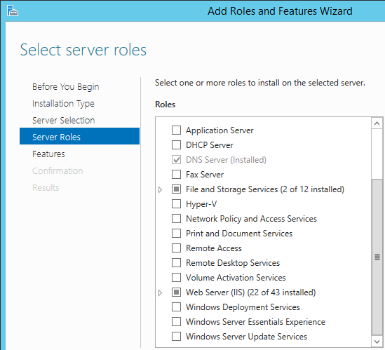
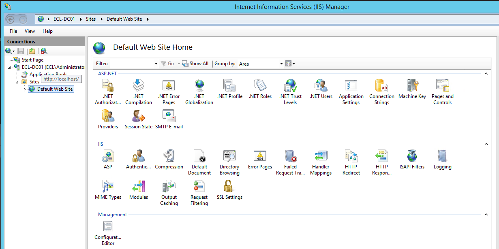

# 🧠 Active Directory & Core Windows Services Setup

This document details the full **Active Directory**, **Certificate Authority**, and **IIS Web Server** configuration used in the **Enterprise Cybersecurity Lab (ECL)**.

---

## 📁 Domain Overview

- **Domain Name:** `ECL.lab`
- **Primary Domain Controller:** `ECL-DC01`
- **Windows Server Version:** *2012 R2 Standard*
- **Core Roles Installed:**
  - Active Directory Domain Services (AD DS)
  - DNS Server
  - Active Directory Certificate Services (AD CS)
  - Web Server (IIS)

---

# 🏛️ Active Directory Structure

## 1. Domain Root  

## 2. Domain Controllers OU  

## 3. Computers OU  

## 4. ECL-Groups OU  

## 5. ECL-Users OU  

## 6. Domain Admin Properties  

## 7. AD Users & Computers (Tree View)  

---

# 🔐 Certificate Authority (AD CS)

The CA provides certificates for:
- Internal servers  
- Workstations  
- Firewall integrations (Palo Alto & Fortinet)  
- Future secure services: SSL inspection, NPS, ClearPass, etc.

## CA Role Installed  

## CA Console  

---

# 🌐 IIS Web Server (Installed on DC)

Used for internal services such as:
- Software distribution  
- Hosting internal landing/testing pages  
- Certificate enrollment pages  

## IIS Role Installed  

## Default Web Site  

## IIS Software Center Folder  

## IIS Tools Menu  

---

# 🔄 DNS Configuration

## Forward Lookup Zone  

---

# 🏁 Final Notes

This Active Directory environment forms the backbone of the **ECL SOC ecosystem**, supporting:

- Identity management  
- Certificate deployment  
- Log forwarding and visibility  
- Secure authentication for servers and firewalls  
- Future integrations (ClearPass, Suricata, Zeek, Wazuh, Splunk)

This layout reflects a **professional, enterprise‑grade AD deployment**, appropriate for engineering work and portfolio documentation — while remaining neutral for current employer visibility.

---

*Last updated: November 2025*
