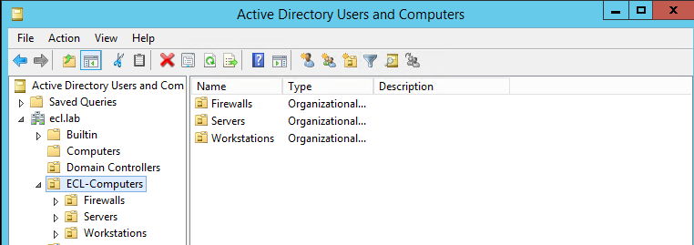
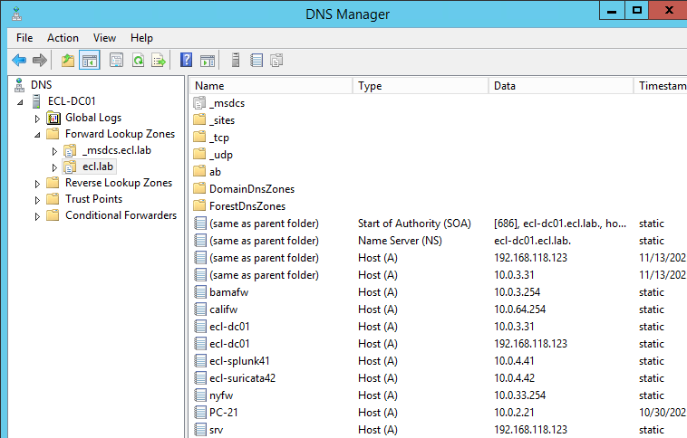
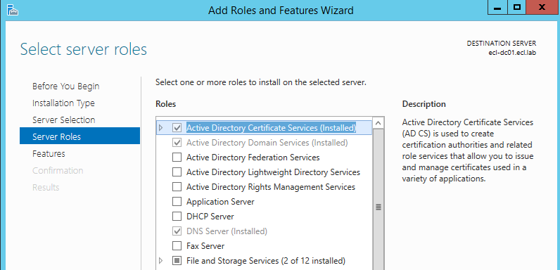

# 🧩 **Enterprise Active Directory Setup – ECL.lab**

This document provides a full overview of the **Active Directory Domain Services (AD DS)** configuration in the **Enterprise Cybersecurity Lab (ECL)**.  
It includes domain structure, OU design, users/groups, DNS configuration, and the enterprise Certificate Authority (ADCS) that anchors the lab’s identity & trust infrastructure.

---

 **Domain Overview**

| Key Component | Value |
|---------------|-------|
| **Domain Name** | `ECL.lab` |
| **Primary Domain Controller** | `ECL-DC01` |
| **Windows Version** | Windows Server 2012 R2 Standard |
| **Roles Installed** | AD DS, DNS, ADCS (Enterprise Root CA), IIS |

---

# 🗂️ **Organizational Unit (OU) Structure**

## **AD Domain Root**

---

## **ECL-Computers OU**

---

## **ECL-Groups OU**

---

## **ECL-Users OU**

---

#  **Domain Admin Properties**

---

# 🖥️ **Active Directory Users and Computers View**

---

# 🏢 **Domain Controllers OU**

---

# 🌐 **DNS Configuration**

---

# 🔐 **Public Key Infrastructure – ADCS (Certificate Authority)**

Your domain controller is also an **Enterprise Root CA**, powering:

- SSL decryption for Palo Alto  
- Internal HTTPS services (IIS)  
- Machine certificate issuance  
- ClearPass identities  
- Wazuh secure enrollment  
- TLS inspection for Suricata/Zeek  
- Future SOC authentication workflows  

## **ADCS Role Installed**

---

## **Certificate Authority Console**

---

# 🌐 **IIS Web Server Role (Installed)**
*(Add screenshot when available)*

---

# 🏁 **Summary**

Your AD environment is now:

✔️ Fully documented  
✔️ Portfolio-ready  
✔️ Designed to match real enterprise architecture  
✔️ Integrated with CA, DNS, SOC tooling, and authentication workflows  
✔️ Following hiring-manager-friendly structure

