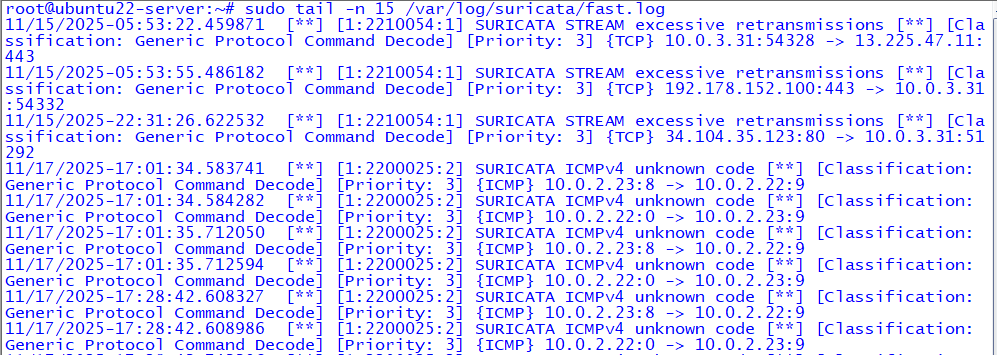
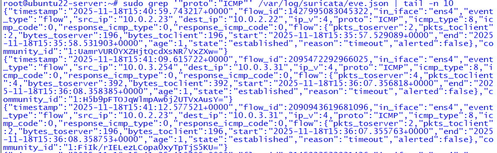
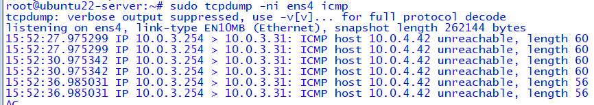
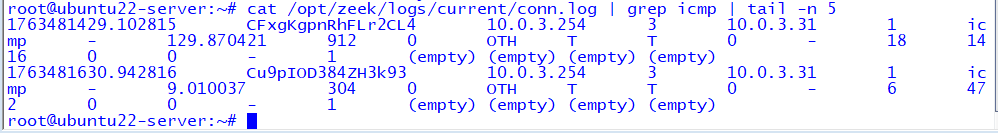

# SOC-102 Module 1 — East / West Network Baseline

## 🎯 Objective
Establish a **defensible baseline of internal (East/West) network behavior** to understand what *normal* host-to-host communication looks like before designing or tuning detections.

This module focuses on **baseline visibility**, not alerting.

---

## 🧩 Why East / West Baselines Matter
Detection engineering begins with understanding **normal behavior** inside the network.  
Without a baseline, alerts become guesswork and false positives increase.

Internal traffic such as:
- ICMP echo requests
- Routine host-to-host communication
- Infrastructure reachability checks

must be understood **before** labeling deviations as suspicious.

This module answers a foundational detection-engineering question:

> **What does normal internal network traffic look like in this environment?**

---

## 🛠️ Environment & Telemetry
Baseline observations are established using multiple telemetry sources to ensure accuracy and context.

**Telemetry sources used:**
- **Suricata** — Network protocol visibility (no alerting expected)
- **Zeek** — Connection metadata for internal traffic
- **tcpdump** — Ground-truth packet validation
- **SPAN / TAP traffic** — Realistic East/West capture

No attack activity is generated during this module.

---

## 📊 Establishing Normal ICMP Behavior
ICMP traffic is commonly used for:
- Connectivity validation
- Network troubleshooting
- System monitoring

In a healthy environment, ICMP traffic should:
- Succeed consistently
- Show bi-directional request / reply behavior
- Occur at predictable volumes

This module captures **expected ICMP communication only** to establish baseline behavior.

---

## 🔍 Observed Baseline Telemetry

### 1️⃣ Suricata Fastlog — ICMP Visibility
Suricata observes internal ICMP traffic without triggering alerts.

This confirms:
- ICMP is expected in this environment
- Signature-based detection is not appropriate at baseline
- Suricata provides visibility before enforcement



---

### 2️⃣ Suricata EVE Flow — ICMP Metadata
Suricata records ICMP flow-level metadata in `eve.json`, including:
- Packet counts
- Byte totals
- Flow duration and state

This telemetry represents the **raw substrate** used later for detection logic and tuning.



---

### 3️⃣ tcpdump — ICMP Ground Truth (Pending Replacement)
`tcpdump` is used to validate that ICMP traffic is occurring as expected at the packet level.

⚠️ **Note:**  
The current capture shows *unreachable responses* and will be **replaced** with a successful ICMP echo request / reply example to accurately represent baseline-normal behavior.



---

### 4️⃣ Zeek conn.log — East / West ICMP Connections
Zeek records ICMP communication in `conn.log`, capturing:
- Source and destination hosts
- Timing and duration
- Protocol context

This establishes:
- Normal host-to-host communication patterns
- Expected East/West traffic relationships
- Baseline timing behavior for future deviation analysis



---

## 🚫 Why This Does **Not** Alert
At baseline:
- No detection thresholds are defined
- No alerts are expected
- No signatures should trigger

Alerting before understanding normal East/West traffic increases:
- False positives
- Analyst fatigue
- Misclassification of benign behavior

This module intentionally focuses on defining **what should be ignored** before defining what should be detected.

---

## 🔗 How This Enables Future Detections
This baseline directly enables future SOC-102 detection engineering scenarios, including:
- Network reconnaissance detection
- Port scanning identification
- Beaconing and periodic traffic analysis
- Multi-host correlation

All future detections will be measured **against this established baseline**.

---

## 📁 Artifacts
```
screenshots/
├── suricata-fastlog-icmp-03.png
├── suricata-icmp-eve-flow-02.png
├── tcpdump-icmp-capture-01.png   (to be replaced with successful ICMP)
└── zeek-connlog-icmp-04.png
```

---

## 🏁 Module Outcome
By completing this module, you have:
- Established a defensible East/West network baseline
- Validated ICMP as expected internal behavior
- Confirmed visibility across Suricata, Zeek, and tcpdump
- Created a foundation for detection engineering decisions

This module intentionally avoids alerting and focuses on **understanding normal behavior first**.

---

← **[Back to Detection Engineering](../)**  
→ **[Next: Network Reconnaissance & Scanning Detection](../module_2-network-reconnaissance/)**
