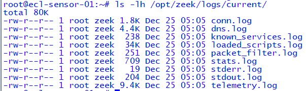
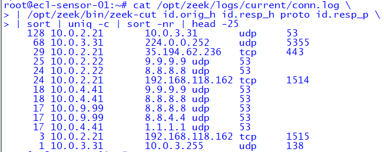
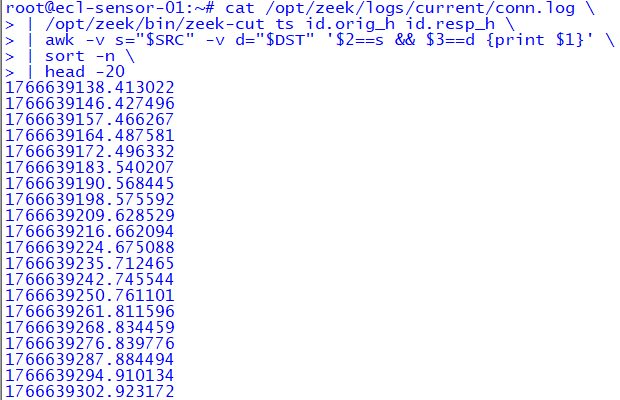
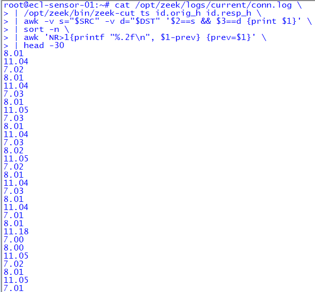

# SOC-102 Module 3 — Detecting Beaconing & Periodic Communication

## Objective
This module demonstrates how a SOC analyst identifies **beaconing behavior**
by analyzing network telemetry for **repeated, periodic connections** that are
commonly associated with malware command-and-control (C2) activity.

The focus is on **analyst-driven detection**, not signature-based alerts.

---

## Data Sources
- **Zeek** (`conn.log`)
- East–west network traffic mirrored to the Zeek sensor
- Splunk (raw log ingestion)

---

## Scenario Overview
An internal host repeatedly initiates outbound TCP connections to the same
internal destination and port at **regular time intervals**. Although the
connections fail to fully establish, the **timing consistency** strongly
indicates automated beaconing behavior rather than human-driven activity.

---

## Investigation Walkthrough

### 1️⃣ Zeek Log Verification

Before performing any analysis, the analyst verifies that Zeek is running
properly and actively generating connection logs. This confirms that the
telemetry source is valid and trustworthy.

---

### 2️⃣ Repeated Destination Analysis

Connection counts are reviewed to identify hosts repeatedly attempting
connections to the same destination and port. High-frequency repetition
to a fixed target is a common early indicator of beaconing.

---

### 3️⃣ Raw Connection Timestamp Review

Raw Zeek timestamps are examined to evaluate whether the repeated connections
occur at predictable intervals. This step shifts the analysis from *volume*
to *timing*, which is critical for detecting low-and-slow beaconing.

---

### 4️⃣ Time Delta Consistency Validation

Time deltas between successive connections are calculated to determine whether
the traffic exhibits consistent periodic behavior. Regular intervals confirm
automated callbacks rather than user-initiated traffic.

---

## Analyst Notes
Zeek logs were ingested in **raw format** without a parsing add-on. During the
investigation, manual field extraction was used to validate source, destination,
and timing consistency. This reflects real-world SOC conditions where structured
parsing may not always be immediately available.

---

## Conclusion
The observed traffic demonstrates clear beaconing characteristics:

- Repeated connections to a fixed destination and port
- Consistent, machine-like timing intervals
- Minimal or failed session establishment

This behavior aligns with common command-and-control (C2) beaconing patterns and
would warrant escalation for further investigation in a production SOC.

---

## Skills Demonstrated
- Network telemetry validation
- Beaconing and periodicity analysis
- Zeek log interpretation
- Splunk-based investigation
- Analyst-driven detection reasoning

