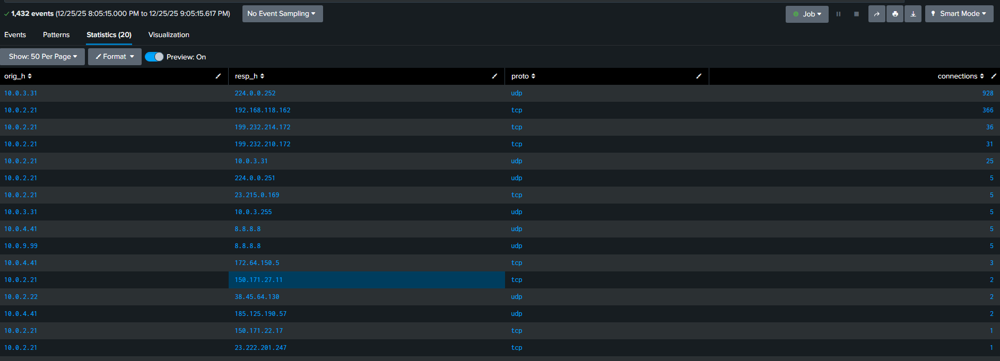
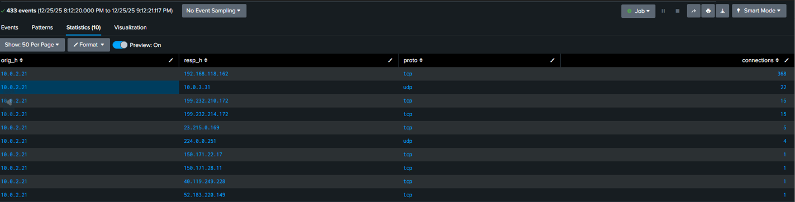
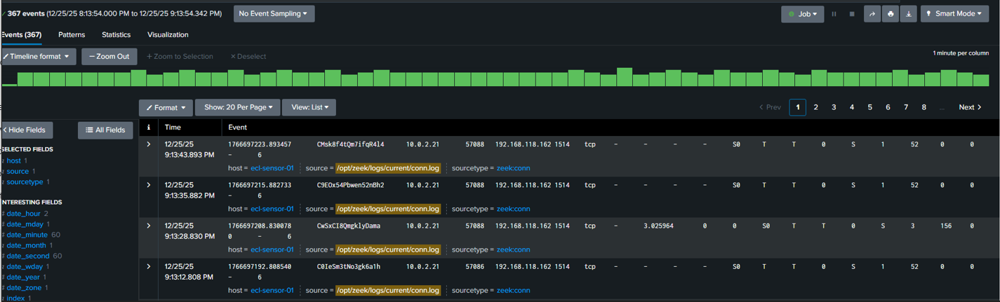
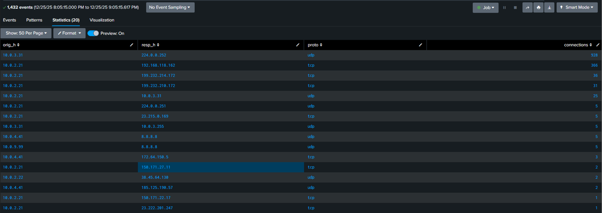

# 🟡 SOC-102 — Module 4: Detection Validation & False Positives

## Overview
This module focuses on **validating detection results and identifying false positives** using Zeek network telemetry analyzed in Splunk.  
Rather than immediately escalating on repetitive or high-volume traffic, this module demonstrates how a SOC analyst applies **baseline analysis, raw log validation, and asset context** to determine whether activity is malicious or expected.

The goal of this module is to show **analyst judgment**, not just alert generation.

---

## 1️⃣ Baseline Network Activity (What “Normal” Looks Like)

The first step in detection validation is establishing a **baseline of normal network behavior**.

From the baseline:
- High-volume UDP multicast traffic is present, consistent with normal internal service discovery.
- Multiple internal hosts generate routine outbound and broadcast traffic.
- The Jumpbox (10.0.2.21) appears among top talkers but is not immediately anomalous without further context.

This baseline provides the reference point required before labeling any behavior as suspicious.

---

## 2️⃣ Detection Candidate Identification

After reviewing the baseline, repeated TCP connections originating from the **Jumpbox (10.0.2.21)** were identified.

Key observations:
- A high number of TCP connections from a single source to a single destination.
- The destination IP `192.168.118.162` received the majority of these connections.
- At a glance, this pattern could resemble **periodic communication or beaconing behavior**.

This activity was flagged as a **detection candidate** requiring further validation.

---

## 3️⃣ Raw Event Validation

To validate the detection candidate, raw Zeek `conn.log` events were reviewed.

The raw events confirmed:
- Repeated short-lived TCP connections.
- Destination port `1514`, commonly used for log ingestion.
- Consistent source and destination pairing over time.

Reviewing raw telemetry ensures that aggregate statistics are supported by actual event evidence and helps eliminate misinterpretation.

---

## 4️⃣ Environmental Context & False Positive Confirmation

Environmental context was applied to determine whether the behavior was anomalous.

Findings:
- The destination host `192.168.118.162` was identified as the **Wazuh Manager**.
- The observed traffic represents expected **security telemetry and agent communication**.
- Other hosts in the environment generated equal or greater volumes of routine traffic.

Based on destination role, protocol usage, and environmental comparison, the activity was confirmed as a **false positive**.

---

## 🛠️ Detection Tuning Considerations

To prevent unnecessary alerts for similar behavior in the future, tuning strategies may include:
- Suppressing alerts for known internal security infrastructure.
- Requiring external destinations before triggering periodic communication alerts.
- Applying persistence, duration, or multi-destination thresholds.

These tuning steps help reduce alert fatigue while preserving detection effectiveness.

---

## 🎯 Outcome

This module demonstrates a realistic SOC workflow:
- Establishing a baseline
- Identifying a detection candidate
- Validating activity through raw logs
- Applying asset and environmental context
- Correctly classifying a false positive

---

## 🔑 Key Takeaway

> **Repetitive network behavior is not inherently malicious — context determines severity.**

Effective SOC analysts validate detections before escalation to ensure high-quality alerts and efficient incident response.

