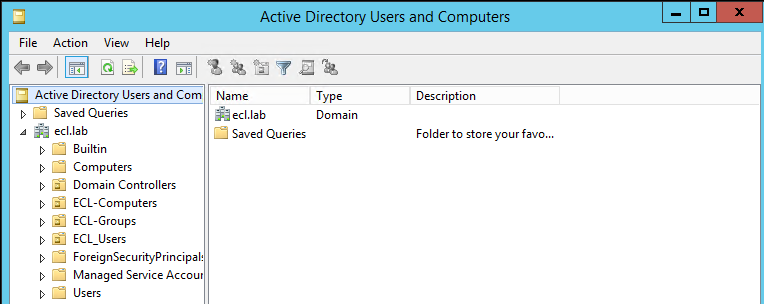
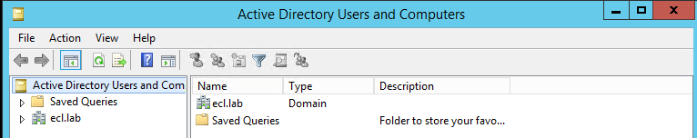
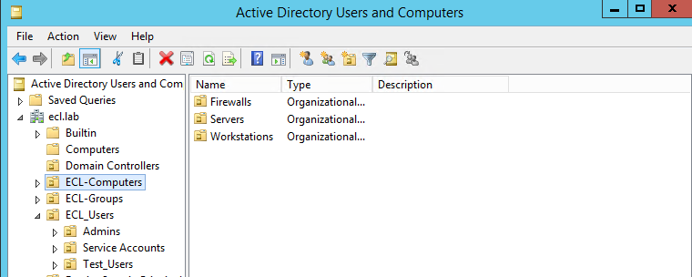
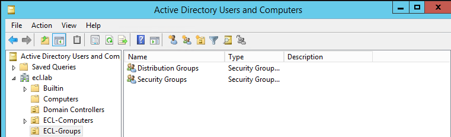
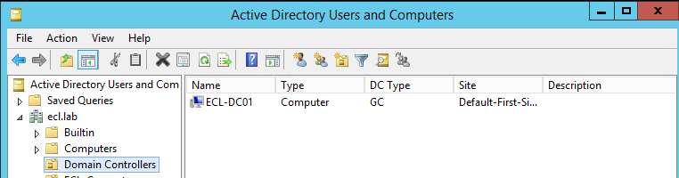
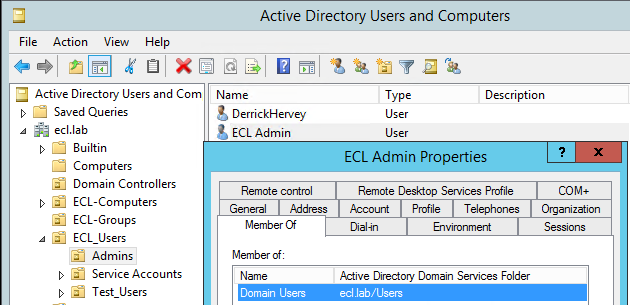
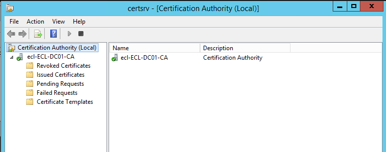
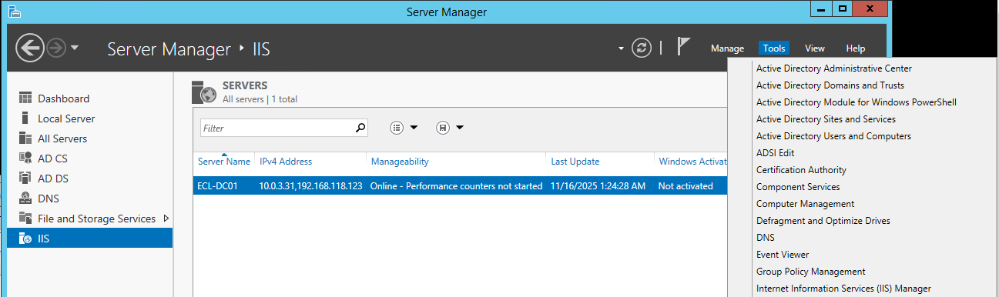
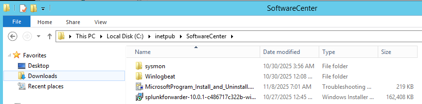

# Phase 3.1 – Active Directory, DNS, Certificate Services & IIS
## Enterprise Identity & Trust Foundation

This README merges your **original Active Directory documentation** with the **structured Phase 3 lab format**, giving you a clean, professional, step-by-step identity foundation for the ECL.

---

# 🧩 Lab Objectives
- Deploy Active Directory Domain Services (AD DS)
- Configure DNS Forward Lookup Zones & Records
- Build Organizational Units and Group Structure
- Deploy Certificate Authority (AD CS)
- Install & Configure IIS for internal services
- Provide identity and trust foundations for ClearPass, User-ID, SSL decryption, and authentication

---

# 🏛️ Domain Overview
- **Domain:** `ECL.lab`
- **Primary DC:** `ECL-DC01`
- **Windows Server Version:** *2012 R2 Standard*
- **Installed Roles:**
  - Active Directory Domain Services (AD DS)
  - DNS Server
  - Active Directory Certificate Services (AD CS)
  - Web Server (IIS)

---

# 🏗️ Step 1 — AD DS Installation & Promotion
### Screenshots




---

# 🗂️ Step 2 — Organizational Unit Structure
### OU Structure Implemented
- **ECL-Users**
- **ECL-Groups**
- **ECL-Computers**
- **Domain Controllers**

### Screenshots






---

# 👤 Step 3 — Users, Groups & Permissions
### Notes
- Standard user accounts created
- Admin memberships validated

### Screenshot


---

# 🌐 Step 4 — DNS Configuration
### Work Completed
- Forward Lookup Zone created: **ECL.lab**
- DNS validated against core services

### Screenshot


---

# 🔐 Step 5 — Certificate Authority (AD CS)
### Purpose
This CA supports:
- Internal servers
- Workstations
- Palo Alto & Fortinet integrations
- SSL Inspection
- ClearPass / RADIUS trust

### Screenshots



---

# 🌐 Step 6 — IIS Internal Web Server
### Purpose
- Hosts internal software distribution
- Certificate enrollment pages
- Internal testing pages

### Screenshots





---

# 🔍 Step 7 — Verification
- AD tree validated
- DNS resolving internal hosts
- CA issuing certificates
- IIS reachable internally

---

# 📁 Folder Structure (GitHub)
```
identity-trust/
│
├── active-directory/
│   ├── README.md (this file)
│   └── screenshots/
│       ├── ad-domain-root.png
│       ├── ad-ecl-users-ou.png
│       ├── ad-ecl-groups-ou.png
│       ├── ad-computers-ou.png
│       ├── ad-domain-admin-properties.png
│       ├── dns-forward-lookup-zone.png
│       ├── dc-ca-role-installed.png
│       ├── dc-ca-console.png
│       ├── iis-role-installed.png
│       ├── iis-default-website.png
│       └── iis-tools-menu.png
```

---

# 🔄 Navigation
- **⬅️ Back to Phase 3 Overview**
- **➡️ ClearPass Integration (Phase 3.2)**
- **🏠 Back to ECL Portfolio Home**
