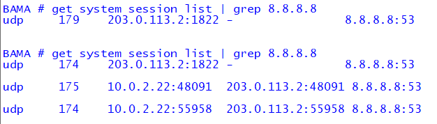
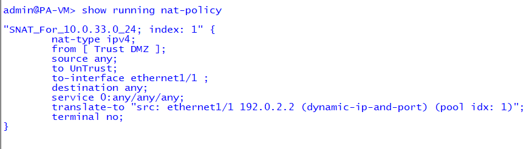

# 🧩 Phase 1 – Network Connectivity Verification  
*Foundation Phase of the Enterprise Cybersecurity Lab (ECL)*  

---

## 🎯 Objective  
Validate core routing, NAT, and Internet reachability across the **Enterprise Cybersecurity Lab (ECL)**.  
Each component demonstrates full traffic flow from internal LAN hosts through multiple firewalls and the edge router to the Internet.

---

## 🧱 Topology Overview  

| Component | Role | Key Function |
|:--|:--|:--|
| **Edge Router** | Cisco Router | Double NAT and default gateway to Internet |
| **Bama_FW** | FortiGate | Outbound NAT and routing to Edge Router |
| **NY_FW** | Palo Alto | DIPP NAT for Trust → Untrust traffic |
| **LAN Host** | Windows / Linux PC | Test connectivity and verify routes |


---

## 🧩 Verification Steps & Results  

### 1️⃣ Router NAT Translations  
Dynamic NAT mappings translating firewall WAN IPs to public egress IP.  
```bash
show ip nat translations
```


---

### 2️⃣ Fortinet (Bama_FW) Routing Table  
Displays connected subnets and default route toward Edge Router.  
```bash
get router info routing-table all
```


---

### 3️⃣ Fortinet (Bama_FW) NAT Verification  
Active session output proving LAN (10.0.2.x) traffic translation.  
```bash
get system session list | grep 8.8.8.8
```


---

### 4️⃣ Palo Alto (NY_FW) Routing Table  
Lists connected networks and default route via 192.0.2.1.  
```bash
show routing route
```


---

### 5️⃣ Palo Alto (NY_FW) NAT Policy  
Configured DIPP rule translating internal (10.0.33.x) to 192.0.2.2.  
```bash
show running nat-policy
```


---

### 6️⃣ LAN PC Internet Connectivity Test  
Continuous ping from LAN host to 8.8.8.8 verifies end-to-end path:  
LAN → Firewall → Router → Internet.  


---

## ✅ Phase Outcome  
- Dual-stage NAT verified across firewalls and edge router  
- Static and default routes confirmed operational  
- Internet connectivity established from all LAN zones  
- Foundation ready for **Phase 2 – Security Visibility & Telemetry**

---

**Navigation:**  
[⬅️ Back to ECL Home](../README.md)  •  [➡️ Next Phase – Security Visibility & Telemetry](../siem/rsyslog-forwarding-lab/)

_Last updated: 2025-11-12_
