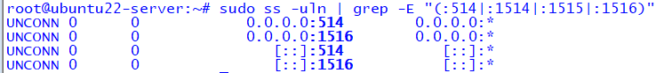
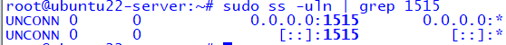
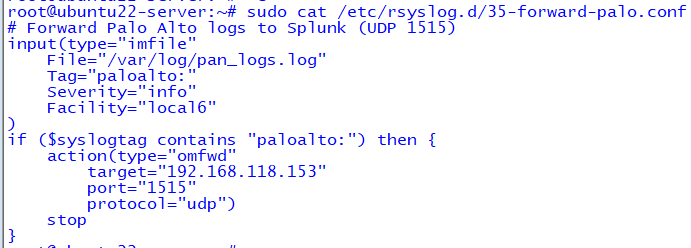
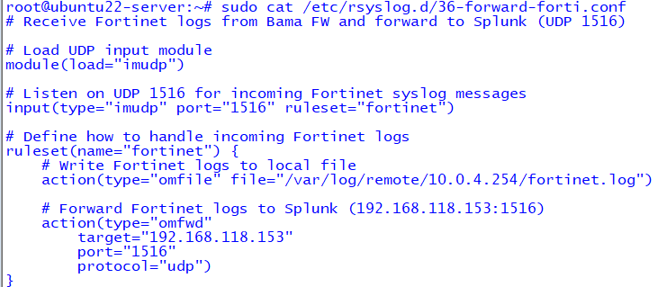
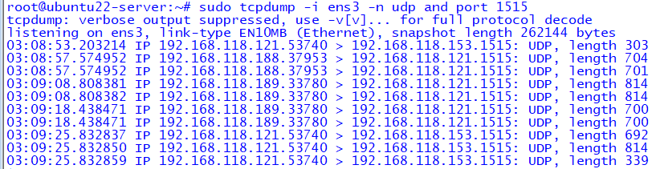
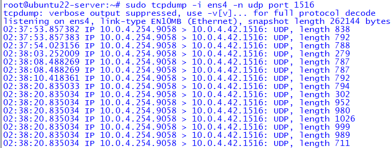
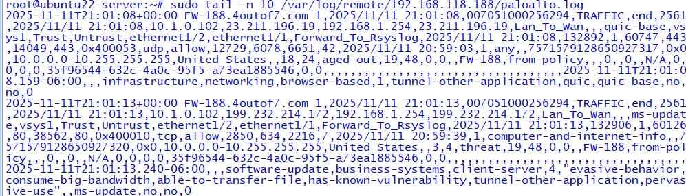
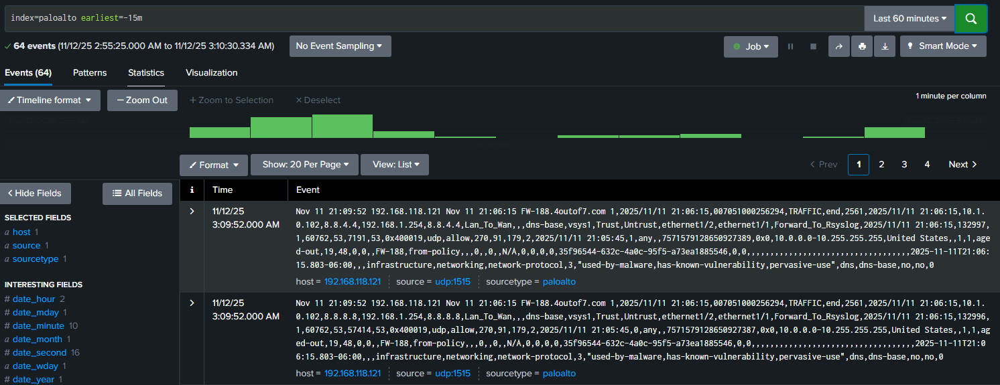
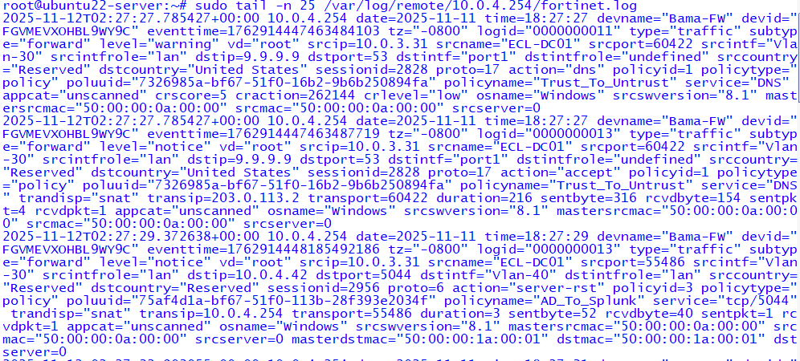
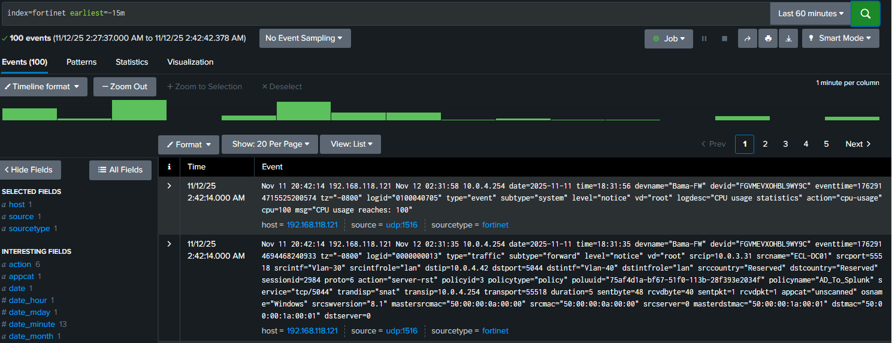

# 🧠 Rsyslog to Splunk Centralized Logging Lab

## 🔎 Overview
This lab demonstrates how to configure **Rsyslog** on Ubuntu as a centralized log collector and forwarder, sending system, firewall, and endpoint logs to **Splunk** for analysis and correlation.  
It forms part of the **Enterprise Cybersecurity Lab (ECL)** SIEM integration phase.

## 🎯 Objectives
- Configure Rsyslog to receive and forward logs from multiple sources (firewalls, endpoints, servers).  
- Enable Splunk to receive logs on designated ports (1514–1516, 9997).  
- Validate end-to-end visibility of logs from Palo Alto and Fortinet firewalls.  
- Automate cleanup to prevent disk exhaustion.

## 🧩 Topology
```
[FW-188]──┐
           ├──> [Rsyslog Server: Ubuntu 22 (10.0.4.42 / 192.168.118.121)]
[FW-189]──┘                 │
                            ▼
                       [Splunk Server: 192.168.118.153]
```

**Key Components:**
| Device | Role | IP Address | Purpose |
|:--|:--|:--|:--|
| FW-188 | Palo Alto Firewall | 192.168.118.188 | Forwards logs via Rsyslog |
| FW-189 | Palo Alto Firewall | 192.168.118.189 | Forwards logs via Rsyslog |
| Bama-FW | Fortinet Firewall | 10.0.4.254 | Sends syslog directly to Rsyslog |
| ubuntu22-server | Rsyslog Collector | 10.0.4.42 / 192.168.118.121 | Aggregates & forwards logs |
| splunk | Splunk Indexer | 192.168.118.153 | Central SIEM / Log Viewer |

---

## ⚙️ Configuration Summary

### Rsyslog Setup (Ubuntu 121)
**Rsyslog Modules:**
```bash
module(load="imuxsock")      # Local syslog
module(load="imudp")         # UDP listener
module(load="imfile")        # File monitor input
input(type="imudp" port="514")
```

**Forwarding Rules:**
- Palo Alto → `port 1515`
- Fortinet → `port 1516`
- Local Syslogs → `port 1514`
- Forward to Splunk Indexer (`192.168.118.153`)

Example snippet:
```bash
# /etc/rsyslog.d/35-forward-palo.conf
input(type="imfile"
    File="/var/log/pan_logs.log"
    Tag="paloalto:"
)
if ($syslogtag contains "paloalto:") then {
    action(type="omfwd"
        target="192.168.118.153"
        port="1515"
        protocol="udp")
    stop
}
```

---

### Splunk Indexer (Ubuntu 153)
Enable listener ports:
```bash
sudo /opt/splunk/bin/splunk enable listen 9997 -auth admin:password
```

Verify active ports:
```bash
tcp   LISTEN 0      128   0.0.0.0:9997
udp   UNCONN 0      0     0.0.0.0:1514
udp   UNCONN 0      0     0.0.0.0:1515
udp   UNCONN 0      0     0.0.0.0:1516
```

---

### Fortinet Forwarding (Bama-FW)
```bash
config log syslogd setting
    set status enable
    set server "10.0.4.42"
    set mode udp
    set port 514
    set facility local7
    set source-ip "10.0.4.254"
end
```

---

### Palo Alto Forwarding (FW-188 / FW-189 via Panorama)
- Syslog Server: `192.168.118.121`
- Port: `1515`
- Format: BSD
- Profile: `Forward_To_Rsyslog`
- Categories: Traffic, Threat, System, Config

---

## 🧪 Verification & Log Validation

### On Rsyslog (Ubuntu 121)
Check if ports are active:
```bash
sudo ss -uln | grep -E "514|1515|1516"
```

Monitor incoming logs:
```bash
sudo tail -f /var/log/remote/192.168.118.188/paloalto.log
sudo tail -f /var/log/remote/10.0.4.254/fortinet.log
```

Confirm forwarding to Splunk:
```bash
sudo tail -n 20 /opt/splunkforwarder/var/log/splunk/metrics.log | grep tcpout
```

### On Splunk GUI
Run searches:
```
index=main sourcetype=syslog earliest=-15m
index=paloalto earliest=-15m
index=fortinet earliest=-15m
```

---

## 🖼️ Screenshot Gallery

### 1️⃣ Rsyslog UDP Listeners


### 2️⃣ Rsyslog UDP Listener (1515)


### 3️⃣ Rsyslog Palo Config


### 4️⃣ Rsyslog Fortinet Config


### 5️⃣ Rsyslog Forwarding to Splunk


### 6️⃣ Rsyslog Forwarding Traffic


### 7️⃣ Palo Alto Log Local Receipt


### 8️⃣ Splunk Palo Alto Logs


### 9️⃣ Fortinet Live Logs


### 🔟 Splunk Fortinet Index


---

## 🧰 Maintenance & Automation
To prevent disk exhaustion from the Splunk dispatch directory:
```bash
sudo rm -rf /opt/splunk/var/run/splunk/dispatch/*
```

Optional cleanup script:
```bash
sudo nano /opt/splunk/bin/cleanup_dispatch.sh
```

Schedule with cron:
```
0 * * * * /opt/splunk/bin/cleanup_dispatch.sh
```

---

[🔙 Return to SIEM Lab Index](../)  
[🏠 Return to Enterprise Cybersecurity Lab Index](../../)

---
🧩 Part of the **Enterprise Cybersecurity Lab Series**  
Built and verified in **ECL Phase 3 – SIEM Integration**

