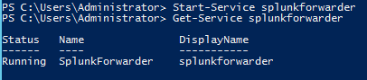
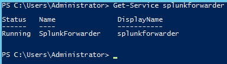
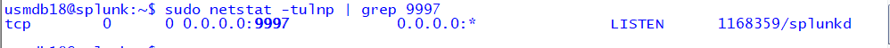
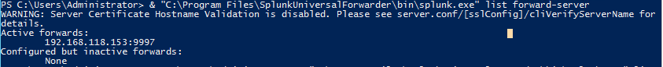
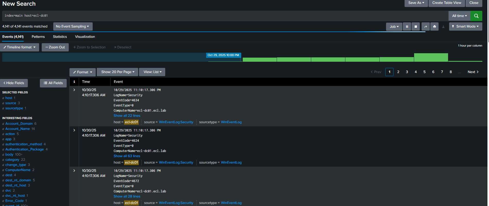
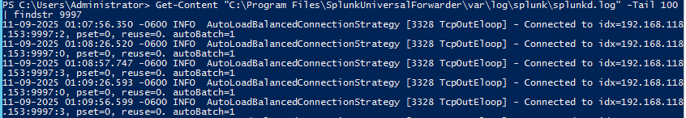

# 🧠 Splunk Universal Forwarder Log Ingestion Lab  
*Windows → Splunk Indexer via Universal Forwarder*


---

## 🎯 Objective
Install, configure, and verify the **Splunk Universal Forwarder** on a **Windows Server (Domain Controller)** to forward **Windows Event Logs** to a **Splunk Indexer** for centralized visibility.

---

## 🧩 Topology Overview
| Role | Hostname | IP Address | Description |
|------|----------|------------|-------------|
| 🖥️ Windows DC | `ecl-dc01` | `192.168.118.123` | Hosts the Splunk Universal Forwarder |
| 📊 Splunk Indexer | `splunk` | `192.168.118.153` | Receives forwarded logs on port `9997` |

---

<a id="step1"></a>
## Step 1: Install the Splunk Universal Forwarder
Run the MSI installer on the Domain Controller, accept the license, and create an admin user.  
**Screenshot:** `forwarder-install-success.png`  


---

<a id="step2"></a>
## Step 2: Configure the Forwarder Outputs
During setup (or post-install), specify:  
- **Deployment Server:** *(optional – leave blank)*  
- **Receiving Indexer:** `192.168.118.153`  
- **Port:** `9997`  

**Screenshot:** `forwarder-outputs-conf.png`  


---

<a id="step3"></a>
## Step 3: Verify the Forwarder Service
Confirm status with PowerShell:
```powershell
Get-Service splunkforwarder
```
**Running:** `forwarder-service-running.png`  


**Stopped (optional capture):** `forwarder-service-stopped.png`  


---

<a id="step4"></a>
## Step 4: Validate Connectivity to Indexer
From the DC:
```powershell
Test-NetConnection 192.168.118.153 -Port 9997
```
**Screenshot:** `forwarder-test-netconnection-9997.png`  


---

<a id="step5"></a>
## Step 5: Confirm Active Forwarder on Indexer
Indexer CLI:
```bash
sudo /opt/splunk/bin/splunk list forward-server
```
**Screenshots:**  
- `indexer-active-forwarders.png`  


- `indexer-port-9997-listening.png`  


---

<a id="step6"></a>
## Step 6: Review Logs in Splunk Web
Search in Splunk Web:
```
index=main host=ecl-dc01
```
**Screenshot:** `splunk-search-results.png`  


---

<a id="step7"></a>
## Step 7: Review Forwarder Log File
On the DC, tail the forwarder log for connection lines to `192.168.118.153:9997`.
**Screenshot:** `forwarder-connection-log.png`  


---

<a id="verification"></a>
## ✅ Verification Summary
| Check | Status | Result |
|:--|:--|:--|
| Forwarder Installed | ✅ | Service operational on Windows DC |
| Port 9997 Reachable | ✅ | Connectivity verified via `Test-NetConnection` |
| Forwarder Active on Indexer | ✅ | Confirmed under `list forward-server` |
| Logs Visible in Splunk | ✅ | Windows events indexed successfully |

---

<a id="lessons"></a>
## 🧭 Lessons Learned
- Keep **outputs.conf** simple at first (no SSL) to validate path; add TLS later.  
- Time sync matters for dashboards and correlation.  
- Capture before/after screenshots for each validation step.

---
## 🧩 Sysmon Integration (Windows Telemetry)

Sysmon was deployed on Windows endpoints to enrich visibility beyond standard event logs.  
It collects detailed process creation, network connection, and registry modification events — all of which are forwarded to **Splunk** through the existing **Universal Forwarder**.

### 🧱 Configuration Summary
| Component | Details |
|:--|:--|
| **Hosts** | Windows Domain Controller (`ecl-dc01`) and Windows 10 Client |
| **Sysmon Version** | Sysinternals Sysmon v15+ |
| **Configuration File** | `sysmonconfig-export.xml` *(based on SwiftOnSecurity baseline)* |
| **Log Location** | `Applications and Services Logs / Microsoft / Windows / Sysmon / Operational` |
| **Forwarding Method** | Splunk Universal Forwarder input:<br>`wineventlog://Microsoft-Windows-Sysmon/Operational` |
| **Destination Index** | `wineventlog` |

### 🔍 Verification Steps
1. **Verify Sysmon logging locally**
   ```powershell
   Get-WinEvent -LogName "Microsoft-Windows-Sysmon/Operational" -MaxEvents 5 | Format-Table TimeCreated, Id, Message


[🔙 Return to SIEM Lab Index](../)  
[🏠 Return to Enterprise Cybersecurity Lab Index](../../)

---

