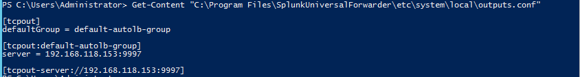

# 🧠 Splunk Universal Forwarder Log Ingestion Lab
*Windows → Splunk Indexer via Universal Forwarder*


---

## 🗂️ Splunk Universal Forwarder Lab Index

Welcome to the **Splunk Universal Forwarder Log Ingestion Lab** — part of the ECL SIEM visibility phase.  
This lab demonstrates Windows → Splunk Indexer integration for centralized event collection and monitoring.

| Step | Description | Link |
|:--|:--|:--|
| 1 | Install the Splunk Universal Forwarder | [View Section →](#step-1) |
| 2 | Configure the Forwarder Outputs | [View Section →](#step-2) |
| 3 | Verify the Forwarder Service | [View Section →](#step-3) |
| 4 | Validate Connectivity to Indexer (TCP/9997) | [View Section →](#step-4) |
| 5 | Confirm Active Forwarder on Indexer | [View Section →](#step-5) |
| 6 | Review Logs in Splunk Web | [View Section →](#step-6) |
| 7 | Review Forwarder Log File | [View Section →](#step-7) |
| ✅ | Verification Summary | [View Section →](#verification-summary) |
| 🧭 | Lessons Learned | [View Section →](#lessons-learned) |

---

## 🎯 Objective
Install, configure, and verify the **Splunk Universal Forwarder** on a **Windows Server (Domain Controller)** to forward **Windows Event Logs** to a **Splunk Indexer**.

---

## 🧩 Topology Overview

| Role | Hostname | IP Address | Description |
|------|-----------|-----------|-------------|
| 🖥️ Windows DC | `ecl-dc01` | `192.168.118.123` | Splunk Universal Forwarder |
| 📊 Splunk Indexer | `splunk` | `192.168.118.153` | Receives logs on port `9997` |

---

<a id="step-1"></a>
## 1️⃣ Install the Splunk Universal Forwarder
Run the MSI installer on the Domain Controller, accept the license, and create an admin user.

🖼 **Screenshot — Forwarder Installation Success**  


---

<a id="step-2"></a>
## 2️⃣ Configure the Forwarder Outputs
During setup, specify:
- **Deployment Server:** *(optional – leave blank)*  
- **Receiving Indexer:** `192.168.118.153`  
- **Port:** `9997`

🖼 **Screenshot — Forwarder Outputs Configuration**  


---

<a id="step-3"></a>
## 3️⃣ Verify the Forwarder Service
After installation, confirm the service status:

```powershell
Get-Service splunkforwarder
