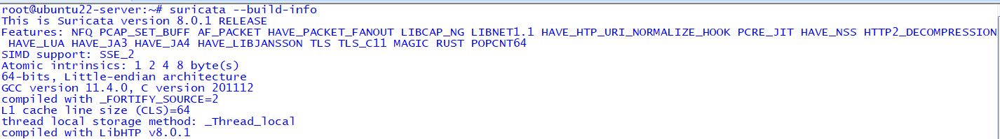
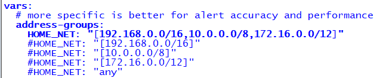
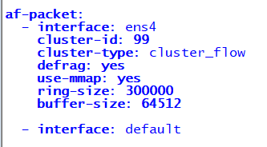
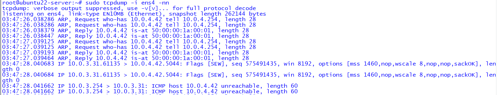
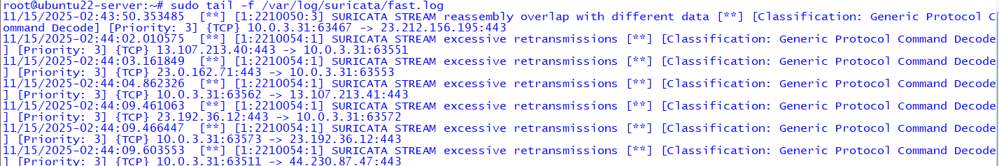
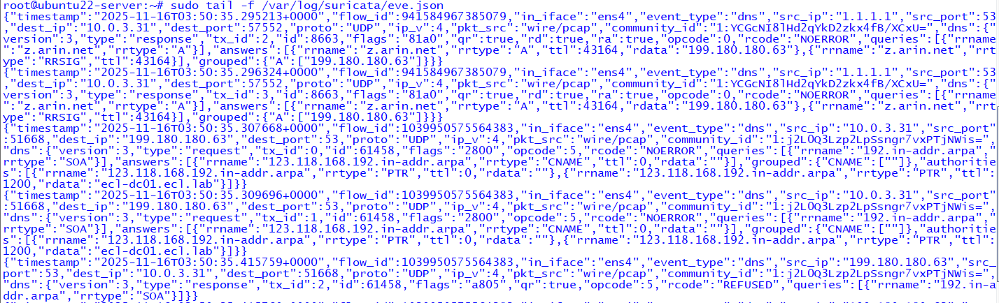

# Suricata IDS Lab – Enterprise Cybersecurity Lab (ECL)

This lab documents the setup, configuration, verification, and alert validation for **Suricata IDS** inside the Enterprise Cybersecurity Lab (ECL). These screenshots demonstrate proper installation, correct interface binding, packet visibility, and alert/log generation for SIEM ingestion.

---

## 1. Suricata Build Information  
This confirms version, architecture, and compiled feature support.



---

## 2. Suricata Configuration (YAML)

### HOME_NET Definition  
Ensures Suricata is monitoring your internal network ranges properly.



### Interface Assignment  
Validates Suricata is bound to the correct SPAN/data-plane interface (e.g., g1/3).



---

## 3. Live Traffic Verification (SPAN / Mirror)

Command executed:

```
sudo tcpdump -i g1/3 -nn
```

This verifies Suricata is receiving real-time mirrored network traffic.



---

## 4. Suricata Alert Verification (fast.log)

Command executed:

```
sudo tail -f /var/log/suricata/fast.log
```

This confirms Suricata is actively detecting threats and anomalies.



---

## 5. EVE JSON Event Stream  
The primary structured JSON output for SIEM ingestion (Splunk, Wazuh, ELK).

Command executed:

```
sudo tail -f /var/log/suricata/eve.json
```



---

# Summary  
This lab verifies the full Suricata pipeline:

- Correct installation  
- Proper interface binding  
- Live packet visibility  
- Alert generation  
- EVE JSON SIEM-ready output  

Suricata is now fully operational within the Enterprise Cybersecurity Lab (Phase 2: Security Visibility & Telemetry).

