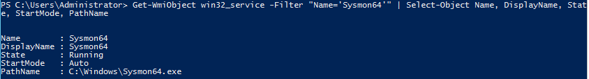
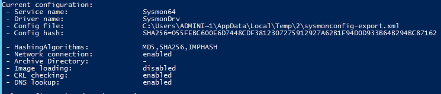
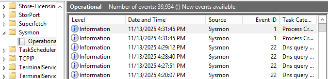
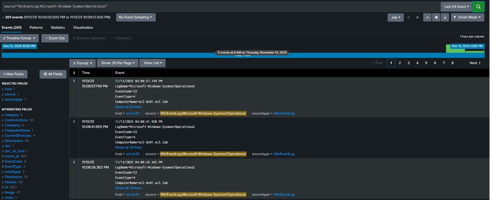
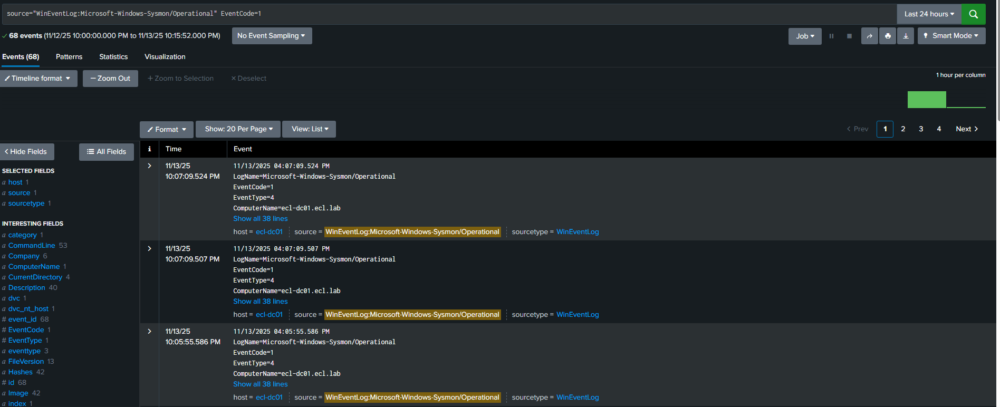
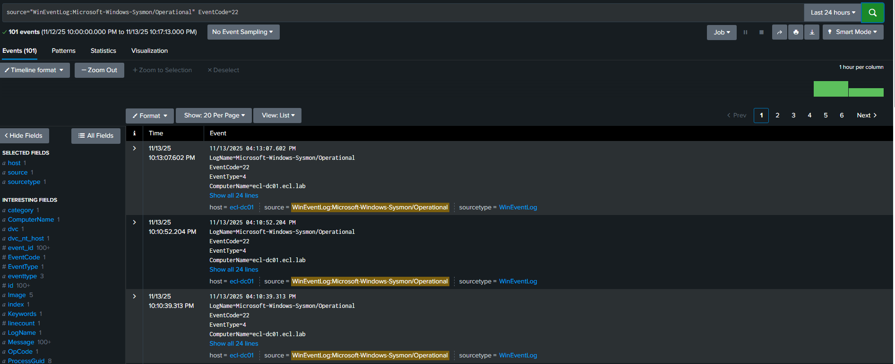

# 🛡️ Sysmon Visibility Lab
**Enterprise Cybersecurity Lab – Phase 2: Security Visibility & Telemetry**

This lab implements **Windows Sysmon** to collect deep endpoint telemetry and forward those logs to **Splunk** using the Splunk Universal Forwarder.

```
Windows → Sysmon → Splunk Forwarder → Splunk Indexer
```

This lab demonstrates endpoint visibility, process monitoring, DNS telemetry, and event enrichment.

---

## 📘 Table of Contents
- Overview  
- Lab Topology  
- Objectives  
- Requirements  
- Sysmon Installation  
- Apply Sysmon Configuration  
- Verify Sysmon Logging  
- Splunk Integration  
- Verification Searches  
- Screenshots  
- Navigation  

---

## 🔎 Overview
Sysmon (System Monitor) is part of Microsoft Sysinternals and provides deep endpoint telemetry such as:

- Process creation (Event ID 1)  
- Network connections  
- DNS queries (Event ID 22)  
- File creation timestamps  
- Registry monitoring  
- Process access  
- WMI monitoring  

This lab shows how to install Sysmon, apply a Sysmon config, and forward logs to Splunk.

---

## 🖥️ Lab Topology

```
+-----------------------------+
| Windows Server (ecl-dc01)   |
| Sysmon + Splunk Forwarder   |
+--------------+--------------+
               |
               v
+-----------------------------+
|     Splunk Indexer          |
+-----------------------------+
```

---

## 🎯 Objectives
- Install Sysmon  
- Apply Sysmon configuration XML  
- Validate Sysmon event generation  
- Forward Sysmon logs to Splunk  
- Validate Process Creation + DNS Query visibility  
- Capture screenshots for your ECL portfolio  

---

## 📦 Requirements
- Windows Server 2019/2022 or Windows 10/11  
- Sysmon64.exe  
- Sysmon configuration XML  
- Splunk Universal Forwarder installed  
- Connective path to Splunk Indexer  

---

## ⚙️ Sysmon Installation

### 1️⃣ Download Sysmon

```powershell
Invoke-WebRequest -Uri "https://live.sysinternals.com/Sysmon64.exe" -OutFile "C:\Tools\Sysmon64.exe"
```

### 2️⃣ Install with configuration

```powershell
sysmon64.exe -accepteula -i sysmon-config.xml
```

### 3️⃣ Verify service status

```powershell
Get-Service Sysmon64
```

**Screenshot:**  


**Service Details:**  


---

## 📄 Apply Sysmon Configuration

To update Sysmon config:

```powershell
sysmon64.exe -c sysmon-config.xml
```

**Screenshot:**  


---

## 📊 Verify Sysmon Logging

Open:

**Event Viewer → Applications and Services Logs → Microsoft → Windows → Sysmon → Operational**

You should see:

- Event ID 1 (Process Create)  
- Event ID 22 (DNS Query)  
- Event ID 3 (Network Connect)

**Screenshot:**  


---

## 🔁 Splunk Integration

Your working `inputs.conf`:

```
[WinEventLog://Microsoft-Windows-Sysmon/Operational]
disabled = 0
index = wineventlog
renderXml = true
sourcetype = XmlWinEventLog:Microsoft-Windows-Sysmon/Operational
```

Splunk confirmed logs arriving using:

```
source="WinEventLog:Microsoft-Windows-Sysmon/Operational"
```

---

## 📡 Verification Searches

### ✔️ 1. All Sysmon Events  

```
source="WinEventLog:Microsoft-Windows-Sysmon/Operational"
```

**Screenshot:**  


---

### ✔️ 2. Process Creation Events (Event ID 1)

```
source="WinEventLog:Microsoft-Windows-Sysmon/Operational" EventCode=1
```

Trigger events:

```powershell
notepad.exe
calc.exe
cmd.exe
powershell.exe
```

**Screenshot:**  


---

### ✔️ 3. DNS Query Events (Event ID 22)

```
source="WinEventLog:Microsoft-WWindows-Sysmon/Operational" EventCode=22
```

Generate DNS traffic:

```powershell
nslookup google.com
nslookup github.com
nslookup microsoft.com
```

**Screenshot:**  


---

## 📸 Screenshots

Store all images in:

```
sysmon-lab/screenshots/
```

Screenshots included:

- `sysmon-config.png`  
- `sysmon-eventviewer-operational.png`  
- `sysmon-service-status.png`  
- `sysmon-service-details.png`  
- `splunk-sysmon-events.png`  
- `splunk-process-creation.png`  
- `splunk-dns-events.png`  

---

## 🔗 Navigation

**⬅ Back to SIEM Folder**  
`../`

**⬅ Back to ECL Home**  
`../../README.md`

---

This completes the Sysmon → Splunk visibility lab.
