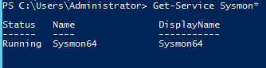

# 🛡️ Sysmon Visibility Lab  
**Enterprise Cybersecurity Lab – Phase 2: Security Visibility & Telemetry**

This lab implements **Windows Sysmon** to collect deep endpoint telemetry and forward those logs to **Splunk** through your existing SIEM pipeline.

```
Windows → Sysmon → Splunk Forwarder → Splunk Indexer
```

This README is built specifically for your environment and aligned with the rest of your ECL Phase‑2 labs.

---

## 📘 Table of Contents
- Overview  
- Lab Topology  
- Objectives  
- Requirements  
- Sysmon Installation  
- Apply Sysmon Configuration  
- Verify Sysmon Logging  
- Splunk Integration  
- Verification Queries  
- Screenshots  
- Navigation  

---

## 🔎 Overview
Sysmon (System Monitor) is part of the Sysinternals Suite and provides enhanced Windows endpoint visibility by logging:

- Process Creation (Event ID 1)  
- Network Connections (Event ID 3)  
- Registry Modifications  
- File Creation Timestamps  
- DNS Queries (Event ID 22)  
- Process Access  
- WMI Activity  

In this lab, Sysmon logs are forwarded to Splunk using the Splunk Universal Forwarder via the `WinEventLog://Microsoft-Windows-Sysmon/Operational` input.

---

## 🖥️ Lab Topology
```
+-----------------------------+
| Windows Server (ecl-dc01)   |
| Sysmon + Splunk Forwarder   |
+--------------+--------------+
               |
               v
+-----------------------------+
| Splunk Indexer (192.168.x) |
+-----------------------------+
```

---

## 🎯 Objectives
- Install Sysmon  
- Apply Sysmon configuration  
- Confirm Sysmon is generating events  
- Forward Sysmon logs to Splunk  
- Validate Process Creation & DNS Query events  
- Capture screenshots for GitHub documentation  

---

## 📦 Requirements
- Windows Server 2019/2022 or Windows 10/11  
- Sysmon  
- Sysmon configuration XML  
- Splunk Universal Forwarder installed and configured  
- Splunk Indexer  

---

## ⚙️ Sysmon Installation

### 1️⃣ Download Sysmon
```powershell
Invoke-WebRequest -Uri "https://live.sysinternals.com/Sysmon64.exe" -OutFile "C:\Tools\Sysmon64.exe"
```

### 2️⃣ Install Sysmon with configuration
```powershell
sysmon64.exe -accepteula -i sysmon-config.xml
```

### 3️⃣ Verify Sysmon service
```powershell
Get-Service Sysmon64
```

You should see **Status: Running**.

Screenshot:  



Screenshot:  
🖼 `sysmon-service-details.png`

---

## 📄 Apply Sysmon Configuration

Place your Sysmon configuration file at:

```
C:\Tools\sysmon-config.xml
```

To update configuration later:

```powershell
sysmon64.exe -c sysmon-config.xml
```

Screenshot reference:  
🖼 `sysmon-config.png`

---

## 📊 Verify Sysmon Logging in Windows

### Event Viewer:
**Applications and Services Logs → Microsoft → Windows → Sysmon → Operational**

You should see events such as:
- Event ID 1 (Process Create)  
- Event ID 22 (DNS Query)

Screenshot reference:  
🖼 `sysmon-eventviewer-operational.png`

---

## 🔁 Splunk Integration

Your working inputs.conf:

```
[WinEventLog://Microsoft-Windows-Sysmon/Operational]
disabled = 0
index = wineventlog
renderXml = true
sourcetype = XmlWinEventLog:Microsoft-Windows-Sysmon/Operational
```

Splunk confirmed logs arriving with:
```
source = WinEventLog:Microsoft-Windows-Sysmon/Operational
host = ecl-dc01
```

---

## 📡 Verification Searches (Splunk)

### ✔️ 1. All Sysmon Events  
```
source="WinEventLog:Microsoft-Windows-Sysmon/Operational"
```
Screenshot:  
🖼 `splunk-sysmon-events.png`

---

### ✔️ 2. Process Creation Events (Event ID 1)  
```
source="WinEventLog:Microsoft-Windows-Sysmon/Operational" EventCode=1
```

Trigger new events:
```powershell
notepad.exe
calc.exe
cmd.exe
powershell.exe
```

Screenshot:  
🖼 `splunk-process-creation.png`

---

### ✔️ 3. DNS Query Events (Event ID 22)  
```
source="WinEventLog:Microsoft-Windows-Sysmon/Operational" EventCode=22
```

Trigger new DNS lookups:
```powershell
nslookup google.com
nslookup microsoft.com
nslookup github.com
```

Screenshot:  
🖼 `splunk-dns-events.png`

---

## 📸 Screenshots

Store all screenshots under:

```
enterprise-cybersecurity-lab/siem/sysmon-lab/screenshots/
```

Include these 7 screenshots:

1. `sysmon-config.png`  
2. `sysmon-service-status.png`  
3. `sysmon-service-details.png`  
4. `sysmon-eventviewer-operational.png`  
5. `splunk-sysmon-events.png`  
6. `splunk-process-creation.png`  
7. `splunk-dns-events.png`  

---

## 🔗 Navigation

**↩ Back to SIEM Folder**  
`../`

**↩ Back to ECL Home**  
`../../README.md`

---

This completes the Sysmon → Splunk visibility lab.

