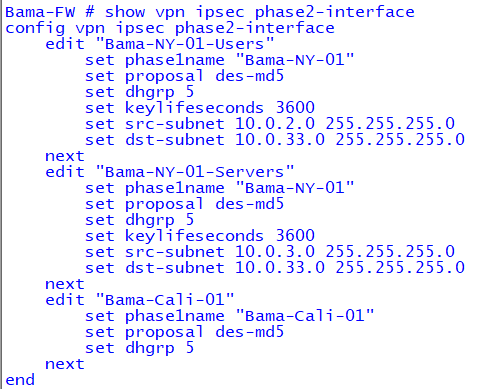
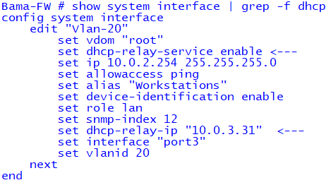
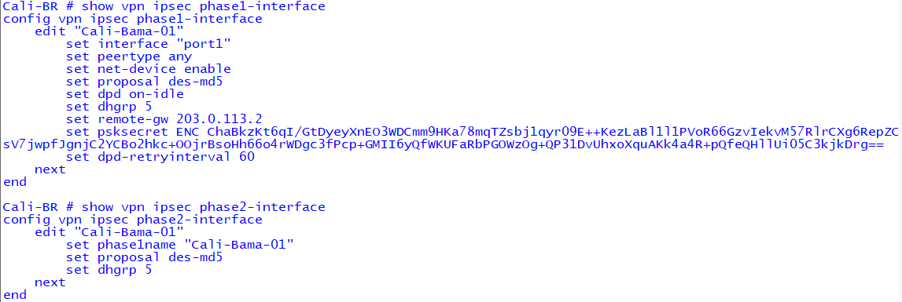
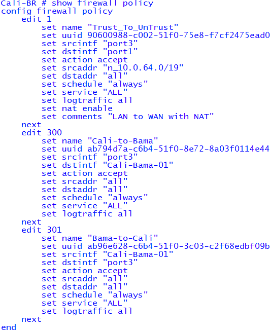

# 🏢 Enterprise Cybersecurity Lab  
## 🔐 Hub-and-Spoke VPN + Centralized DHCP Case Study  
### (Bama Hub – NY Spoke – Cali Spoke)

This lab demonstrates a production-grade **hub-and-spoke VPN architecture** between three sites (Bama, NY, and Cali) using **Fortinet + Palo Alto firewalls**, with **centralized DHCP services** routed securely across IPSec tunnels.

This environment mirrors real enterprise hybrid topologies where:
- Branches rely on HQ for DHCP  
- Routing, VPN, and security policies must interoperate across vendors  
- Connectivity and telemetry flow through a central hub  

---

# 🧭 **1. Architecture Overview**

### **Hub: Bama-FW (Fortinet)**
- Acts as central VPN concentrator  
- Provides DHCP relay for all spokes  
- Hosts 10.0.3.0/24 (DC/Servers) and 10.0.2.0/24 (Users)

### **Spoke 1: NY-FW (Palo Alto)**
- Multiple proxy-IDs for Users + Servers  
- Receives DHCP via IPSec tunnel from Bama

### **Spoke 2: Cali-FW (Fortinet)**
- ANY/ANY selectors for simplicity  
- Routes 10.0.2.0/24 and 10.0.3.0/24 back through tunnel

---

# 🖼️ **2. Topology Diagram**

```
                ┌────────────────────┐
                │    NY (Palo Alto)  │
                │   10.0.33.0/24     │
                └─────────▲──────────┘
                          IPSec
                            ▲
                            │
                            ▼
      ┌─────────────────────────────────────────┐
      │              Bama Hub (Fortinet)        │
      │         10.0.2.0/24 (Users)             │
      │         10.0.3.0/24 (Servers/DC)        │
      │         DHCP Relay → 10.0.3.31          │
      └─────────▲──────────────▲───────────────┘
                IPSec          IPSec
                  ▲              ▲
                  │              │
                  ▼              ▼
        ┌──────────────────┐      
        │   Cali (Fortinet)│
        │   10.0.64.0/24   │
        └──────────────────┘
```

---

# 📸 **3. Screenshot Evidence**

## 🟦 **Bama (Hub)**

### Phase 1


### Phase 2


### VPN Summary


### DHCP Relay Configuration


---

## 🟩 **Cali (Spoke)**

### Phase1 + Phase2


### Static Routes


### VPN Summary


### Firewall Policies


---

## 🟥 **NY (Palo Alto Spoke)**

### IKE + IPSec SA Status


### IPSec SAs / Proxy-IDs


---

# 🧪 **4. Connectivity Verification**

### Cali → Bama DC (10.0.3.31)
```
execute ping 10.0.3.31
```

### Cali → Bama User Subnet (10.0.2.21)
```
execute ping 10.0.2.21
```

### NY → Bama (source inside)
```
ping source <NY-inside-interface> 10.0.3.31
```

All tests successful.

---

# 🛠️ **5. Troubleshooting Notes**

### 🔹 Selector Mismatch
Initially Bama and Cali selectors did not align. Converting Cali to ANY/ANY resolved mismatch.

### 🔹 `net-device enable`
Required on Fortinet tunnel interfaces for proper routing.

### 🔹 Palo Alto Proxy-IDs
Palo Alto required **two** proxy-IDs for NY:
- Users ↔ Users  
- Servers ↔ Servers  

### 🔹 DHCP Relay
DHCP relay must be configured on the correct VLAN subinterface:
```
set dhcp-relay-service enable
set dhcp-relay-ip <DC Address>
```

---

# 🎓 **6. Lessons Learned**

- Hub-and-spoke VPN is highly scalable when spokes use simplified selectors  
- DHCP relay centralization reduces branch management overhead  
- Cross-vendor IPSec requires *exact* matches in Phase1/Phase2  
- Proxy-IDs must map 1:1 between Palo Alto and Fortinet  
- Routing consistency is critical for VPN stability  

---

# 💼 **7. Hiring Manager Summary**

This case study demonstrates hands-on experience with:

- Multi-site IPSec VPN design  
- Interoperability between Fortinet + Palo Alto  
- Centralized DHCP relay over VPN  
- Real-world subnet design  
- Routing, NAT, firewall policies, and selector tuning  
- Full end-to-end validation and documentation  

This lab showcases **network security architecture**, **multi-vendor VPN integration**, and **enterprise-level troubleshooting skills**.

---

# ✔ Completed  
This lab is fully documented and validated as part of the **Enterprise Cybersecurity Lab** project.

