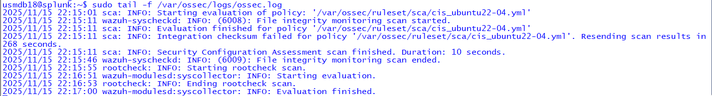
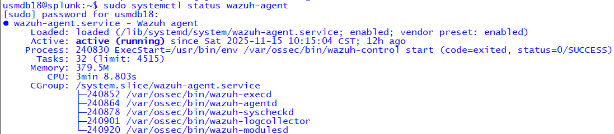
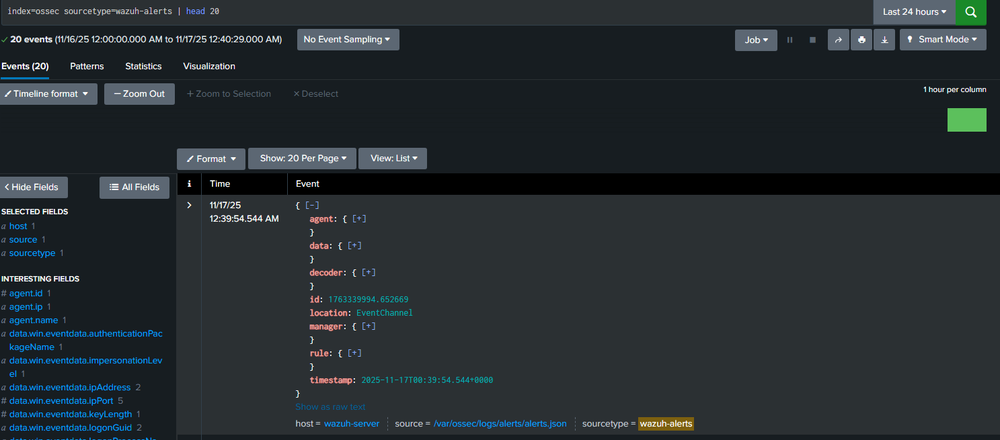

# 🛡️ **Wazuh SIEM Lab – Enterprise Cybersecurity Lab (ECL)**

This lab documents the setup, validation, and SIEM integration of **Wazuh** inside the Enterprise Cybersecurity Lab (ECL).  
It demonstrates successful agent enrollment, decoding, rule matching, Wazuh-Manager health, and end-to-end forwarding of alerts into **Splunk Enterprise** for SOC investigation workflows.

---

## 🏗️ **Architecture Overview**

```
       [Linux Endpoint]
              │
        Wazuh Agent
              │
      ┌────────────────┐
      │ Wazuh Manager  │
      └────────────────┘
              │
      Forwarded Alerts (JSON)
              │
     [Splunk Enterprise]
```

---

## 📂 **File Structure**

```
wazuh-lab/
├── screenshots/
│   ├── wazuh-active-agents.png
│   ├── wazuh-agent-info.png
│   ├── wazuh-agent-log.png
│   ├── wazuh-agent-status.png
│   ├── wazuh-manager-status.png
│   ├── wazuh-to-splunk-alerts.png
└── README.md
```

---

# 🔍 **1. Wazuh Agent Enrollment**

Shows that the Linux host is enrolled and communicating.


---

# 🔍 **2. Agent Info**

Displays agent metadata, IP, status, and last connection.


---

# 🔍 **3. Wazuh Agent Log Output**

Shows initial agent telemetry and confirms communication with Wazuh Manager.



---

# 🔍 **4. Wazuh Agent Status**

Shows enabled modules such as syscheck, logcollector, and syscollector.



---

# 🔍 **5. Wazuh Manager Status**

Validates that core Wazuh services are active.


---

# 🔍 **6. Splunk Forwarded Events**

This screenshot verifies that Wazuh alerts reach Splunk  
(index = `ossec`), confirming end-to-end SIEM integration.



---

# 📝 **Summary**

This lab demonstrates full Wazuh-to-Splunk integration inside the Enterprise Cybersecurity Lab (ECL), including:

- Agent enrollment  
- Decoding and rule evaluation  
- Wazuh Manager health validation  
- Alerts successfully forwarded and indexed by Splunk  
- SOC-ready detection and investigation workflow  

Wazuh now serves as a core SIEM component within your ECL environment — powering host telemetry, alerting, and threat detection for further labs such as detection engineering, threat hunting, and incident response.

---

### Phase 2 SIEM Flow Navigation

⬅️ Previous: [Sysmon Endpoint Lab](../sysmon-lab/)  
➡️ Next: [Zeek Network Metadata Lab →](../zeek-lab/)

[⬅ Back to Phase 2 Overview](../README.md)

