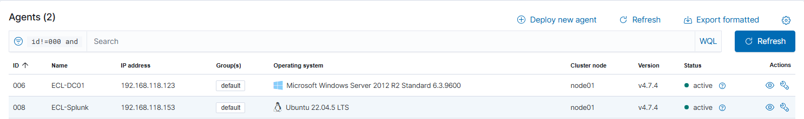
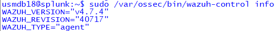
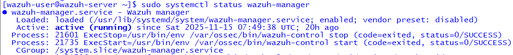

# Wazuh SIEM Lab

## 1. Wazuh Agent Enrollment

Shows that the Linux host is enrolled and communicating.

## 2. Agent Info

Displays agent metadata, IP, status, and last connection.

## 3. Wazuh Manager Status

Validation that the manager services are active.

## 4. Wazuh Logtest Validation

Demonstrates decoding and rule triggering using wazuh-logtest.

## 5. Splunk Forwarded Events

Shows Wazuh alerts arriving successfully in Splunk.

## 6. Architecture Diagram (Text-Based)

            [Linux Hosts / Endpoints]
                     |
                Wazuh Agent
                     |
            --------------------
            |   Wazuh Manager  |
            --------------------
                     |
            Forwarded Alerts
                     |
                  Splunk

## Summary

This lab demonstrates full Wazuh agent enrollment, alert generation,
rule matching, and forwarding to Splunk for SOC investigation workflows.
