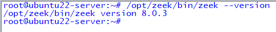
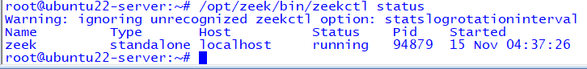
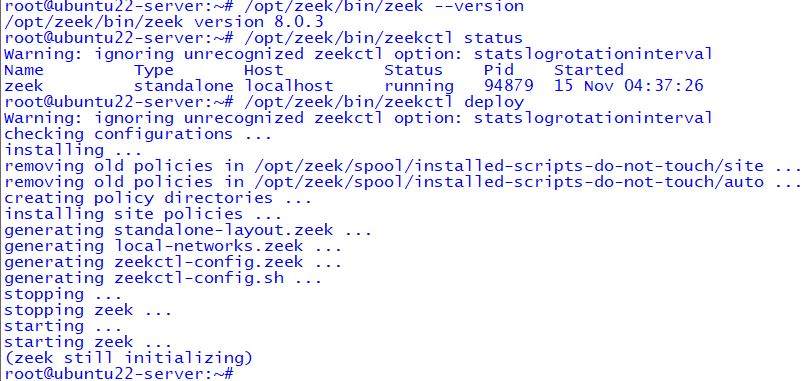
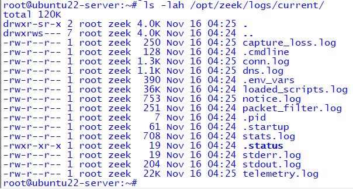
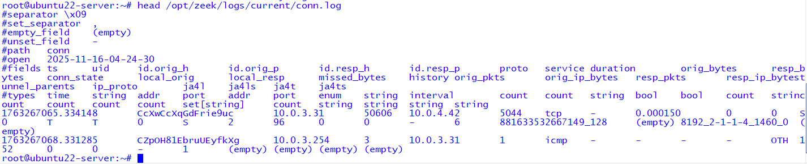

# Zeek Network Security Monitoring Lab – Enterprise Cybersecurity Lab (ECL)

This lab documents the setup, verification, and SIEM integration of **Zeek** inside the Enterprise Cybersecurity Lab (ECL).  
These screenshots demonstrate correct installation, ZeekControl status, startup behavior, log generation, and metadata parsing for network security visibility.

---

## 1. Zeek Version  
This confirms the installed Zeek binary version.

**Command Used:**
```
/opt/zeek/bin/zeek --version
```



---

## 2. Zeek Service Status (ZeekControl)  
ZeekControl manages Zeek as a standalone node.  
This screenshot verifies the service is running and stable.

**Command Used:**
```
/opt/zeek/bin/zeekctl status
```



---

## 3. Zeek Deployment / Startup Confirmation  
Restarting or deploying via ZeekControl validates script installation, configuration checks, and Zeek initialization.

**Command Used:**
```
/opt/zeek/bin/zeekctl deploy
```



---

## 4. Zeek Log Directory  
Zeek writes structured logs to `/opt/zeek/logs/current/`.  
This screenshot verifies correct log generation and rotation.

**Command Used:**
```
ls -lah /opt/zeek/logs/current/
```



---

## 5. Zeek Metadata Log Sample (conn.log)  
This screenshot demonstrates Zeek’s core functionality: extracting connection metadata from mirrored network traffic.

**Command Used:**
```
head /opt/zeek/logs/current/conn.log
```



---

# Summary  
Your Zeek deployment is fully operational and integrated within the ECL environment:

- Zeek installed successfully  
- Managed via **ZeekControl**  
- Running as a **standalone** node  
- Logs written to `/opt/zeek/logs/current/`  
- Connection metadata successfully parsed  
- Ready for SIEM ingestion (Splunk, Wazuh, ELK)

Zeek provides deep network visibility in **Phase 2: Security Visibility & Telemetry** of the Enterprise Cybersecurity Lab.

---
### Phase 2 SIEM Flow Navigation

⬅️ Previous: [Wazuh SIEM Lab](../wazuh-lab/)

[🏠 Back to Phase 2 Overview](./README.md)


