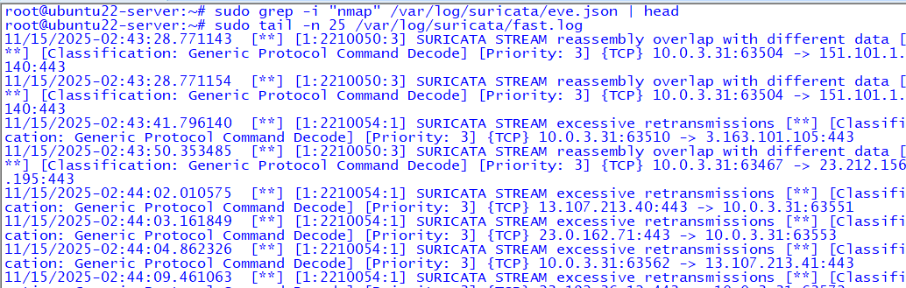
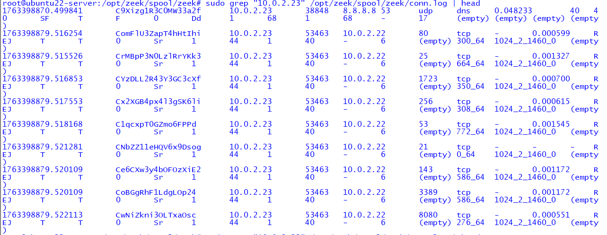
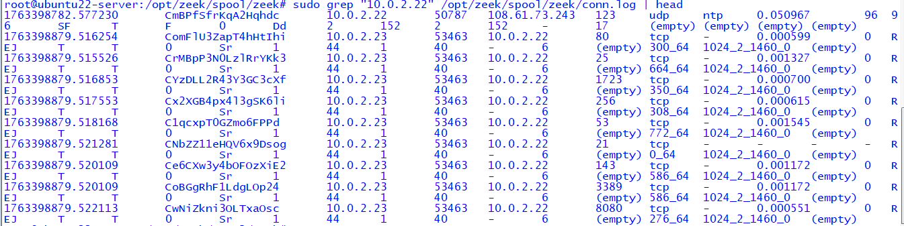
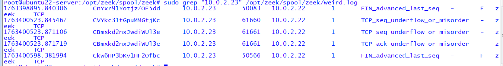
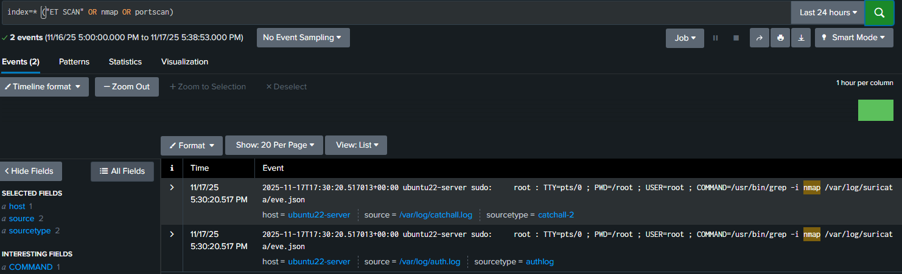

# 🛡️ Enterprise Cybersecurity Lab – Phase 4
## Threat Detection & Response  
### Detection Lab #1 — Nmap Port Scan Reconnaissance

## 📌 Overview
This mini-lab demonstrates how an adversary performing **internal network reconnaissance** using **Nmap** is detected across:

- **Suricata IDS (SPAN-based visibility)**
- **Zeek Network Security Monitor**
- **Splunk SIEM Correlation**

A Kali machine inside the **User VLAN (VLAN 20)** simulates a compromised workstation conducting lateral reconnaissance against another internal system.

---

## 🧩 Lab Topology Context
- **Attacker:** Kali Linux (10.0.2.23 – VLAN 20)  
- **Target Host:** Internal endpoint (10.0.2.22 – VLAN 20)  
- **IDS/NSM Sensor:** Suricata + Zeek (Ubuntu121 w/ SPAN feed)  
- **SIEM:** Splunk Enterprise  

Suricata and Zeek passively inspect all mirrored VLAN 20 traffic from the Bama Switch.

---

## ⚔️ Phase 1 — Attack Execution (Kali 10.0.2.23)

### 1. Basic SYN Scan
```
sudo nmap -sS 10.0.2.22
```

### 2. Version + OS Detection
```
sudo nmap -sS -sV -O 10.0.2.22
```

### 3. Aggressive Full Scan
```
sudo nmap -A 10.0.2.22
```

---

## 🔎 Phase 2 — Suricata Detection (Ubuntu121)

### Suricata Alerts
```
sudo tail -n 25 /var/log/suricata/fast.log
```



---

## 📡 Phase 3 — Zeek NSM Detection

### Zeek conn.log – Attacker View
```
sudo grep "10.0.2.23" /opt/zeek/spool/zeek/conn.log | head -n 15
```



---

### Zeek conn.log – Target View
```
sudo grep "10.0.2.22" /opt/zeek/spool/zeek/conn.log | head -n 15
```



---

### Zeek weird.log – Packet Anomalies
```
sudo grep "10.0.2.23" /opt/zeek/spool/zeek/weird.log
```



---

## 📊 Phase 4 — Splunk SIEM Correlation

### Suricata-related search
```
index=* ("ET SCAN" OR nmap OR portscan)
```



---

## 📁 Screenshots Folder Structure
```
nmap-port-scan-lab/
└── screenshots/
    ├── suricata-nmap-alerts.png
    ├── zeek-connlog-attacker-nmap.png
    ├── zeek-connlog-target-nmap.png
    ├── zeek-weirdlog-nmap.png
    ├── splunk-suricata-nmap.png
```

---

## 📝 Analyst Summary
This lab demonstrates:
- Internal recon behavior
- IDS/NSM visibility from a SPAN port
- Suricata packet anomaly detection
- Zeek protocol-level scan visibility
- Splunk ingestion and search capability

---

## 🔙 Navigation
- [Back to Phase 4 Overview](../../README.md)
- [ECL Home](../../../README.md)
