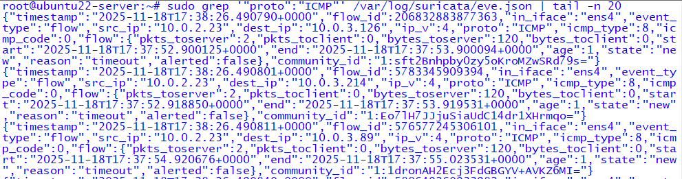
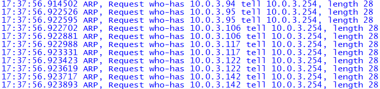
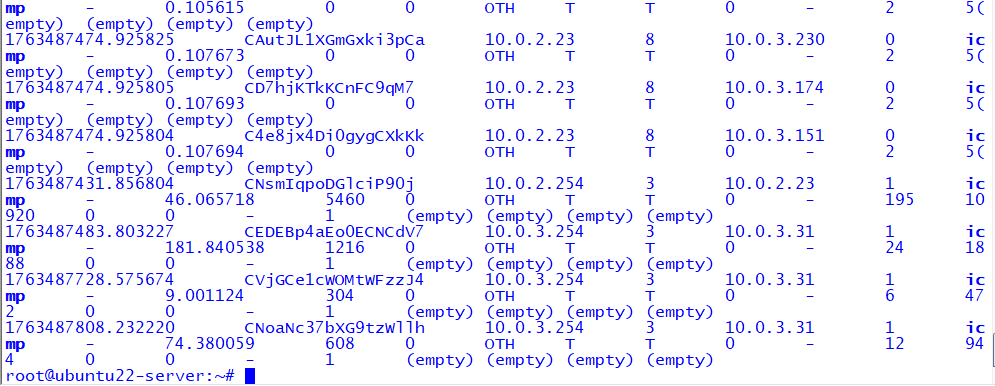
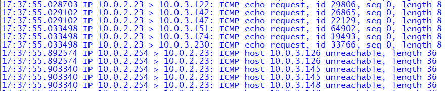

# 🛰️ Module 2 — Nmap Host Discovery Scan (ICMP Sweep)

This module demonstrates how a simple **Nmap host discovery scan (`-sn`)** generates  
**ICMP Echo Requests** and **ARP traffic**, and how those packets appear inside the SOC pipeline:

- **Suricata IDS** (SPAN-based visibility)
- **Zeek Network Security Monitor**
- **tcpdump** (packet capture validation)

---

## 🎯 Objective

Identify how an internal attacker performing host discovery is detected across multiple telemetry sources.

This module answers:

1. **What traffic does an Nmap `-sn` scan generate?**  
2. **How does Suricata log this reconnaissance attempt?**  
3. **How does Zeek record ARP/ICMP activity?**  
4. **How would a SOC analyst validate and interpret this activity?**

---

## 🔎 Attack Description — Nmap Host Discovery

The attacker (Kali: `10.0.2.23`) performs a host sweep:

```bash
nmap -sn 10.0.3.0/24
```

This generates:

- **ARP Requests** (for hosts on the same VLAN)
- **ICMP Echo Requests** (for hosts on remote VLANs)
- **No port scanning** — discovery only

---

# 📡 Detection Walkthrough

---

## 1️⃣ Suricata — ICMP Visibility (eve.json)

Suricata detects the ICMP echo requests coming from the attacker.

### 📸 Screenshot — Suricata ICMP Flow (eve.json)


---

## 2️⃣ tcpdump — ARP Traffic Capture

ARP packets reveal layer‑2 probing of local VLAN addresses.

### 📸 Screenshot — ARP Packet Capture  


---

## 3️⃣ Zeek — Conn.log Detection of ICMP Sweep

Zeek logs ICMP flow records for each probe.

### 📸 Screenshot — Zeek ICMP conn.log Entry  


---

## 4️⃣ tcpdump — ICMP Echo Requests

Packet capture validation of the Nmap ICMP probes.

### 📸 Screenshot — tcpdump ICMP Echo Requests  


---

# 🧠 SOC Analyst Interpretation

### What This Activity Suggests
- Lateral movement reconnaissance  
- Mapping internal IP space  
- Discovering reachable systems  
- Pre-attack enumeration prior to credential testing or exploitation

### Is This Malicious?
**High probability (Medium–High severity)**  
Nmap sweeps are rarely normal in enterprise environments unless done by IT security teams.

### Recommended Actions
- Verify whether the source host is authorized to run scans  
- Search for correlated authentication failures or SMB enumeration  
- Monitor for immediate follow-up activity:
  - Port scans  
  - Brute-force attempts  
  - Suspicious service connections  

---

# 📁 Navigation

🔙 [Back to SOC Home](../README.md)  
🔙 [Back to ECL Root](../../README.md)

