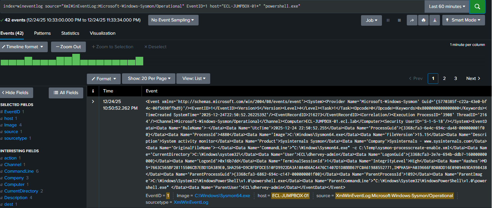
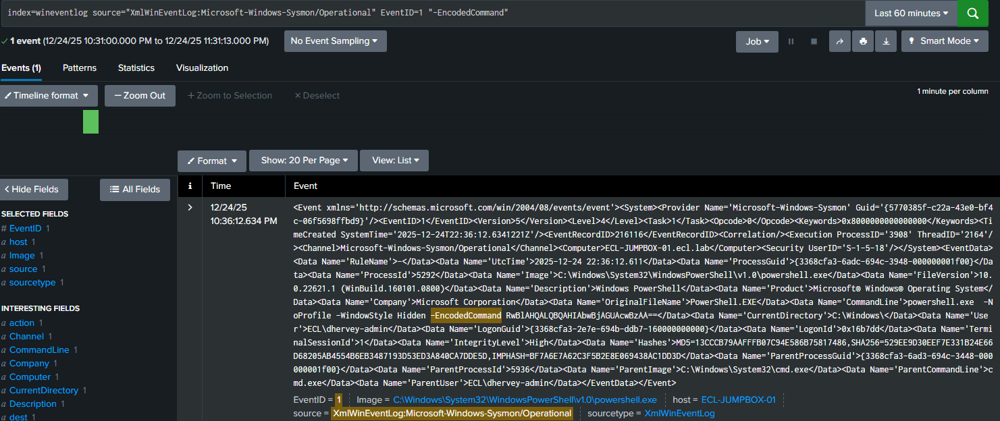

# 🟡 Module 3 — Detecting Malicious PowerShell Activity (Expected vs Unexpected)

## Overview
This module demonstrates how a SOC analyst differentiates legitimate administrative PowerShell usage from suspicious, obfuscated PowerShell execution using Sysmon process creation telemetry and Splunk SIEM analysis.

Rather than treating all PowerShell activity as malicious, this module focuses on contextual analysis of command-line behavior, which is critical for reducing false positives in real SOC environments.

---

## Objective
Validate the analyst’s ability to:
- Confirm PowerShell process creation telemetry
- Distinguish expected vs unexpected PowerShell execution
- Identify obfuscation and evasion techniques
- Make a defensible SOC triage decision based on evidence

---

## Telemetry Source
- Endpoint Telemetry: Sysmon
- Event Type: Process Create
- Sysmon Event ID: 1
- SIEM: Splunk
- Index: wineventlog
- Source: XmlWinEventLog:Microsoft-Windows-Sysmon/Operational

---

## Scenario Summary
Two PowerShell executions were observed on a Windows endpoint:

1. A benign, expected PowerShell execution consistent with administrative activity.
2. A suspicious PowerShell execution using encoded commands and hidden execution.

The analyst must determine which activity requires escalation.

---

## Detection and Investigation

### Expected PowerShell Execution (Benign)

Observed characteristics:
- Process: powershell.exe
- Command line is readable and unobfuscated
- No attempt to hide execution
- No encoding or evasion flags present

Splunk validation:
```
index=wineventlog source="XmlWinEventLog:Microsoft-Windows-Sysmon/Operational" EventID=1 "powershell.exe"
```

**Screenshot – Expected PowerShell Execution**




SOC assessment:
PowerShell execution observed with clear command-line arguments and no signs of obfuscation.
Activity is consistent with normal administrative or scripting behavior.

Disposition:
- Severity: Low
- Action: No escalation required
- Classification: Expected behavior

---

### Unexpected PowerShell Execution (Suspicious)

Observed characteristics:
- Process: powershell.exe
- Command line includes:
  - -EncodedCommand
  - -WindowStyle Hidden
  - -NoProfile
- Execution hidden from user visibility
- Encoded payload used to obscure intent

Splunk validation:
```
index=wineventlog source="XmlWinEventLog:Microsoft-Windows-Sysmon/Operational" EventID=1 "-EncodedCommand"
```

**Screenshot – Encoded / Suspicious PowerShell Execution**




SOC assessment:
PowerShell executed with encoded commands and hidden window style, consistent with obfuscation and defense evasion techniques commonly observed in malicious activity.

Disposition:
- Severity: High
- Action: Escalate for investigation
- Classification: Suspicious behavior

---

## Analyst Decision Summary

| Execution Type                 | Classification | Action    |
|--------------------------------|----------------|-----------|
| Plain-text PowerShell          | Expected       | No action |
| Encoded and hidden PowerShell  | Suspicious     | Escalate |

---

## Key Takeaways
- PowerShell usage alone is not inherently malicious
- Command-line context is critical for accurate detection
- Encoded commands and hidden execution are strong indicators of suspicious activity
- Short-lived processes are often more reliably analyzed in a SIEM than in local event viewers
- Effective SOC analysis focuses on behavior, not just tooling

---

## Why This Matters
This module reflects real-world SOC workflows where analysts must:
- Avoid alert fatigue
- Reduce false positives
- Identify true attacker tradecraft
- Justify decisions with clear evidence

The focus on expected vs unexpected behavior mirrors how mature SOC teams handle PowerShell activity at scale.

---

## Module Status
🟢 Complete

