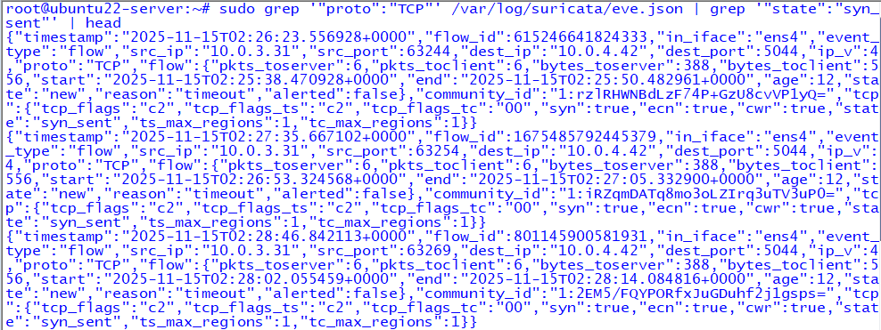
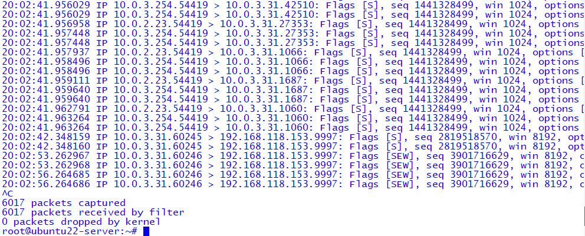
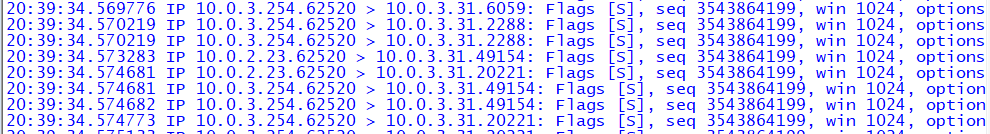

# 🛡️ Module 3 --- Nmap Port Scanning Detection

## Enterprise Cybersecurity Lab -- Phase 4 (Threat Detection & Response)

------------------------------------------------------------------------

## 📌 Overview

This module demonstrates detection of **Nmap SYN scan reconnaissance**
using:

-   **Suricata IDS** (SPAN-based packet visibility)\
-   **Zeek Network Security Monitor**\
-   **tcpdump packet capture**

The attacker is a Kali machine inside **VLAN 20**, scanning another
internal host.\
Suricata + Zeek (Ubuntu121) receives mirrored traffic.

------------------------------------------------------------------------

## ⚔️ Phase 1 --- Attack Execution (Kali 10.0.2.23)

### 🔹 SYN Scan

    sudo nmap -sS 10.0.3.31

------------------------------------------------------------------------

## 🔎 Phase 2 --- Suricata Detection

Command used:

    sudo grep '"proto":"TCP"' /var/log/suricata/eve.json | grep '"state":"syn_sent"'

### 📸 Screenshot

------------------------------------------------------------------------

## 📡 Phase 3 --- Packet Capture (tcpdump)

Command used:

    sudo tcpdump -nnvvv -i ens4 tcp[tcpflags] & 2 != 0

### 📸 Screenshot

------------------------------------------------------------------------

## 📘 Phase 4 --- Zeek NSM Visibility

Command used:

    sudo grep "10.0.2.23" /opt/zeek/logs/current/conn.log | head

### 📸 Screenshot

------------------------------------------------------------------------

## 📁 Screenshot Folder Structure

    module_3-nmap-port-scanning/
    └── screenshots/
        ├── module3-suricata-synscan-evejson.png
        ├── tcpdump-syn-scan-capture.png
        ├── suricata-zeek-synscan-tcpdump.png

------------------------------------------------------------------------

## 📝 Analyst Summary

This module demonstrates:

-   SYN scan behavior from attacker → internal host\
-   Suricata's detection of **unfinished TCP handshakes**\
-   Zeek's conn.log tracking abnormal connection attempts\
-   tcpdump verifying raw SYN packets

------------------------------------------------------------------------

## 🔙 Navigation

-   [Back to SOC Root](../README.md)\
-   [Back to ECL Home](../../README.md)
