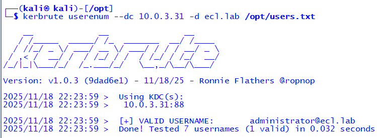
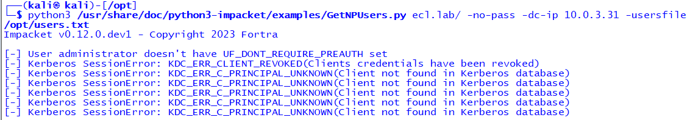
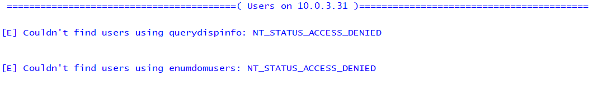
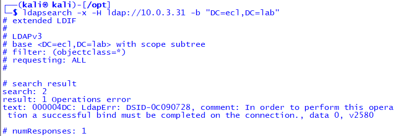
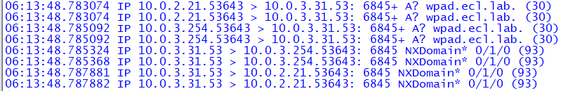
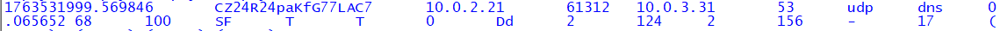
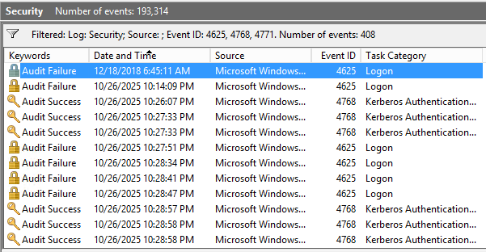
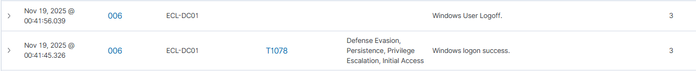

# 🛡️ Enterprise Cybersecurity Lab – Phase 4, Module 4
# Active Directory Credential Enumeration & Detection

This module demonstrates how adversaries enumerate Active Directory accounts using common offensive techniques, and how enterprise security controls (Suricata, Zeek, Windows Event Logs, Wazuh) detect the activity.

## 📁 Folder Structure
```
module_4-ad-credential-enumeration/
│── README.md
└── screenshots/
    ├── asrep-enum.png
    ├── enum4linux-users.png
    ├── kerbrute-user-enum.png
    ├── ldapsearch-enum.png
    ├── suricata-dns.png
    ├── zeek-dns.png
    ├── windows-detection-4625-4768.png
    └── wazuh-auth-events.PNG
```

## 📸 Screenshots (Click to View)

### 1. Kerbrute – User Enumeration


### 2. AS-REP Roasting Enumeration


### 3. Enum4Linux – User Enumeration


### 4. LDAP Anonymous Enumeration


### 5. Suricata – DNS Reconnaissance Visibility


### 6. Zeek – DNS / Directory Resolution Logs


### 7. Windows Security Logs – Failed & Kerberos Logons (4625, 4768)


### 8. Wazuh – Windows Authentication Events Ingestion


## 🧩 MITRE ATT&CK Mapping
| Technique | ID | Description |
|----------|------|-------------|
| Account Discovery | T1087 | Enumerating users & groups via Kerbrute, Enum4Linux, LDAP |
| Brute Force | T1110 | High-volume Kerberos authentication attempts |
| Kerberos Pre-Auth | T1558.004 | AS-REP roasting |
| Credential Access | TA0006 | Enumeration & pre-auth bypass behavior |
| Initial Access | T1078 | Wazuh-mapped authentication events |

## 📝 Analyst Summary
During this module, the attacker workstation executed multiple AD enumeration techniques commonly used during penetration testing and adversarial reconnaissance.

The SOC visibility stack successfully revealed:
- DNS reconnaissance (Suricata + Zeek)
- Kerberos authentication attempts (Windows 4768)
- Failed logon attempts (Windows 4625)
- Host-based detection telemetry (Wazuh)

This demonstrates full visibility across:
- Network layer
- Protocol layer
- Authentication layer
- Endpoint/SIEM ingestion layer

## 🔙 Navigation
- ← Back to Phase 4 Overview
- ← Back to Enterprise Cybersecurity Lab Home
