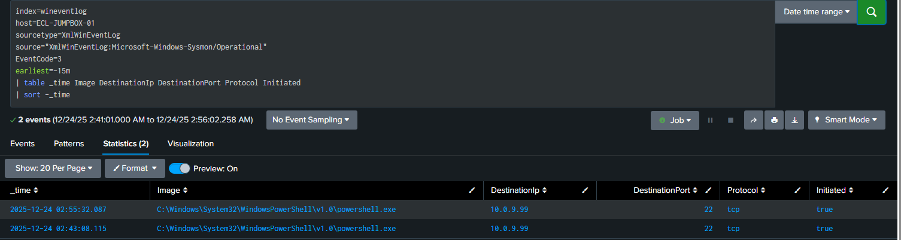
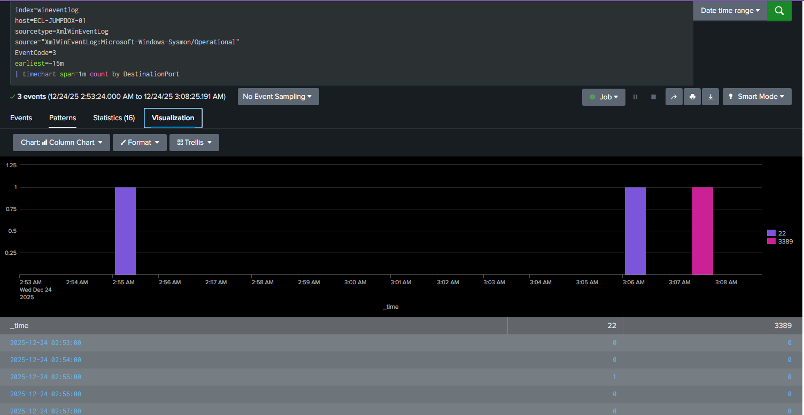
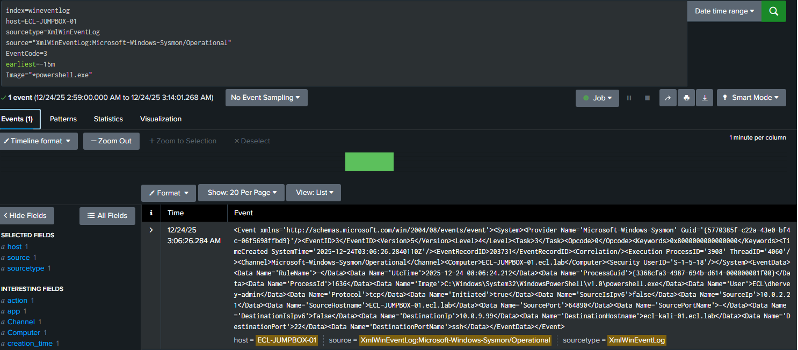

# Module 6 — Detecting Port Enumeration with Sysmon EventCode 3

## Overview
This module demonstrates how Sysmon EventCode 3 (Network Connection)
can be used to detect and investigate suspicious outbound network
activity indicative of internal reconnaissance.

The scenario simulates a host generating outbound connections using
PowerShell, with telemetry collected by Sysmon and analyzed in Splunk.

---

## Lab Environment
- Endpoint: ECL-JUMPBOX-01 (Windows 11)
- Telemetry: Sysmon (EventCode 3 – Network Connection)
- SIEM: Splunk
- Suspicious Process: PowerShell

---

## Detection Objective
Identify potential reconnaissance activity by analyzing:
- Outbound network connections
- Destination IP and port usage
- Initiating process
- Connection timing patterns

---

## 1. Sysmon EventCode 3 Evidence
Sysmon records outbound network connections including destination
address, port, protocol, and initiating process.

This view confirms that PowerShell is generating network connections
from the endpoint.

---

## 2. Detection via Port Activity Analysis
Aggregating EventCode 3 data highlights destination port activity
over time, enabling analysts to identify suspicious patterns.

---

## 3. SOC Investigation Drill-Down
A detailed event review confirms the initiating process, destination
host, destination port, and protocol, validating analyst findings.

---

## MITRE ATT&CK Mapping
- **T1046** – Network Service Scanning

---

## Analyst Takeaways
- Sysmon provides high-fidelity host-level network telemetry
- Process-based network connections enable rapid attribution
- Aggregation and drill-down are critical for validation

---

## Conclusion
Sysmon EventCode 3 is an effective detection and investigation source
for identifying suspicious internal reconnaissance when paired with
SIEM analytics.
