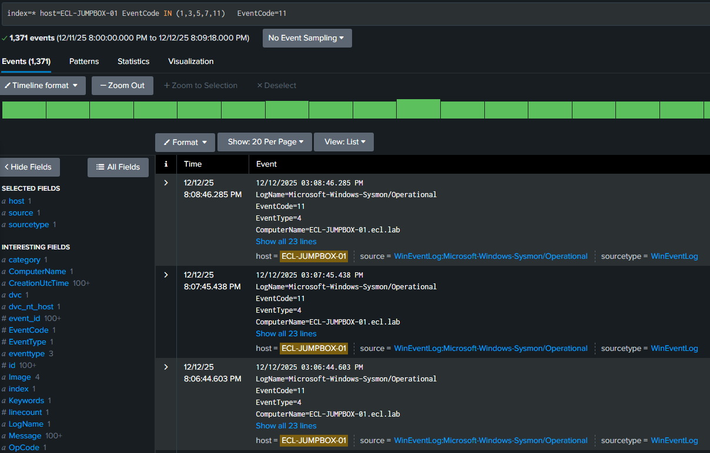

# Module 6 — Endpoint Network Reconnaissance with Sysmon EventCode 3

## Overview
This module demonstrates how **Sysmon EventCode 3 (NetworkConnect)** can be
used to detect and investigate **endpoint-initiated network reconnaissance**
activity. The focus is on **high-confidence, explainable detections**
appropriate for SOC-101 workflows.

Rather than relying on noisy, large-scale scans, this lab highlights how
controlled endpoint activity still produces reliable telemetry that a
SOC analyst can validate and triage using Splunk.

---

## Lab Environment
- **Endpoint:** ECL-JUMPBOX-01 (Windows Server 2022)
- **Telemetry:** Sysmon — EventCode 3 (NetworkConnect)
- **SIEM:** Splunk
- **Activity Source:** PowerShell-initiated network connections

> Sysmon events are ingested using XML rendering (`XmlWinEventLog`),
> preserving full event context for investigation.

---

## Detection Objective
Identify suspicious endpoint network reconnaissance behavior by analyzing:
- Outbound network connections initiated by user-level processes
- Destination IP and port usage
- Process attribution (PowerShell vs background services)
- Initiated vs non-initiated connections

---

## 1. Verify Sysmon Network Telemetry
Confirm that Sysmon is generating **EventCode 3** network connection events
and that they are successfully ingested into Splunk.

```spl
index=wineventlog
host=ECL-JUMPBOX-01
sourcetype=XmlWinEventLog
source="XmlWinEventLog:Microsoft-Windows-Sysmon/Operational"
EventCode=3
| sort - _time
| head 10
```



---

## 2. Generate Endpoint Network Activity
Controlled outbound network connections are generated from the endpoint
using PowerShell-based commands. These actions create **initiated**
network events suitable for SOC analysis.


---

## 3. Observe Sysmon EventCode 3 Details
Each network connection is recorded by Sysmon, including:
- Process image
- Destination IP
- Destination port
- Protocol
- Initiation status

```spl
index=wineventlog
host=ECL-JUMPBOX-01
sourcetype=XmlWinEventLog
source="XmlWinEventLog:Microsoft-Windows-Sysmon/Operational"
EventCode=3
| table _time Image DestinationIp DestinationPort Protocol Initiated
```


---

## 4. Detect Suspicious Activity in Splunk
Splunk is used to differentiate intentional user-initiated activity from
background system noise by filtering on specific processes.

```spl
index=wineventlog
host=ECL-JUMPBOX-01
sourcetype=XmlWinEventLog
source="XmlWinEventLog:Microsoft-Windows-Sysmon/Operational"
EventCode=3
Image="C:\\Windows\\System32\\WindowsPowerShell\\v1.0\\powershell.exe"
```


---

## 5. SOC Investigation
The SOC analyst reviews timing, destination context, and process attribution
to determine whether the observed behavior represents benign administration
or suspicious reconnaissance.


---

## MITRE ATT&CK Mapping
- **T1046 — Network Service Scanning**
- **T1059.001 — Command and Scripting Interpreter: PowerShell**

---

## Analyst Takeaways
- Endpoint telemetry provides high-fidelity network visibility
- Process attribution is critical for effective triage
- Not all reconnaissance is noisy; low-volume activity still leaves artifacts
- Sysmon EventCode 3 enables explainable SOC detections

---

## Conclusion
This module demonstrates how **endpoint-based network telemetry**
supports SOC-101 detection and triage workflows, forming the foundation
for more advanced detection engineering and threat hunting.
