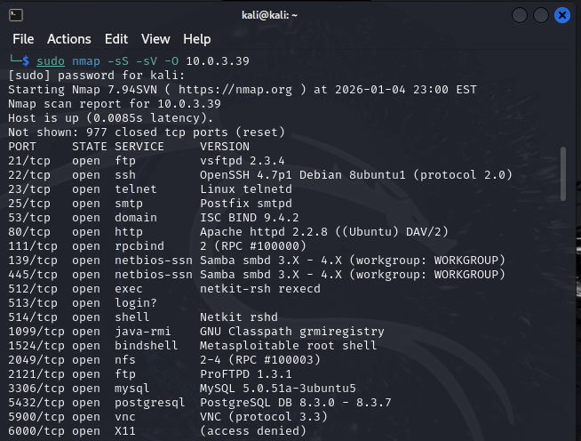
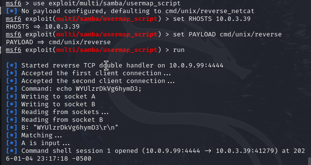
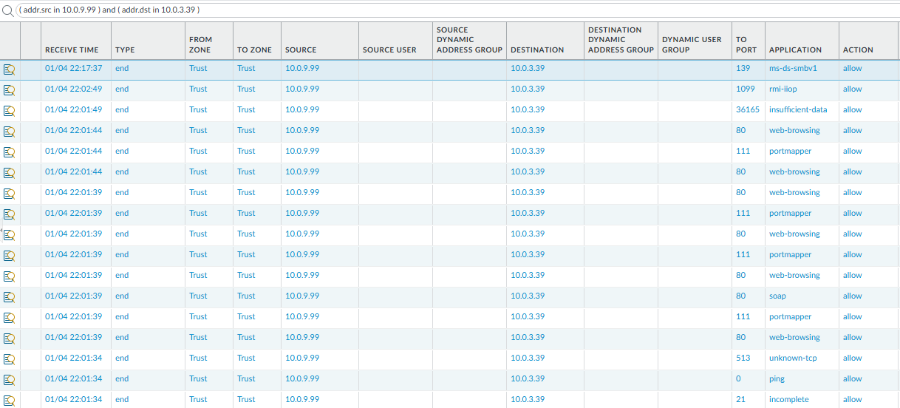
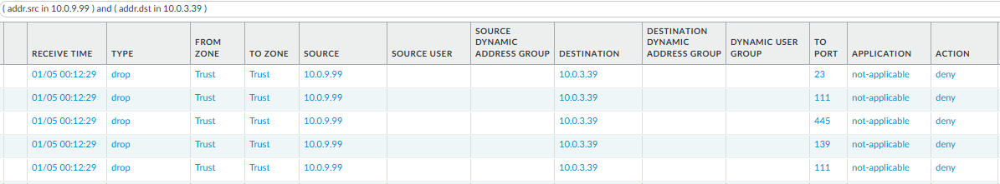

# Lab 01 — Exposure Validation & Control Effectiveness

## Overview
This lab demonstrates an **end-to-end vulnerability exploitation lifecycle** in a segmented enterprise-style network. The objective was to move beyond theoretical vulnerability findings and **validate real exploitability**, analyze firewall control behavior, apply remediation, and **verify control effectiveness**.

This lab mirrors responsibilities commonly found in **Vulnerability Exploitation, Network Security, and Enterprise Defense** roles.

---

## Environment

| Component | Details |
|--------|--------|
| Attacker | Kali Linux |
| Attacker IP | `10.0.9.99` |
| Attacker Zone | Trust |
| Target | Metasploitable2 |
| Target IP | `10.0.3.39` |
| Target Zone | Trust |
| Enforcement Point | Palo Alto Firewall (Bama_FW) |
| Traffic Type | Inter-VLAN (North–South) |

---

## Lab Objectives

- Identify exposed services across VLAN boundaries
- Validate exploitability of exposed services
- Analyze firewall behavior and control gaps
- Implement effective remediation
- Re-test to confirm risk reduction

---

## Step 1 — Exposure Discovery

An Nmap scan was performed from the attacker host to enumerate exposed services on the target system.

The scan revealed multiple **legacy and high-risk services** exposed across VLAN boundaries, including SMB, RPC, and Telnet.

**Key Observation:**
> Segmentation existed, but service-level exposure created a viable attack surface.

---

## Step 2 — Exploit Validation

To determine whether the exposure represented real risk, an SMB exploitation attempt was conducted using Metasploit.

The `usermap_script` Samba vulnerability was successfully exploited, resulting in **remote command execution** on the target system.

**Key Observation:**
> The vulnerability was not theoretical — the target was actively exploitable across the firewall.

---

## Step 3 — Firewall Control Analysis

Firewall traffic logs were reviewed to understand how the traffic was handled.

The Palo Alto firewall classified and **allowed** SMB, RPC, and related traffic between the attacker and target systems.

**Key Observation:**
> Existing firewall policy permitted high-risk legacy services, enabling exploitation despite segmentation.

---

## Step 4 — Remediation & Control Effectiveness

Firewall policy was updated to **explicitly deny legacy services** at the service (port) level, ensuring traffic was blocked at session initiation.

After clearing existing sessions, the same connection attempts were re-tested.

The firewall successfully denied traffic to ports **23, 111, 139, and 445**, preventing both scanning and exploitation.

**Key Observation:**
> Blocking legacy services at the transport layer eliminated the attack path and validated control effectiveness.

---

## Results Summary

| Phase | Outcome |
|----|----|
| Exposure Discovery | High-risk services identified |
| Exploit Validation | Remote code execution achieved |
| Control Analysis | Firewall allowed exploitation |
| Remediation | Legacy services blocked |
| Re-Testing | Exploitation prevented |

---

## Analyst Takeaways

- Vulnerability findings must be validated through exploit testing to assess true risk
- Segmentation alone does not guarantee security if services are overexposed
- App-ID controls may not stop legacy protocols at session initiation
- Service-level enforcement is critical for mitigating legacy protocol risk
- Re-testing is required to confirm remediation effectiveness

---

## Enterprise Relevance

This lab directly aligns with enterprise security responsibilities such as:

- Vulnerability validation and prioritization
- Firewall policy analysis and remediation
- Risk-based decision making
- Control effectiveness testing

---

## Lab Status

**Status:** Complete

This lab serves as the foundation for subsequent labs focusing on lateral movement, segmentation strategy, detection validation, and incident response.

