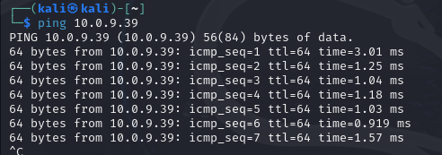
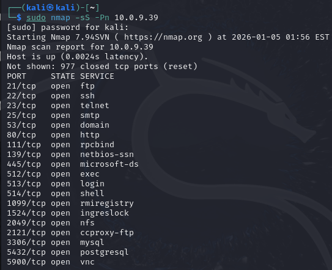
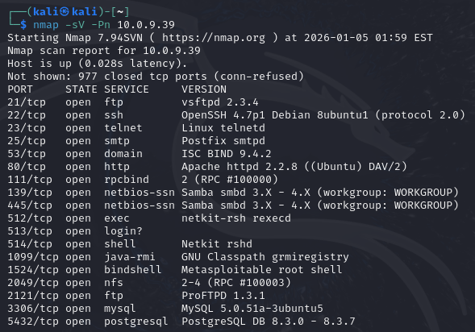

# 🧪 Lab 02 — East/West Lateral Movement Validation

## 📘 Overview
This lab demonstrates the **risk of unrestricted East/West traffic** inside a trusted internal network.  
By placing an attacker (**Kali Linux**) and a vulnerable system (**Metasploitable**) in the **same VLAN**, we validate how lateral movement becomes trivial once an attacker gains an internal foothold.

This lab intentionally contrasts with **Lab 01 — Exposure Validation**, which focused on **North/South (perimeter) traffic**.

---

## 🎯 Objective
- Validate that hosts in the same VLAN can communicate **without firewall enforcement**
- Demonstrate internal service exposure via **lateral reconnaissance**
- Highlight architectural blind spots that enable **post-compromise lateral movement**

---

## 🧱 Lab Architecture

| Host | IP Address | VLAN | Role |
|-----|-----------|------|------|
| Kali Linux | 10.0.9.99 | VLAN 99 | Attacker |
| Metasploitable | 10.0.9.39 | VLAN 99 | Vulnerable Internal Host |

- Same subnet  
- Same broadcast domain  
- No firewall hop  
- Pure East/West traffic  

---

## 🔍 Step 1 — East/West Connectivity Validation

Before any enumeration, basic connectivity was validated to confirm implicit trust between hosts in the same VLAN.

**Command executed from Kali:**

    ping 10.0.9.39

**Result:**  
Successful ICMP replies confirm direct East/West communication without any security control enforcement.

**Security Insight:**  
Traffic between internal hosts does not traverse perimeter firewalls and is often unmonitored by default.

---

## 🔍 Step 2 — Lateral Service Enumeration (SYN Scan)

A TCP SYN scan was performed to identify exposed services on the internal host.

**Command executed from Kali:**

    sudo nmap -sS -Pn 10.0.9.39

**Result:**  
Numerous services were discovered, including FTP, Telnet, SMTP, SMB, RPC, databases, and remote management services.

**Security Insight:**  
Once inside a trusted VLAN, attackers can enumerate a large internal attack surface without triggering perimeter defenses.

---

## 🔍 Step 3 — Service & Version Disclosure

To assess risk severity, service version detection was performed.

**Command executed from Kali:**

    nmap -sV -Pn 10.0.9.39

**Result:**  
Legacy and vulnerable services were fingerprinted, significantly reducing attacker effort and accelerating exploitation.

**Security Insight:**  
Internal version disclosure enables rapid exploitation and privilege escalation during lateral movement.

---

## 🧠 Key Findings

- East/West traffic inside a flat VLAN is **implicitly trusted**
- Internal systems expose a **large and fingerprintable attack surface**
- Perimeter firewalls provide **no visibility or enforcement** for lateral movement
- Post-breach attacker expansion requires **no initial exploitation**

---

## 🏢 Enterprise Relevance

This lab reflects a common real-world condition:

> Once an attacker gains internal access, lateral movement is unrestricted unless additional segmentation or detection controls exist.

These findings directly support:
- Network Security Architecture
- SOC Detection Engineering
- Threat Modeling & Purple Teaming
- Zero Trust justification

---

## 🔗 Lab Progression

- Lab 01: North/South Exposure Validation  
- Lab 02: East/West Lateral Movement Validation  
- Lab 03: East/West Detection Engineering (Zeek / Suricata / Splunk)

---

## ✅ Lab Status
**Completed — Validation Phase**

All objectives were met and documented with empirical evidence.
