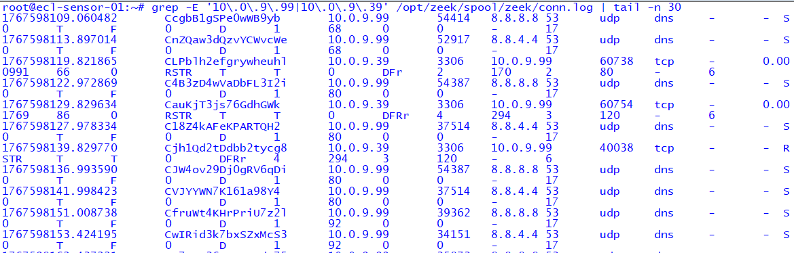
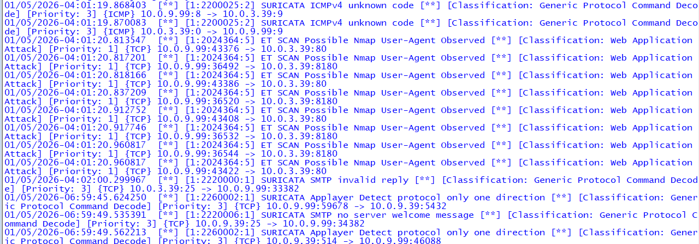
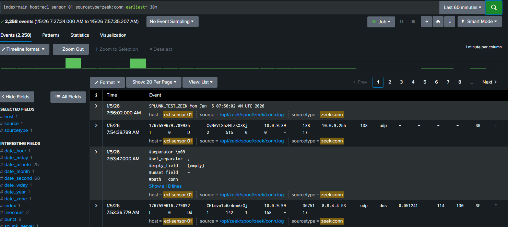
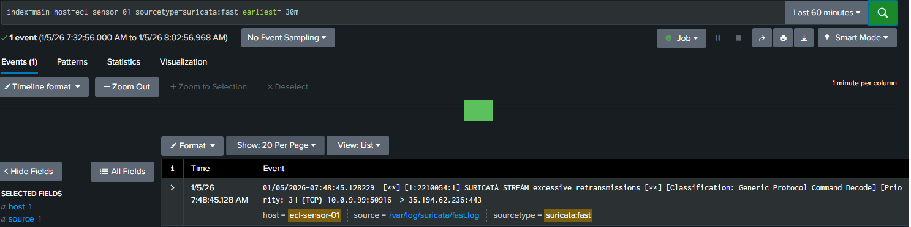

# 🛡️ Lab 03 — Detection Engineering (East/West Lateral Movement)

## Overview
This lab demonstrates how **internal lateral movement** can be detected using a layered security monitoring approach.  
Following successful East/West reconnaissance in Lab 02, this lab validates that **enterprise-grade detection tooling** can observe, alert on, and correlate malicious internal activity.

The focus is not exploitation, but **detection engineering** — ensuring the SOC can see what matters.

---

## 🎯 Objectives
- Detect East/West reconnaissance using **network telemetry**
- Validate **IDS signature detection** for internal scanning
- Confirm **SIEM ingestion and correlation**
- Demonstrate a realistic **SOC investigation workflow**

---

## 🧪 Lab Scenario
- **Attacker:** Kali Linux (`10.0.9.99`)
- **Target:** Metasploitable (`10.0.9.39`)
- **Network:** Same VLAN (VLAN 99)
- **Traffic Direction:** East/West (internal)
- **Tools:**
  - Zeek (behavioral network telemetry)
  - Suricata (signature-based IDS)
  - Splunk (SIEM correlation)

---

## 🔍 Detection Results

### 1️⃣ Zeek — Behavioral Detection of Lateral Scanning
Zeek captured multiple short-lived connections from Kali to Metasploitable across numerous ports.  
This activity is consistent with **internal service enumeration** rather than normal application behavior.

**Key Indicators:**
- Repeated connection attempts
- Multiple destination ports
- Reset and failed connection states
- Internal-to-internal traffic

📸 **Zeek Connection Telemetry**

---

### 2️⃣ Suricata — Signature-Based Detection
Suricata generated alerts identifying **Nmap scanning behavior**, along with secondary protocol anomalies caused by the scan.

**Notable Alerts:**
- `ET SCAN Possible Nmap User-Agent Observed`
- ICMP protocol anomalies
- SMTP and application-layer irregularities

These alerts confirm **tool-based malicious activity**, even on internal traffic.

📸 **Suricata IDS Alerts**

---

### 3️⃣ Splunk — SOC Visibility (Zeek Telemetry)
Zeek logs were ingested into Splunk after correcting a log path ingestion issue related to symlinked directories.  
Once resolved, Splunk provided full visibility into internal scanning behavior.

**SOC Value:**
- Centralized telemetry
- Timeline analysis
- Analyst-ready investigation view

📸 **Splunk — Zeek Telemetry**

---

### 4️⃣ Splunk — Extended Validation (Suricata Alerts)
As an extended validation step, Suricata alerts were also forwarded to Splunk.  
This enables **cross-tool correlation** and reinforces confidence in detection coverage.

📸 **Splunk — Suricata Alerts**

---

## 🧠 SOC Analyst Perspective
From a SOC standpoint, this lab demonstrates:
- Detection of **post-compromise lateral movement**
- Correlation of **behavioral and signature-based telemetry**
- Identification and remediation of **SIEM ingestion gaps**
- End-to-end visibility from sensor to SIEM

---

## ✅ Key Takeaways
- East/West traffic is often **under-monitored** yet critical
- Detection engineering requires **both telemetry and signatures**
- SIEM pipelines must be validated, not assumed
- Troubleshooting ingestion issues is a **real SOC responsibility**

---

## 📌 Lab Status
✔ Detection validated at the sensor  
✔ IDS alerts confirmed  
✔ SIEM ingestion fixed and verified  
✔ SOC correlation achieved  

---

## 🔜 Next Lab
**Lab 04 — Containment & Microsegmentation**  
Demonstrating how firewall controls and segmentation prevent or limit lateral movement once detected.

---

