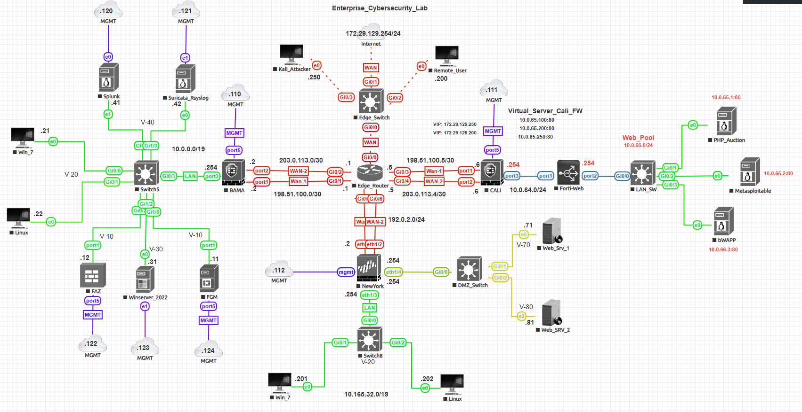

# 🧩 Network Topology Overview

This section documents the core network topology for the **Enterprise Cybersecurity Lab (ECL)**.  
The topology remains consistent across all phases of the lab and integrates:
- Active Directory
- Palo Alto Networks and Fortinet firewalls
- SIEM and SOC components

> 🛠️ *Status:* Topology finalized and verified in lab environment  
> 🗓️ *Last updated:* October 2025

