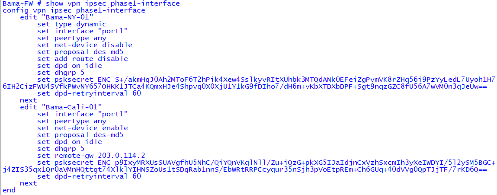
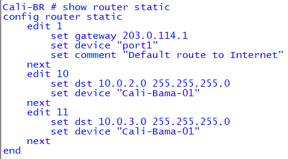
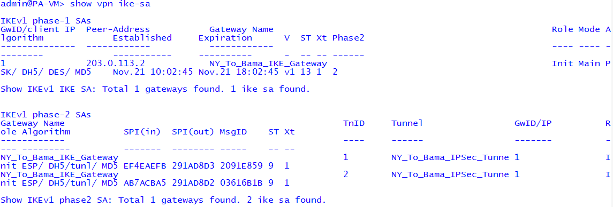
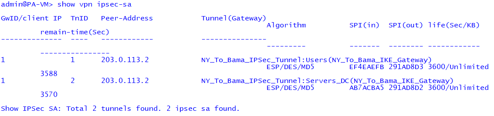

# 🏢 Enterprise Cybersecurity Lab  
## 🔐 Hub-and-Spoke VPN + Centralized DHCP (Cross-Vendor Architecture)  
### Bama Hub • NY Spoke • Cali Spoke

This lab demonstrates a production-grade **hub-and-spoke IPSec VPN architecture** between three sites (Bama, NY, and Cali) using **Fortinet + Palo Alto firewalls**, with **centralized DHCP services** routed securely across IPSec tunnels.

---

# 🧭 1. Lab Architecture Overview

### **Hub: Bama-FW (Fortinet)**
- Central VPN concentrator  
- DHCP relay for all spokes  
- Networks:
  - `10.0.2.0/24` (Users)  
  - `10.0.3.0/24` (Servers/DC)

### **Spoke 1: NY-FW (Palo Alto)**
- Two proxy-IDs (Users + Servers)  
- DHCP received through IPSec tunnel  

### **Spoke 2: Cali-FW (Fortinet)**
- ANY/ANY selectors  
- Routes `10.0.2.0/24` and `10.0.3.0/24`

---

# 🖼️ 2. Topology Diagram (ASCII)

```
                         ┌───────────────────────────────┐
                         │     Bama Hub – Fortinet        │
                         │   --------------------------    │
                         │   Role: Central Hub             │
                         │   Networks:                     │
                         │      • 10.0.2.0/24 (Users)      │
                         │      • 10.0.3.0/24 (Servers/DC) │
                         └───────────────────────────────┘
                                      /        \
                                     /          \
                                    /            \
                                   /              \
                                  /                \
                                 /                  \
                                /                    \
                               /                      \
              ┌────────────────────────┐     ┌────────────────────────┐
              │   NY Spoke – Palo Alto │     │ Cali Spoke – Fortinet  │
              │  --------------------- │     │ ----------------------- │
              │  Role: Spoke           │     │ Role: Spoke            │
              │  Network:              │     │ Network:               │
              │    • 10.0.33.0/24      │     │   • 10.0.64.0/24       │
              └────────────────────────┘     └────────────────────────┘
```

---

# 📸 3. Screenshot Evidence

### 🟦 **Bama (Hub)**  
  
  
  


---

### 🟩 **Cali (Spoke)**  
  
  
  


---

### 🟥 **NY (Palo Alto Spoke)**  
  


---

# 🧪 4. Connectivity Verification

### Cali → Bama DC (`10.0.3.31`)
```
execute ping 10.0.3.31
```

### Cali → Bama Users (`10.0.2.21`)
```
execute ping 10.0.2.21
```

### NY → Bama (Palo Alto sourced ping)
```
ping source <NY-inside-interface> 10.0.3.31
```

✔ All tunnels validated.

---

# 🛠 5. Troubleshooting Notes

- Cali selector mismatch fixed with ANY/ANY  
- `net-device enable` required on Fortinet tunnel interfaces  
- Palo Alto required two Proxy-IDs  
- DHCP relay required correct VLAN-interface configuration  

---

# 🎓 6. Lessons Learned

- Multi-vendor IPSec requires identical Phase1/Phase2  
- Proxy-ID alignment is mandatory  
- Central DHCP simplifies branch design  
- Routing symmetry prevents drops and asymmetry issues  

---

# 🏠 Back to Network Security  
[← Network Security](../../)


