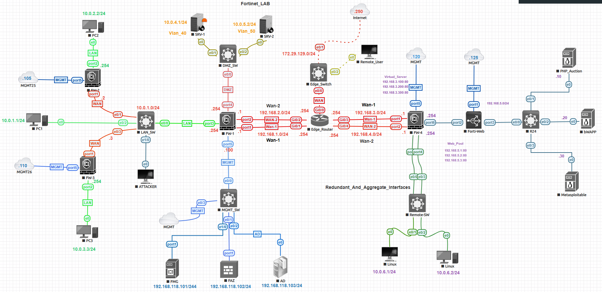

# 🛡️ Fortinet Network Security Labs

Welcome to my **Fortinet Lab Series** — an ongoing collection of enterprise firewall and network-security configurations built on **FortiGate**, **FortiManager**, and **FortiAnalyzer** platforms.  
Each lab showcases **real-world Fortinet deployments**, demonstrating concepts such as **NAT**, **VPN**, **High Availability**, **Centralized Management**, and **Threat Visibility**.

---

## 🌐 Lab Topology

  
*(This core topology is shared across all Fortinet labs — including NAT, VPN, FortiManager, and FortiAnalyzer integrations.)*

**Core Components:**
| Device | Role | IP Address / Function |
|:--------|:------|:----------------------|
| **FW-1** | HQ FortiGate | LAN/WAN Gateway (10.0.1.0/24, 192.168.1.0/24) |
| **FW-3** | Branch FortiGate | Remote VPN Site (10.0.3.0/24) |
| **FMG** | FortiManager | Centralized Management (192.168.118.101) |
| **FAZ** | FortiAnalyzer | Log & Event Aggregation (192.168.118.102) |
| **AD/DC** | Active Directory + DNS + CA | (192.168.118.123) |
| **Edge Router** | WAN & VPN Gateway | (192.168.1.254 / 192.168.3.254) |
| **Clients / Servers** | Various | SRV1 (10.0.4.1), SRV2 (10.0.5.2), PC1–PC3 |

---

## 🚦 Fortinet Lab Index

| Lab Name | Description | Link |
|:-----------|:-------------|:------|
| **Base Configuration & Internet Access** | Configure initial FortiGate setup — interfaces, zones, default routes, DNS, and policies for internet access. | [View Lab →](./fortinet-base-config-lab) |
| **IPSec Site-to-Site VPN** | Build secure IPSec tunnels between HQ and Branch FortiGates. | [View Lab →](./fortinet-site-to-site-vpn-lab) |
| **Dynamic VPN Failover (Redundant Tunnels)** | Implement dual-hub or backup VPN tunnels with automatic failover and monitoring. | [View Lab →](./fortinet-dynamic-vpn-lab) |
| **SD-WAN Configuration** | Deploy SD-WAN zones with performance SLAs, load balancing, and health checks. | [View Lab →](./fortinet-sdwan-lab) |
| **FortiManager Integration** | Add devices to FortiManager, push centralized policies, and manage version control. | [View Lab →](./fortinet-fmg-integration-lab) |
| **FortiAnalyzer Visibility** | Configure log forwarding and event correlation for threat analytics and reporting. | [View Lab →](./fortinet-faz-visibility-lab) |
| **Hybrid VPN (Palo ↔ Fortinet)** | Create a cross-vendor IPSec tunnel with a Palo Alto peer and validate interoperability. | [View Lab →](./fortinet-cross-vendor-vpn-lab) |

---

## 🧠 Learning Objectives

- Understand FortiGate **NAT, VPN, and Policy** frameworks  
- Deploy centralized management via **FortiManager**  
- Monitor and analyze logs in **FortiAnalyzer**  
- Build hybrid, multi-vendor VPNs (Fortinet ↔ Palo Alto)  
- Strengthen enterprise **visibility and automation** in Fortinet Security Fabric  

---

## 🧩 Supporting Files

📁 `/screenshots` — all configuration screenshots  
📁 `/configs` — CLI and backup configurations  
📁 `/diagrams` — Visio / draw.io topology files  
📁 `/documentation` — step-by-step markdown files  

---

📘 *More Fortinet Labs coming soon — focusing on HA clustering, FortiManager workflow automation, and FortiAnalyzer incident analysis.*

