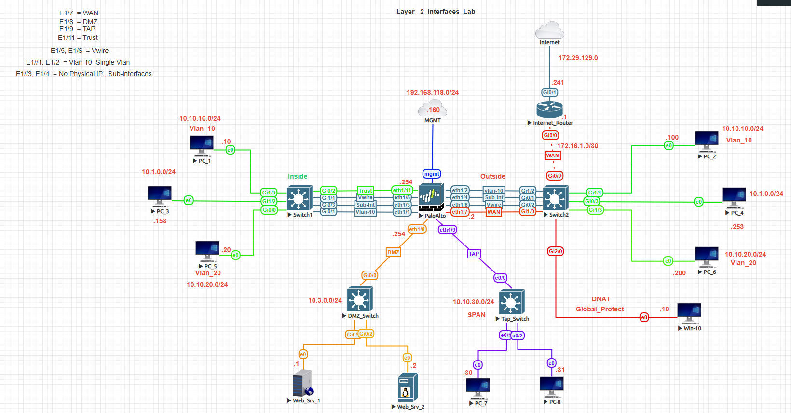
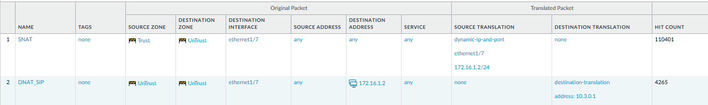
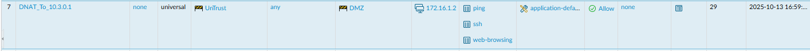
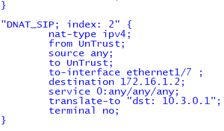
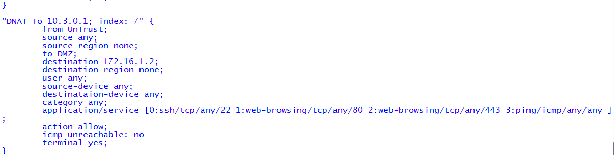
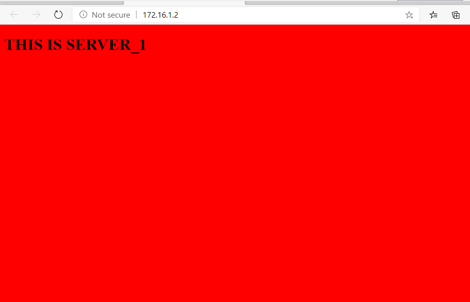
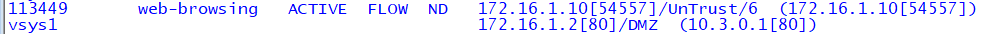
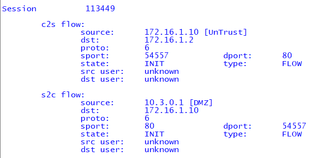
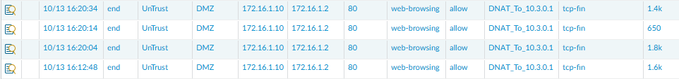

# 🧱 Palo Alto DNAT Lab

## 🎯 Objective
The goal of this lab is to configure and verify **Destination NAT (DNAT)** on a Palo Alto firewall to allow external users on the WAN to access a web server located in the **DMZ**.

---

## 🧩 Topology

---

## ⚙️ Configuration Steps

---

### 2️⃣ Create the DNAT Policy
---
**NAT Rule:**
Name: DNAT_SIP
Type: ipv4
From: Untrust
Source: any
To: Untrust
Destination: 172.16.1.2
Service: any
Translated Address: 10.3.0.1

This rule translates inbound requests to the firewall’s public IP into the internal web server’s IP address in the DMZ.

📸 **Screenshot:**  

---

### 3️⃣ Create a Security Policy

**Security Rule:**
Name: DNAT_SIP
From: Untrust
To: Untrust
Destination: 172.16.1.2
Translated Address: 10.3.0.1
Service: any

This rule allows the inbound traffic to reach the internal web server after translation.

📸 **Screenshot:**  

---

### 4️⃣ Verify NAT and Security Policies
Run the following commands to confirm configuration:

show running nat-policy

show running security-policy

## 🧪 Verification

### 🔹 Test from WAN PC
Open a browser on your **WAN PC** and browse to:
http[:]//172.16.1.2
You should see the webpage hosted on your internal web server (`10.3.0.1`).

📸 **Screenshot:**  

---

### 🔹 Check Firewall Sessions

Look for entries showing translation from `172.16.1.2` (public IP) to `10.3.0.1` (private IP).

show session all

show session all | match 10.3.0.1

📸 **Screenshot:** 

show session id 113449

📸 **Screenshot:**  

---

### 🔹 Verify in Monitor → Traffic
Confirm that:
- The DNAT policy was matched.
- The action was **allow**.
- The translated destination IP shows **10.3.0.1**.

📸 **Screenshot:**  

---

## 🖼️ Screenshot Summary
| Section | Screenshot File |
|----------|------------------|
| Topology | `topology.png` 
| NAT Policy | `nat-policy.png` |
| Security Policy | `security-policy.png` |
| Policy Verification | `policy-verification.png` |
| Browser Test | `browser-test.png` |
| Session Verification | `session-verify.png` |
| Traffic Log | `traffic-log.png` |

---

## 🧾 Summary
In this lab, we demonstrated how to:
- Configure **Destination NAT** on a Palo Alto Firewall.
- Allow external (Untrust) access to an internal **DMZ web server**.
- Validate functionality using browser testing, firewall sessions, and traffic logs.

✅ **Outcome:**  
External users can successfully reach the internal server via the public IP `172.16.1.2`.
