# Palo Alto GlobalProtect VPN Lab (VMware Environment)

## Objective
This lab demonstrates the configuration of **Palo Alto GlobalProtect VPN** in a VMware environment.  
The goal is to allow remote users to securely connect to the internal network using GlobalProtect with certificate-based authentication.

---

## Topology
The following topology shows the VMware setup for the GlobalProtect lab.

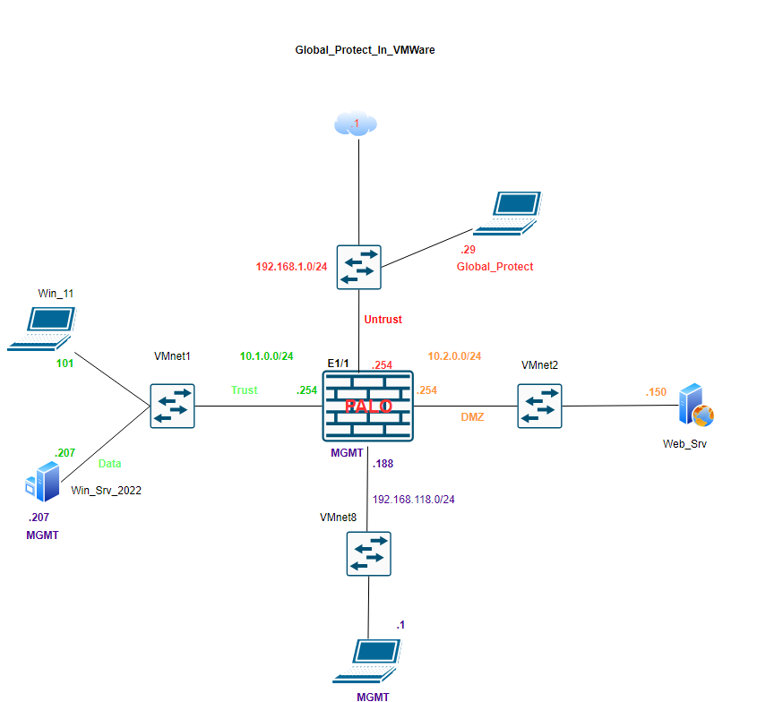

**Key Components:**
- **Firewall:** 192.168.118.188 (Mgmt), WAN 192.168.1.254, Trust 10.1.0.254, DMZ 10.2.0.254  
- **Domain Controller / CA:** 192.168.118.207  
- **Trust Network:** 10.1.0.0/24  
- **DMZ Network:** 10.2.0.0/24  
- **Untrust Network:** 192.168.1.0/24  
- **GlobalProtect Client (WAN PC):** 192.168.1.29  

---

## Lab Environment
- **Platform:** VMware Workstation  
- **PAN-OS Version:** 10.x  
- **Windows Server 2022:** Domain Controller, DNS, Certificate Authority  
- **Windows 10:** GlobalProtect client system  
- **Purpose:** Demonstrate portal, gateway, certificate, and user authentication setup for GlobalProtect.

---

## Step 1: Certificate Configuration

### 1.1 Generate and Export Certificate from CA
1. On the Domain Controller (CA), generate a certificate with the following **Subject Alternative Names (SANs):**  
   - `192.168.1.254`  
   - `192.168.118.207`  
   - `gp.4outof7.com`
2. Export the certificate (including the private key) in **.pfx** format.  
3. Copy it to the firewall for import.

### 1.2 Import Certificate on the Firewall
1. On the firewall, navigate to **Device → Certificates**.  
2. Import the certificate under the **FW_GP_188** name.  
3. Mark it as both **Trusted Root CA** and **Local**.  

**Screenshot:**
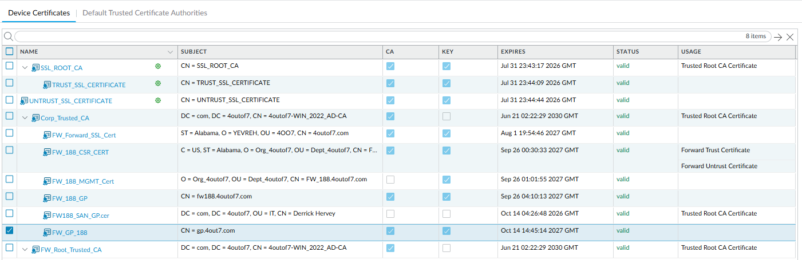

---

## Step 2: Create an Authentication Profile

1. Go to **Device → Authentication Profile**.  
2. Create a profile that uses **Local Database** or **LDAP** (if connected to AD).  
3. Add the user(s) permitted to connect via GlobalProtect.

**Screenshot:**
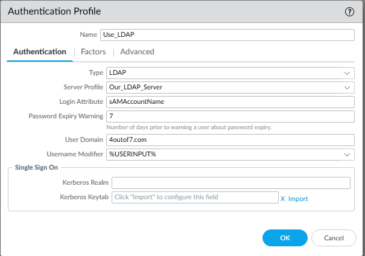

---

## Step 3: Configure GlobalProtect Portal

1. Navigate to **Network → GlobalProtect → Portals → Add**.  
2. Under **General**, bind the portal to interface **ethernet1/1 (192.168.1.254)**.  
3. Under **Authentication**, select the imported certificate (`FW_GP_188`) and the created Authentication Profile.  
4. Under **Agent → Config Selection Criteria**, define:
   - IP Pool: `10.1.0.151–10.1.0.160`
   - DNS Server: `10.1.0.207`
   - Split Tunneling (optional)

**Screenshots:**
- 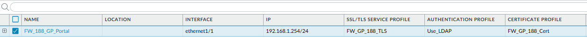
- 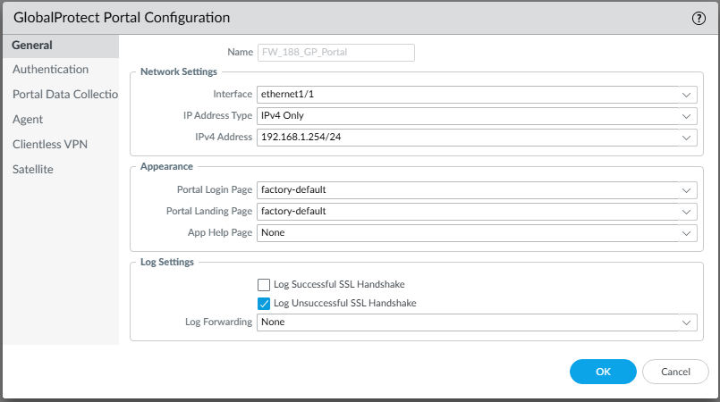
- 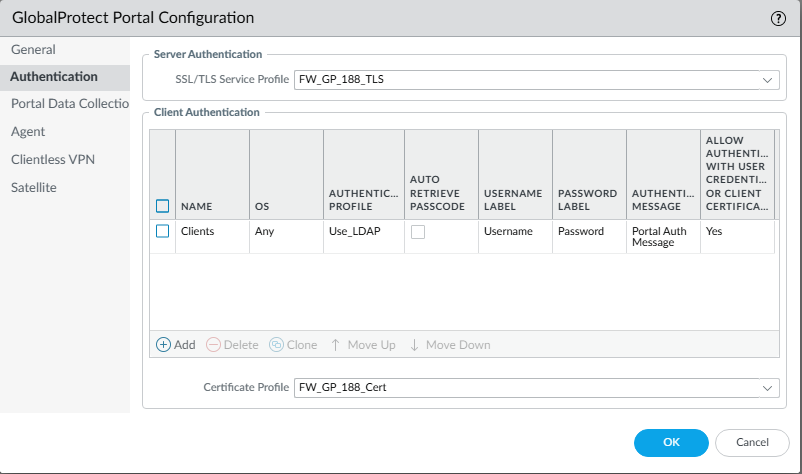
- 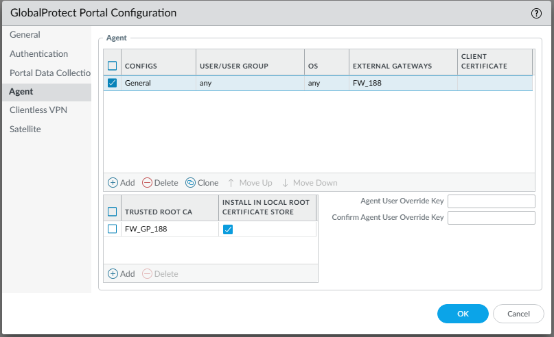

---

## Step 4: Configure GlobalProtect Gateway

1. Go to **Network → GlobalProtect → Gateways → Add**.  
2. Assign the same interface **ethernet1/1 (Untrust)**.  
3. Under **General**, use the `FW_GP_188` certificate.  
4. Under **Authentication**, select the same Authentication Profile.  
5. Under **Client Configuration**, specify:
   - IP Pool: `10.1.0.151–10.1.0.160`
   - DNS: `10.1.0.207`
   - Split-tunneling and access routes (optional)

**Screenshots:**
- 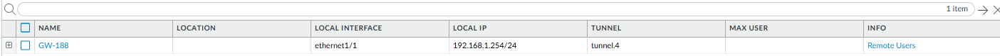
- 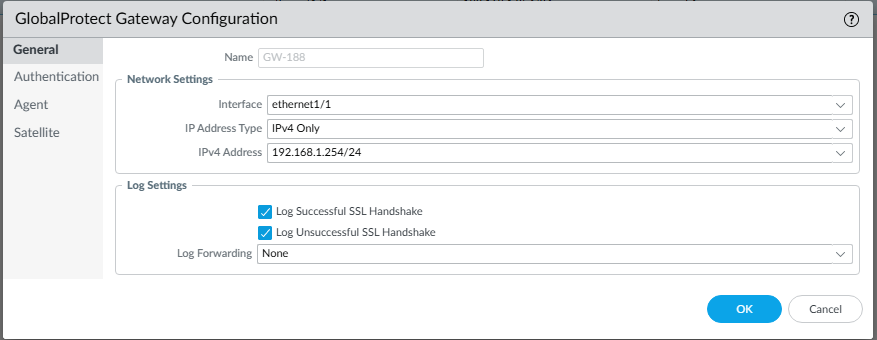
- 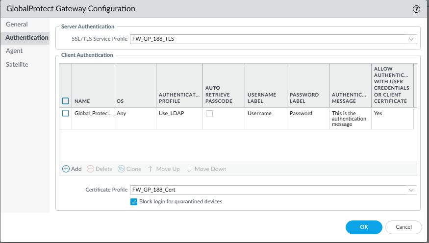
- 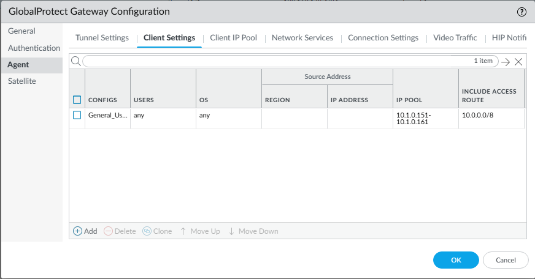

---

## Step 5: Tunnel Interface Configuration

`tunnel.4` is used for GlobalProtect VPN traffic and is assigned to the **Trust zone** and **Default virtual router**.

**Screenshot:**
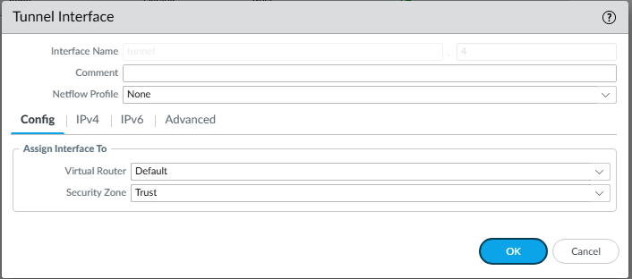

---

## Step 6: Security and NAT Policies

### Security Policy
| Name | From | To | Source | Destination | Application | Action |
|------|------|----|---------|-------------|--------------|---------|
| `GlobalProtect_VPN` | Untrust | Trust | Any | 192.168.1.254 | ssl, web-browsing, ipsec-esp, ping | Allow |

**Screenshot:**


### NAT Policy
| Name | From | To | Source Translation | Destination | Description |
|------|------|----|--------------------|--------------|--------------|
| `SNAT_GP_To_Internet` | Trust | Untrust | Dynamic IP and Port | Any | Allows VPN clients outbound Internet access |

**Screenshot:**
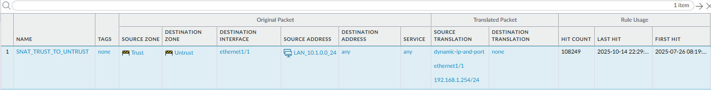

---

## Step 7: Client Connection Test

1. Install and launch the GlobalProtect client on the WAN PC (`192.168.1.29`).  
2. Connect to `gp.4outof7.com` (portal/gateway IP).  
3. Log in with an authorized user credential.  
4. Verify successful connection and IP assignment (e.g., `10.1.0.152`).  

**Screenshot:**
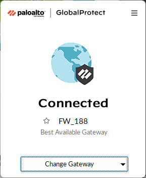

---

## Step 8: Verification

### CLI Verification
```bash
> show global-protect-gateway current-user
> show session all | match 10.1.0.152
> show user ip-user-mapping all


