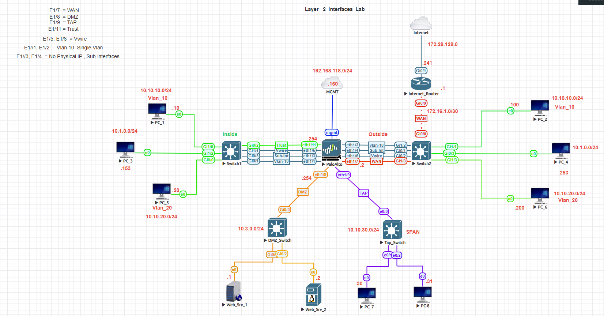
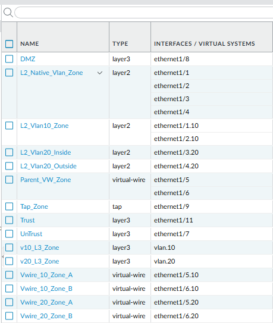
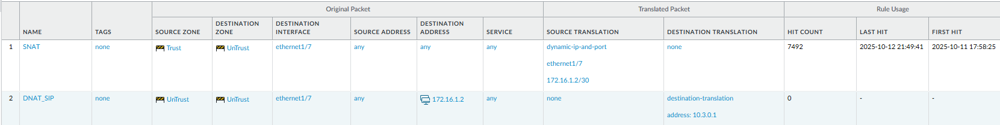
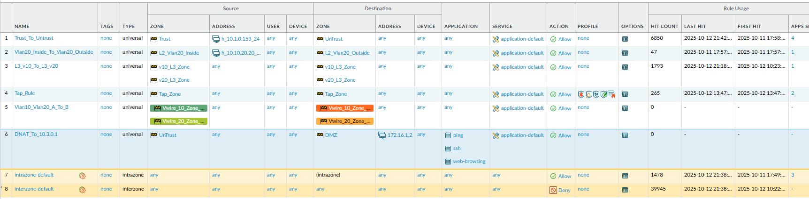
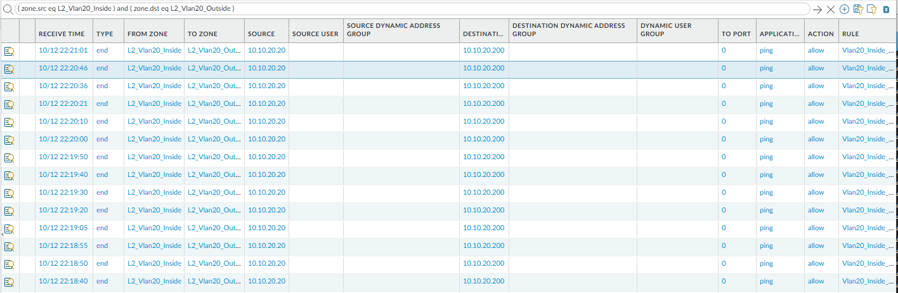
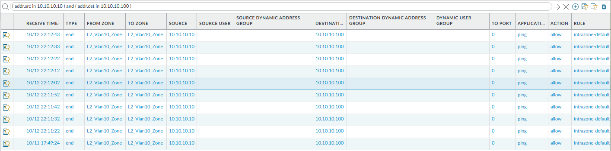
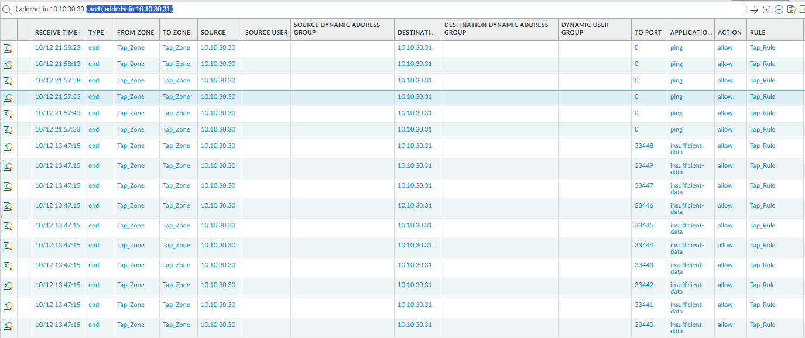

# 🔄 Palo Alto Layer 2, VLAN & NAT Policy Lab


---

## 🎯 Objective
Showcase configuration and validation of:
- Layer-2 VLANs  
- VLAN subinterfaces (L3)  
- Virtual Wire and Tap modes  
- Source NAT and Security Policies  
- Traffic verification using Monitor → Traffic

---

## 🧱 Topology Overview
| Interface | Type | Zone | Purpose |
|------------|------|------|----------|
| e1/1,e1/2 | L2 / VLAN 10 | Inside | Access layer |
| e1/3,e1/4 | L3 sub-interfaces | Inside | Routed segments |
| e1/5,e1/6 | Virtual Wire | VWire | Inline inspection |
| e1/7 | L3 Untrust | WAN | 172.16.1.2/24 |
| e1/9 | Tap | Tap-Monitor | SPAN mirror |
| e1/11 | L3 Trust | Inside | 10.1.0.1/24 |

---

## 🧭 Topology Diagram



*Figure 1: L2, L3, VWire, and Tap layout used for NAT and security policy validation*


## ⚙️ Key Configuration (Summary)

```
set network interface ethernet e1/7 layer3 ip 172.16.1.2/24
set rulebase nat rules Outbound-SNAT from Trust to Untrust source 10.1.0.0/24 to-interface e1/7 source-translation dynamic-ip-and-port interface-address interface e1/7
set rulebase security rules Allow-Trust-to-Untrust from Trust to Untrust source any destination any application any action allow
commit
```

---

## 🧪 Validation Steps
1. Verify NAT and policy logs in **Monitor → Traffic**  
2. Observe mirrored packets on the Tap interface  
3. Confirm intra-VLAN and inter-zone policies  
4. Test outbound Internet access via SNAT

---

## 📸 Screenshots

| Section | Screenshot |
|----------|-------------|
| Interface Overview (with Sub-interfaces) |  |
| Zone Configuration |  |
| NAT Policy |  |
| Security Policy |  |
| Traffic Logs |  |
| Traffic Logs |  |
| Tap Monitor *(optional)* |  |

---

**Back to Labs:** [⬅ Network-Security Index](./index.md)
