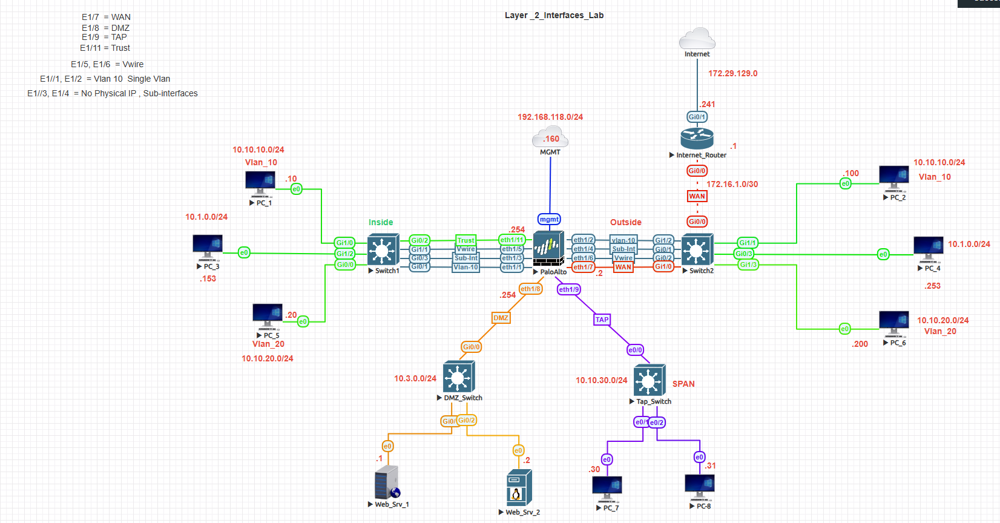
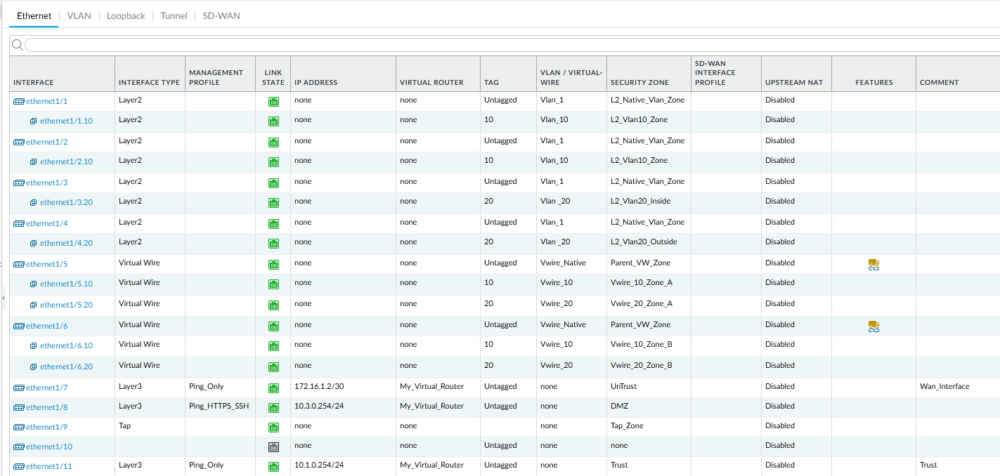
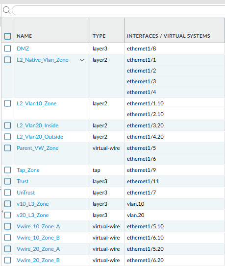
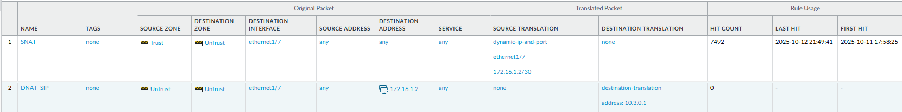
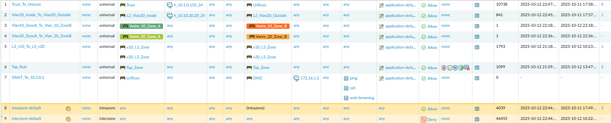
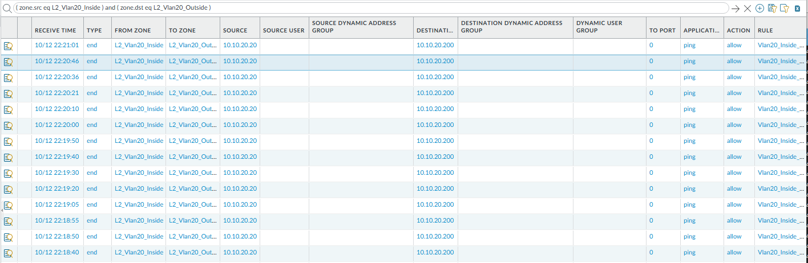
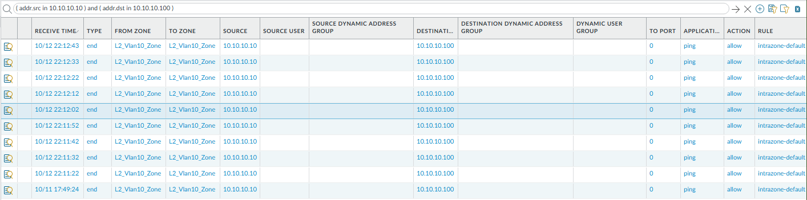
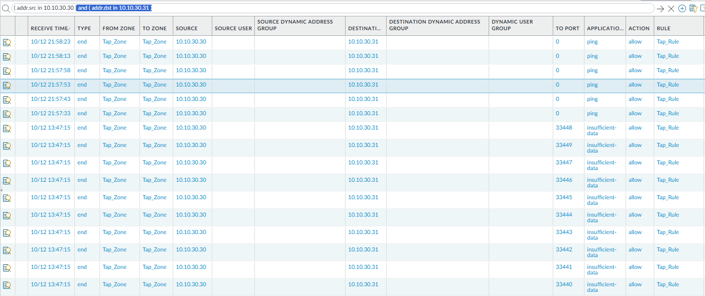

# 🧱 Palo Alto Layer 2, VLAN & NAT Interface Lab

## 🎯 Objective
The goal of this lab is to configure and validate **Layer 2 VLANs, Virtual Wires, and NAT Policies** on a Palo Alto Firewall to demonstrate switching, routing, and traffic translation in a mixed Layer 2 / Layer 3 environment.

---

## 🧩 Topology


**Interface Summary**

| Interface | Type | Zone | Purpose |
|------------|------|------|----------|
| e1/1, e1/2 | Layer 2 / VLAN 10 | Inside | Access Layer (Switching) |
| e1/3, e1/4 | L3 Subinterfaces | Inside | Routed Segments |
| e1/5, e1/6 | Virtual Wire | VWire | Inline Inspection |
| e1/7 | L3 Untrust | WAN | 172.16.1.2/24 |
| e1/9 | Tap | Tap-Monitor | SPAN Mirror |
| e1/11 | L3 Trust | Inside | 10.1.0.1/24 |

---

## ⚙️ Configuration Steps

### 1️⃣ Configure Layer 2 and VLAN Interfaces
Create VLAN objects and assign Layer 2 interfaces.

```
set network interface ethernet e1/1 layer2
set network interface ethernet e1/2 layer2
set network vlan VLAN10 interface [e1/1 e1/2]
set network vlan VLAN10 vlan-id 10
```

📸 **Screenshot:**  


---

### 2️⃣ Configure Layer 3 and Virtual Wire Interfaces
**Layer 3 Subinterface:**
```
set network interface ethernet e1/3 layer3 ip 10.1.10.1/24
```

**Virtual Wire Pair:**
```
set network interface ethernet e1/5 virtual-wire
set network interface ethernet e1/6 virtual-wire
```

📸 **Screenshot:**  


---

### 3️⃣ Configure Source NAT
```
set rulebase nat rules Outbound-SNAT
from Trust to Untrust source 10.1.0.0/24
to-interface e1/7
source-translation dynamic-ip-and-port interface-address interface e1/7
```

This rule translates outbound internal traffic to the firewall’s external interface address.

📸 **Screenshot:**  


---

### 4️⃣ Configure Security Policies
```
set rulebase security rules Allow-Trust-to-Untrust
from Trust to Untrust
source any destination any
application any action allow
```

📸 **Screenshot:**  


---

### 5️⃣ Validate Policies and Traffic Flow
```
> show running nat-policy
> show running security-policy
> show session all
```

📸 **Screenshot:**  
  
📸 **Screenshot:**  


---

### 6️⃣ Optional: Tap Mode Verification
Use the Tap interface to mirror live packets.

📸 **Screenshot:**  


---

## 🧪 Verification Checklist
✅ Verify NAT hits in **Monitor → Traffic**  
✅ Confirm inter-zone and intra-zone policy matches  
✅ Validate Tap and VWire interfaces capture traffic  
✅ Confirm Internet reachability via SNAT  

---

## 🖼️ Screenshot Summary
| Section | Screenshot File |
|----------|----------------|
| Topology | `topology.png` |
| Interface Overview | `interfaces.png` |
| Zone Configuration | `zones.png` |
| NAT Policy | `nat-policy.png` |
| Security Policy | `security-policy.png` |
| Traffic Logs (Interzone) | `traffic-logs-l2-inter-zone.png` |
| Traffic Logs (Intrazone) | `traffic-logs-l2-intra-zone.png` |
| Tap Monitor | `tap-monitor.png` |

---

## 🧾 Summary
In this lab we demonstrated how to:
- Build **Layer 2 VLANs**, **L3 subinterfaces**, and **Virtual Wires**
- Configure **Source NAT (SNAT)** for outbound connectivity
- Validate traffic and policy enforcement in mixed-mode environments  

✅ **Outcome:** Internal hosts in VLAN 10 can securely reach external networks through dynamic IP and port translation.

---

### 🔁 Lab Navigation

| ⬅ Previous | 🏠 Back to Index | Next ➡ |
|-------------|-----------------|---------|
| [← DNAT Lab](../palo-alto-dnat-lab/) | [Network Security Labs](../index.md) | [Site-to-Site VPN Lab →](../palo-alto-site-to-site-vpn/) |

