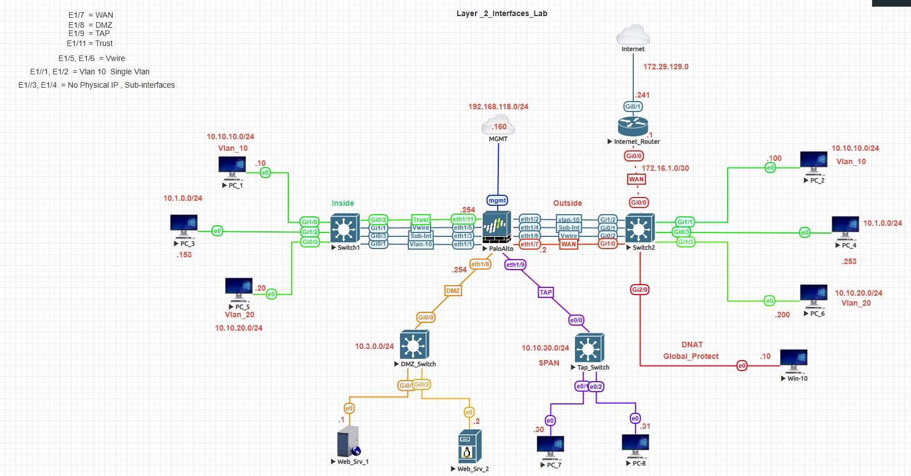
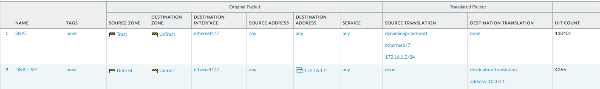
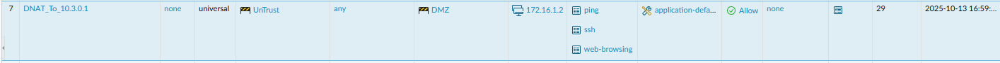
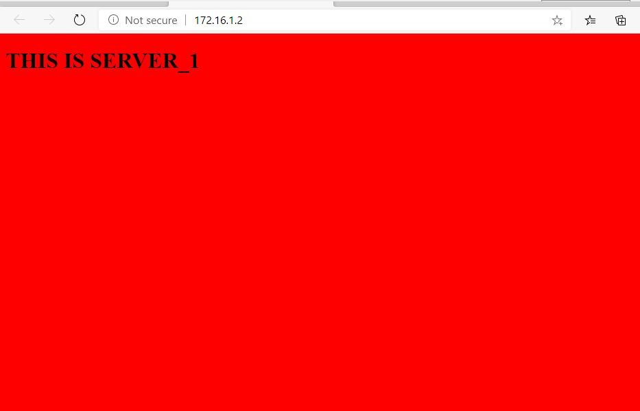
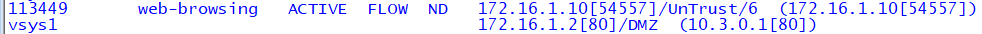
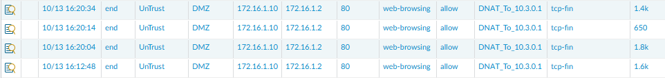

# Palo Alto DNAT Lab

## Objective
Configure and validate Destination NAT (DNAT) to allow external users to access a web server hosted in a DMZ network.

This lab demonstrates how Palo Alto firewalls translate inbound traffic from a public IP address to an internal server while enforcing security policy.

---

## Topology


---

## Prerequisites
- Interfaces and zones configured (Untrust, DMZ)
- Routing configured for internal and external networks
- Web server reachable from the firewall

---

## Configuration Steps

### 1. Create Destination NAT Policy

**Purpose:**  
Translate inbound traffic destined for the public IP to the internal web server.

**NAT Rule:**
```
Name: DNAT_WEB
Type: ipv4
From: Untrust
To: Untrust
Destination: 172.16.1.2
Service: any
Translated Address: 10.3.0.1
```

📸 Screenshot:  


---

### 2. Create Security Policy

**Purpose:**  
Allow the translated traffic from the Untrust zone to reach the DMZ server.

**Security Rule:**
```
Name: ALLOW-WEB-DNAT
From: Untrust
To: DMZ
Destination: 10.3.0.1
Application: web-browsing
Service: application-default
Action: allow
```

📸 Screenshot:  


---

## Verification

### 1. Test from External Client

From a WAN host, browse to:
```
http://172.16.1.2
```

**Expected Result:**  
The internal web server (10.3.0.1) responds successfully.

📸 Screenshot:  


---

### 2. Verify NAT Policy

```
show running nat-policy
```

Confirm the DNAT rule is present and correctly configured.

---

### 3. Verify Security Policy

```
show running security-policy
```

Confirm the allow rule exists and matches the correct zones and destination.

---

### 4. Verify Firewall Sessions

```
show session all filter destination 10.3.0.1
```

**What to look for:**
- Destination translated from 172.16.1.2 → 10.3.0.1
- Session state is active
- Correct zones (Untrust → DMZ)

📸 Screenshot:  


---

### 5. Verify Traffic Logs

Navigate to:
Monitor → Traffic

Confirm:
- Rule matched: ALLOW-WEB-DNAT
- Action: allow
- Destination IP: 10.3.0.1 (post-NAT)

📸 Screenshot:  


---

## Key Takeaways
- DNAT translates inbound traffic before security policy evaluation.
- Security policies must reference the translated (internal) IP, not the public IP.
- Session table validation confirms real-time NAT behavior.

---

## Summary
In this lab, we configured and validated Destination NAT to publish an internal web server to external users.

Traffic flow:
Untrust (172.16.1.2) → DNAT → DMZ (10.3.0.1)

The configuration was verified using:
- Browser testing
- Policy validation
- Session table inspection
- Traffic logs

---

## Navigation

| Previous | Back to Index | Next |
|----------|--------------|------|
| — | [Palo Alto Lab Index](../) | [L2 NAT Lab →](../palo-alto-l2-nat-interface-lab/) |
