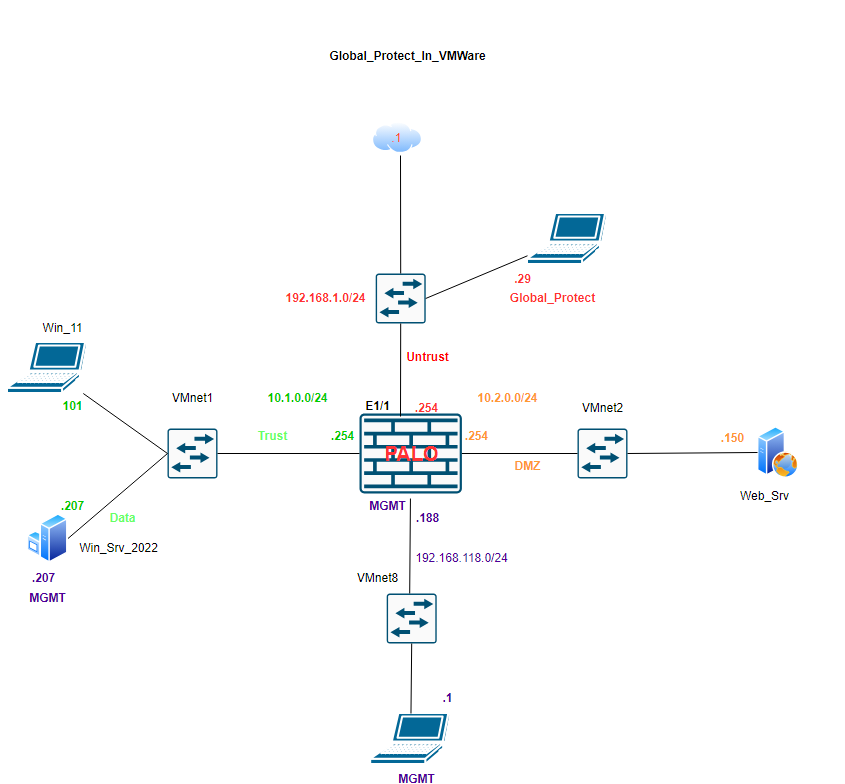

# Palo Alto GlobalProtect VPN Lab

This lab demonstrates how to configure **Palo Alto GlobalProtect VPN** in a VMware environment for secure remote access.

The lab covers:
- Certificate-based authentication (using a Domain CA)
- GlobalProtect **Portal** and **Gateway** configuration
- Authentication Profile setup
- Security and NAT policies
- Client connection and verification steps

---

## 📘 Full Lab Guide
➡️ [Open the Full GlobalProtect Lab Guide](../palo-alto-globalprotect-lab/)

---

## 🧩 Topology Preview

---

## 🧠 Key Learning Objectives
- Understand the relationship between **Portal** and **Gateway**
- Learn how to integrate a **Domain-signed certificate** for VPN authentication
- Observe **GlobalProtect client registration** and IP pool assignment
- Verify user sessions and logs on the firewall

---

## 🧰 Environment Summary
| Component | Role | IP/Subnet |
|------------|------|-----------|
| **PA Firewall (Mgmt)** | Management Interface | 192.168.118.188 |
| **WAN Interface (Untrust)** | GlobalProtect Public IP | 192.168.1.254 |
| **Trust Network** | Internal LAN | 10.1.0.0/24 |
| **DMZ Network** | DMZ Segment | 10.2.0.0/24 |
| **Domain Controller / CA** | Certificate & DNS Services | 192.168.118.207 |
| **GlobalProtect Client (WAN PC)** | Remote User | 192.168.1.29 |

---

🧾 **Note:**  
This lab is built and verified in a **VMware environment**.  
Future versions will include an **EVE-NG variant** for consistency across the full GitHub portfolio.

[View the Palo Alto GlobalProtect VPN Lab →](./palo-alto-globalprotect-lab.md)

---

### 🔁 Lab Navigation

| ⬅ Previous | 🏠 Back to Index | Next ➡ |
|-------------|-----------------|--------|
| [⬅ GlobalProtect VPN Lab](../palo-alto-globalprotect-lab/) | [🏠 Network Security Labs](../) | — |

