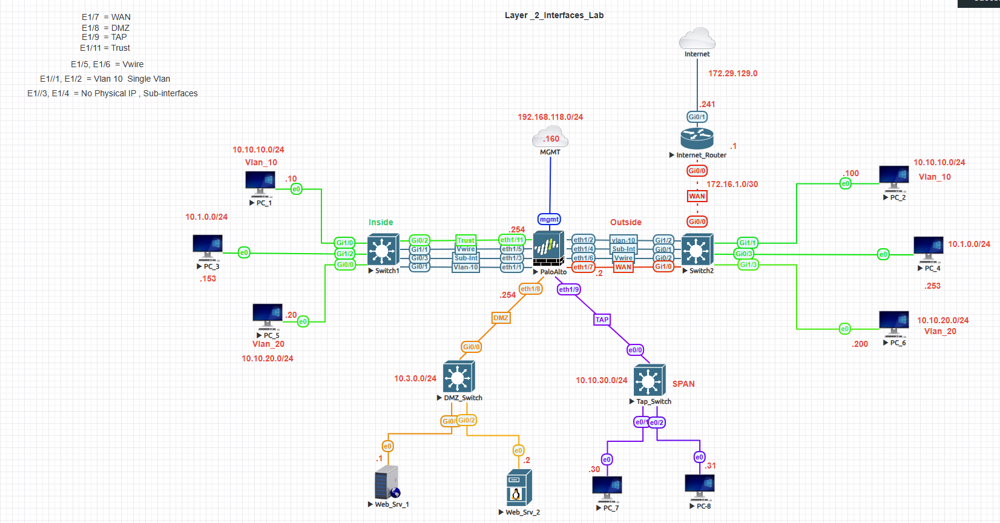
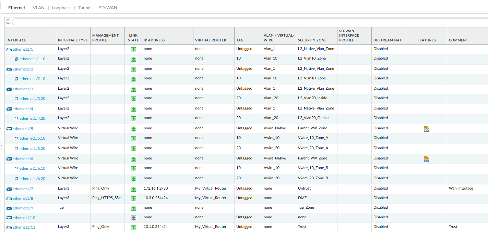
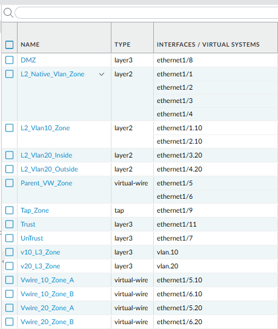
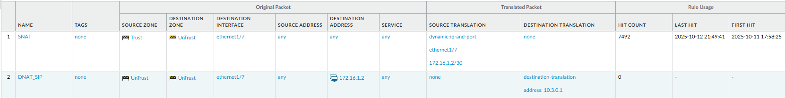
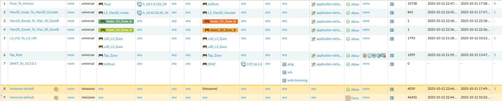
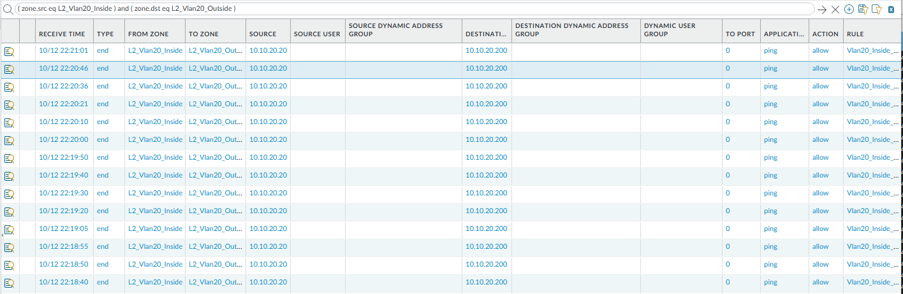
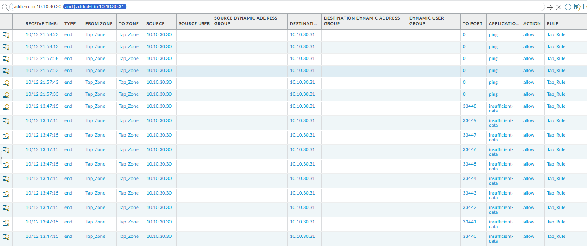

# Palo Alto Layer 2, Layer 3, and Virtual Wire Lab

## Objective
Demonstrate how Palo Alto firewalls handle traffic across Layer 2, Layer 3, and Virtual Wire interfaces, while enabling outbound connectivity using Source NAT.

This lab highlights how different interface types impact traffic flow, policy enforcement, and visibility.

---

## Topology


---

## Interface Summary

| Interface | Type | Zone | Purpose |
|------------|------|------|----------|
| e1/1, e1/2 | Layer 2 / VLAN 10 | Inside | Access Layer (Switching) |
| e1/3, e1/4 | Layer 3 Subinterfaces | Inside | Routed Segments |
| e1/5, e1/6 | Virtual Wire | VWire | Inline Inspection |
| e1/7 | Layer 3 Untrust | WAN | 172.16.1.2/24 |
| e1/9 | Tap | Tap-Monitor | SPAN Mirror |
| e1/11 | Layer 3 Trust | Inside | 10.1.0.1/24 |

---

## Traffic Flow

- VLAN (Layer 2) hosts communicate within the same broadcast domain  
- Layer 3 interfaces route traffic between internal networks  
- Virtual Wire passes traffic inline for inspection without routing  
- Outbound traffic is translated via Source NAT and exits the Untrust interface  

---

## Configuration Steps

### 1. Configure Layer 2 VLAN Interfaces

Configure Ethernet interfaces e1/1 and e1/2 as Layer 2 interfaces and assign them to VLAN 10.

Screenshot:  


---

### 2. Configure Layer 3 and Virtual Wire Interfaces

Create a Layer 3 subinterface for routed traffic and configure a Virtual Wire pair for inline inspection.

Screenshot:  


---

### 3. Configure Source NAT

Configure a Source NAT rule to translate internal private IP addresses to the firewall’s external interface address.

This enables internal hosts to access external networks using dynamic IP and port translation.

Screenshot:  


---

### 4. Configure Security Policy

Create a security policy to allow traffic from the Trust zone to the Untrust zone.

Note: In production environments, policies should use `application-default` instead of `any`.

Screenshot:  


---

## Verification

### CLI Verification

Run the following commands:

```
show running nat-policy
show running security-policy
show session all
```

Confirm:
- Source NAT is translating internal traffic to the external interface IP  
- Security policy allows traffic from Trust to Untrust  
- Sessions show active flows from internal networks to external destinations  

Screenshot:  


---

### Traffic Log Verification

Navigate to:
Monitor → Traffic

Confirm:
- Traffic is allowed from Trust to Untrust  
- Source IP is translated to the external interface  
- Applications and sessions are correctly identified  

Screenshot:  


---

### Optional: Tap Mode Verification

Use the Tap interface to mirror live packets for visibility.

Screenshot:  


---

## Key Takeaways

- Palo Alto supports multiple interface types (Layer 2, Layer 3, Virtual Wire) within a single deployment  
- Source NAT enables internal hosts to reach external networks  
- Security policies control traffic between zones regardless of interface type  
- Virtual Wire allows inline inspection without routing  

---

## Summary

In this lab, we demonstrated how Palo Alto firewalls handle mixed Layer 2, Layer 3, and Virtual Wire environments while enabling outbound connectivity through Source NAT.

Traffic flow:  
Internal Network → Source NAT → Untrust Interface → External Network  

The configuration was validated using CLI commands, traffic logs, and session inspection.

---

## Navigation

| Previous | Back to Index | Next |
|----------|--------------|------|
| [DNAT Lab](../palo-alto-dnat-lab/) | [Palo Alto Lab Index](../) | [Site-to-Site VPN Lab →](../palo-alto-site-to-site-vpn/) |
