# Palo Alto Site-to-Site VPN with Overlapping Subnets

## Objective
Configure a site-to-site VPN between two locations that use identical internal subnets by implementing NAT-based translation.

This lab demonstrates how Palo Alto firewalls resolve overlapping IP space by translating internal networks into unique subnets for VPN communication.

---

## Topology
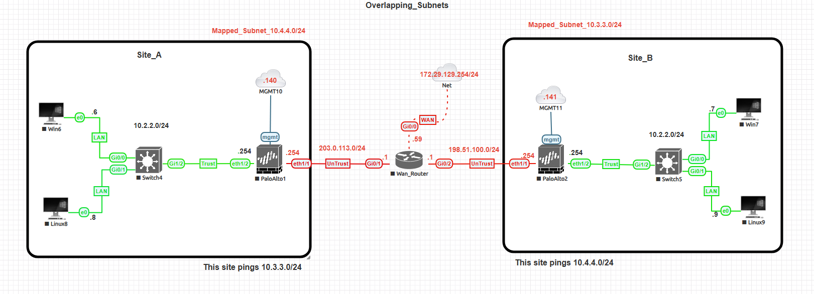

---

## Network Overview

| Component | IP/Subnet | Description |
|------------|------------|-------------|
| Site A LAN | 10.2.2.0/24 | Local subnet (overlaps with Site B) |
| Site B LAN | 10.2.2.0/24 | Overlapping subnet with Site A |
| Site A Translated | 10.4.4.0/24 | Presented to Site B |
| Site B Translated | 10.3.3.0/24 | Presented to Site A |
| WAN Network | 203.0.113.0/24 ↔ 198.51.100.0/24 | Simulated public WAN |

---

## Traffic Flow

Because both sites use the same subnet (10.2.2.0/24), direct routing is not possible.

To resolve this:

- Site A translates 10.2.2.0/24 → 10.4.4.0/24 when sending traffic to Site B  
- Site B translates 10.2.2.0/24 → 10.3.3.0/24 when sending traffic to Site A  

Example flow:

Site A Host (10.2.2.8) → Translated to 10.4.4.8 → Encrypted over VPN →  
Received at Site B as 10.4.4.8 → Translated to 10.2.2.8  

This allows both sites to communicate without IP conflict.

---

## Configuration Steps

### 1. Configure IKE Gateways

Configure IKEv2 gateways on both firewalls using:
- Pre-shared key authentication  
- AES-256 / SHA256 / DH Group 14  

Screenshot:  
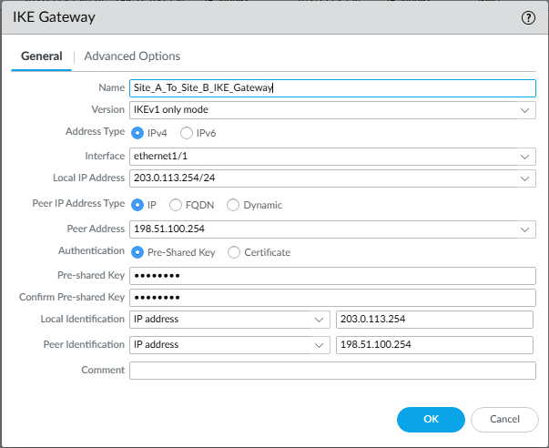  
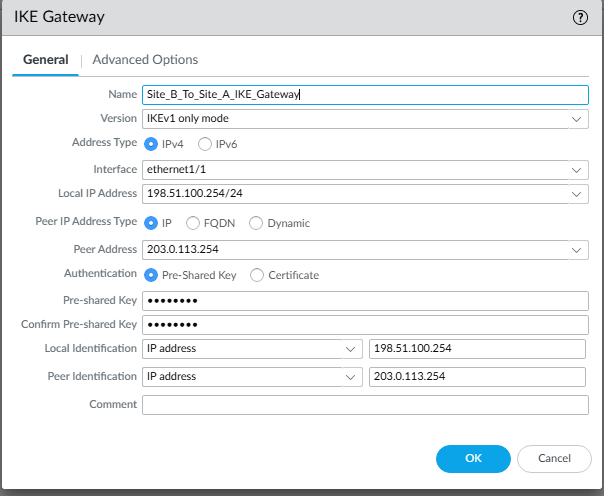

---

### 2. Configure IPSec Tunnel

Create an IPSec tunnel using the configured IKE gateway.

- Tunnel Interface: tunnel.1  
- Auto Key IKE enabled  
- No manual Proxy IDs required  

Note: Proxy IDs are automatically negotiated between Palo Alto firewalls using the translated subnets.

Screenshot:  
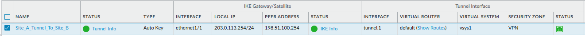  
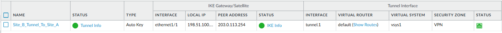

---

### 3. Configure NAT Policies

Configure NAT rules on both firewalls:

| Site | Source NAT | Destination NAT |
|------|-------------|-----------------|
| Site A | 10.2.2.0/24 → 10.4.4.0/24 | 10.3.3.0/24 → 10.2.2.0/24 |
| Site B | 10.2.2.0/24 → 10.3.3.0/24 | 10.4.4.0/24 → 10.2.2.0/24 |

These rules translate traffic before entering and after exiting the VPN tunnel.

Screenshot:  
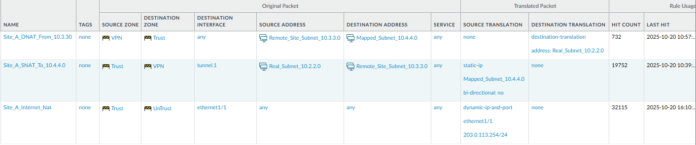  
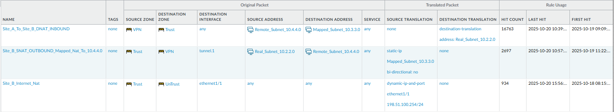

---

### 4. Configure Security Policies

Allow traffic between zones:

- Trust → VPN  
- VPN → Trust  

Screenshot:  
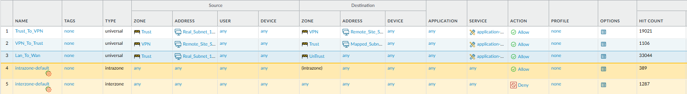

---

### 5. Configure Routing

Add routes for translated subnets:

| Site | Destination | Next Hop |
|------|--------------|-----------|
| Site A | 10.3.3.0/24 | tunnel.1 |
| Site B | 10.4.4.0/24 | tunnel.1 |

Screenshot:  
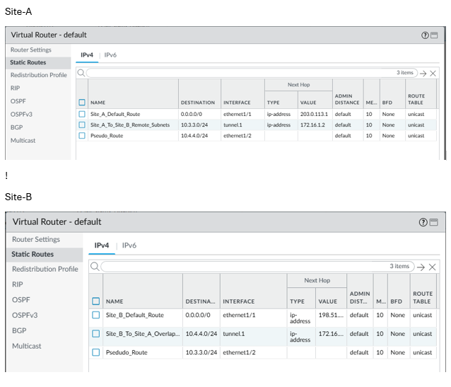

---

## Verification

### VPN Status

Verify that IKE and IPSec Security Associations are established.

Path:
Network → IPSec Tunnels → Tunnel Info  

Screenshot:  
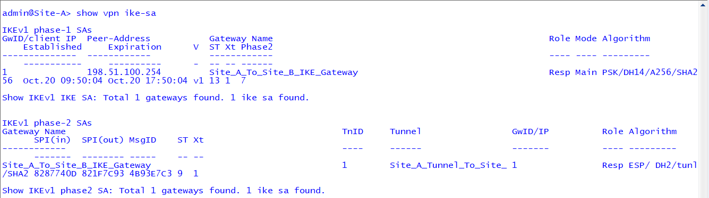  
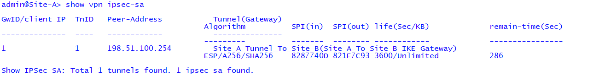

---

### Traffic Verification

Navigate to:
Monitor → Traffic  

Confirm:
- Traffic is seen on tunnel.1  
- Source and destination IPs reflect translated subnets  
- Sessions are allowed and decrypted  

Screenshot:  
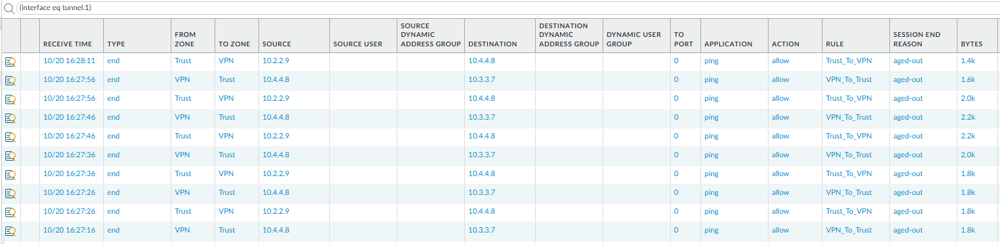

---

### Connectivity Test

From Site A:
```
ping source 10.2.2.8 host 10.3.3.7
```

From Site B:
```
ping source 10.2.2.9 host 10.4.4.8
```

Successful responses confirm proper NAT and VPN operation.

Screenshot:  
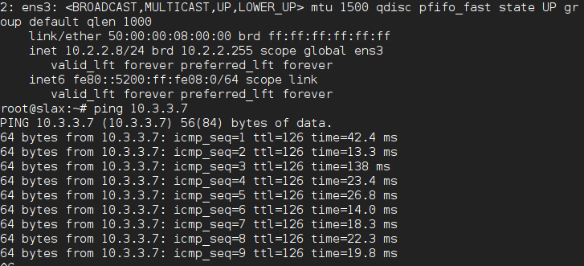  
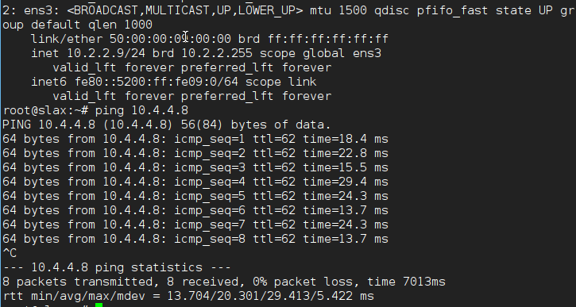

---

### CLI Verification

```
show vpn ipsec-sa
```

Confirm active tunnels and packet counters.

Screenshot:  
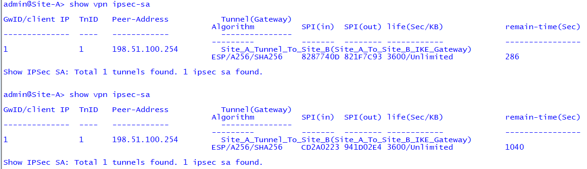

---

## Key Takeaways

- Overlapping subnets require NAT to enable communication  
- Palo Alto supports bidirectional NAT within VPN tunnels  
- Proxy IDs can be automatically negotiated in Palo Alto-to-Palo Alto deployments  
- Traffic must be translated before encryption and after decryption  

---

## Summary

This lab demonstrates how Palo Alto firewalls enable communication between overlapping networks by applying NAT within a site-to-site VPN.

By translating internal subnets into unique address spaces, both sites can securely communicate without IP conflicts.

---

## Navigation

| Previous | Back to Index | Next |
|----------|--------------|------|
| [Site-to-Site VPN Lab](../palo-alto-site-to-site-vpn/) | [Palo Alto Lab Index](../) | [User-ID Integration Lab →](../palo-alto-user-id-lab/) |
