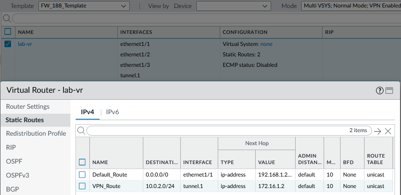
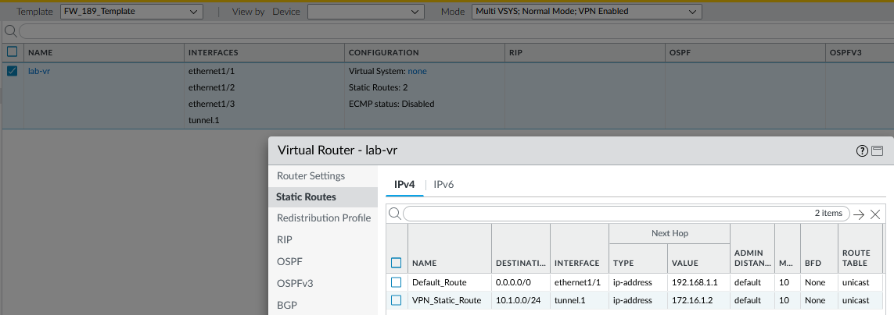

## 🍀 Phase 2 – Template Stack & VPN Validation ✅

### 🎯 Objective
Establish a centralized configuration and control framework in **Panorama** for multiple Palo Alto firewalls, integrating global and site-specific templates for scalable management.

This phase focuses on:

- Building and applying **Template & Template Stacks**
- Deploying **Site-to-Site VPN** configurations via Panorama
- Validating successful **commit**, **push**, and **tunnel establishment**

---

### 🧱 Configuration Overview
| Component | Description |
|------------|-------------|
| **Panorama Templates** | Centralized configuration objects (DNS, NTP, Syslog, Panorama Servers, etc.) applied globally |
| **Device Templates** | Site-specific configurations (zones, interfaces, routes, VPN profiles) for each firewall |
| **Template Stacks** | Combined global + site templates applied to the managed firewalls |
| **Managed Devices** | FW188 and FW189 (Panorama-managed Palo Alto VM-Series Firewalls) |

---

### 🧩 Implementation Steps
1. **Create Global Template**
   - Add DNS, NTP, Syslog, and Panorama Server profiles.  
   - Confirm sync status ✔️ in **Panorama > Managed Devices**.

2. **Create Site-Specific Templates**
   - Configure **Zones**, **Interfaces**, **Virtual Routers**, and **VPN profiles** for FW188 and FW189.  
   - Include static and default routes.

3. **Build Template Stacks**
   - Combine the **Global Template** with each site-specific template.  
   - Verify **template hierarchy** is correct.

4. **Push Configuration to Firewalls**
   - Commit changes to Panorama.  
   - Push configuration to FW188 and FW189.  
   - Verify **commit-success** in logs.

5. **Validate VPN Establishment**
   - Use CLI:  
     ```
     show vpn ike-sa
     show vpn ipsec-sa
     ```
   - Confirm both IKE and IPSec SAs are up ✅.

---

### 🖼️ Screenshots

| Screenshot | Description |
|-------------|-------------|
|  | Panorama commit confirmation |
|  | FW188 interface configuration |
|  | FW189 interface configuration |
|  | FW188 routing overview |
|  | FW189 routing overview |
|  | Phase 1 IKE SA validation |
|  | Phase 2 IPSec SA validation |
|  | Global Syslog profile settings |
|  | Device sync status |
|  | Global vs Site Template hierarchy |
|  | FW188 Template Stack |
|  | FW189 Template Stack |


---

### ✅ Verification Checklist
- [x] Global Template created and applied  
- [x] Site Templates created for FW188 and FW189  
- [x] Template Stacks built and linked  
- [x] Configuration committed and pushed successfully  
- [x] IKE and IPSec SAs established  
- [x] Syslog messages forwarded to Rsyslog/Splunk

---

### 🔗 Return to Lab Index
[← Back to Network-Security Portfolio Index](../../index.md)


---

## 🧱 Phase 3 – Device Groups & Centralized Policy Push ✅

### 🎯 Objective
Establish centralized security and NAT policy management in **Panorama** by using **Device Groups** to deploy consistent rules and profiles across multiple firewalls (**FW188**, **FW189**).

---

### 🧩 Configuration Summary
| Category | Description |
|-----------|-------------|
| **Device Groups** | Global_Device_Group (shared), FW188_Device_Group, FW189_Device_Group |
| **Policies** | `Trust_To_Untrust`, `Lan_To_VPN`, `VPN_To_Lan` |
| **NAT** | Source NAT for outbound Internet access (Trust → Untrust) |
| **Profiles** | Threat Prevention Group (Anti-Virus, Anti-Spyware, URL Filter, Wildfire) |
| **Push Status** | ✅ Commit and Push successful to FW188 and FW189 after resolving sync warnings |

---

### 🧠 Implementation Steps
1. **Create Device Groups**
   - *Panorama → Device Groups → Add*  
   - `Global_Device_Group` (shared) → add FW188 and FW189.  
   - Create `FW188_Device_Group` and `FW189_Device_Group` for local policies.

2. **Create NAT Policy**
   - *Source Zone:* Trust  
   - *Destination Zone:* Untrust  
   - *Translated Packet:* Dynamic IP and Port using interface address  
   - Purpose: enable LAN to Internet access.

3. **Create Security Policies**
   - `Trust_To_Untrust` – LAN to Internet  
   - `Lan_To_VPN` – Local LAN to Remote VPN subnet  
   - `VPN_To_Lan` – Remote VPN subnet to Local LAN  

4. **Attach Threat Prevention Profiles**
   - Apply `Threat_Prevention_Group` to each rule.

5. **Commit and Push**
   - *Commit → Commit to Panorama*  
   - *Commit → Push to Devices → Device Group Push*  
   - Verify success under *Tasks* and *Job Status*.

6. **Validate on Each Firewall**
   ```bash
   > show running security-policy
   > show running nat-policy


