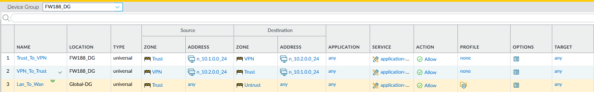
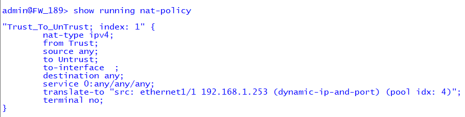
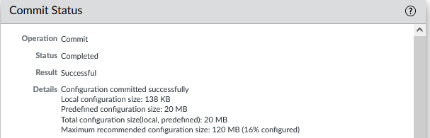
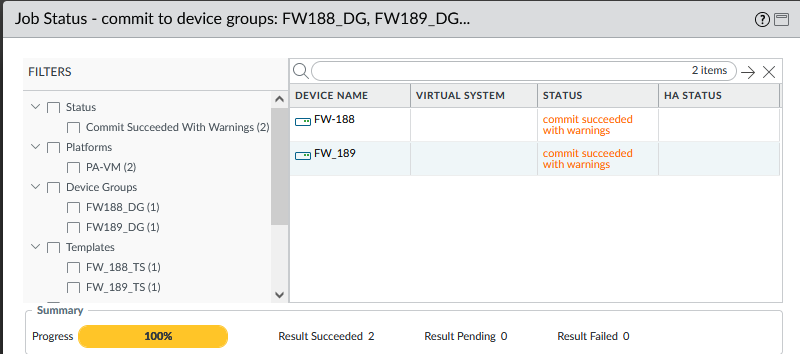

# Palo Alto Panorama Centralized Management Lab

## Overview
This lab demonstrates centralized management of multiple Palo Alto Networks firewalls using Panorama.

The implementation follows a phased approach aligned with enterprise workflows, including device onboarding, configuration standardization, VPN validation, and centralized policy deployment.

---

## Environment

| Component | Description |
|------------|-------------|
| Panorama | Centralized management platform |
| Firewalls | FW188 and FW189 (VM-Series) |
| Scope | Templates, Template Stacks, Device Groups, VPN, Policy |

---

## Phase 1 – Template Creation and Onboarding

### Objective
Onboard firewalls into Panorama and standardize baseline configuration using global and site-specific templates.

### Implementation

- Create Global Template (DNS, NTP, Syslog, Panorama settings)  
- Create Site Templates (interfaces, zones, routing)  
- Assign templates to firewalls  
- Commit and push configuration  

### Validation

Confirm:
- Devices appear in Panorama Managed Devices  
- Template status is synchronized  
- Interfaces and system settings are correctly applied  

Screenshots:  
  
  


---

## Phase 2 – Template Stack and VPN Validation

### Objective
Use Template Stacks to combine global and site-specific configurations and validate site-to-site VPN deployment.

### Implementation

- Create Template Stacks (Global + Site Templates)  
- Assign stacks to FW188 and FW189  
- Configure Site-to-Site VPN (IKE Gateway and IPSec Tunnel)  
- Commit and push from Panorama  

### Validation

Run:
```
show vpn ike-sa
show vpn ipsec-sa
```

Confirm:
- IKE Security Associations are established  
- IPSec tunnels are active  
- Tunnel interfaces are passing traffic  

Screenshots:  
  
  
  


---

## Phase 3 – Device Groups and Centralized Policy Deployment

### Objective
Deploy centralized NAT and Security policies using Panorama Device Groups.

### Implementation

- Create Device Groups:
  - Global_Device_Group  
  - FW188_Device_Group  
  - FW189_Device_Group  

- Configure:
  - Source NAT for outbound traffic  
  - Security policies (Trust → Untrust, LAN → VPN, VPN → LAN)  
  - Threat Prevention profiles  

- Commit and push configuration  

### Validation

Run:
```
show running security-policy
show running nat-policy
```

Confirm:
- Policies are installed on both firewalls  
- NAT rules are applied correctly  
- Traffic matches expected policies  

Screenshots:  
  
  
  


---

## Key Takeaways

- Panorama enables centralized configuration and policy management  
- Templates standardize system and interface configuration  
- Template Stacks allow scalable deployment across multiple sites  
- Device Groups enable consistent security policy enforcement  
- Centralized management reduces configuration drift and operational overhead  

---

## Summary

This lab demonstrates how Panorama provides centralized control over distributed firewalls by managing configuration, VPN connectivity, and security policies from a single platform.

The phased approach mirrors real-world enterprise deployment models and highlights how scalability and consistency are achieved using Panorama.

---

## Navigation

| Back to Index | Return to Portfolio |
|--------------|--------------------|
| [Palo Alto Lab Index](../index.md) | [Network Security Portfolio](../../index.md) |
