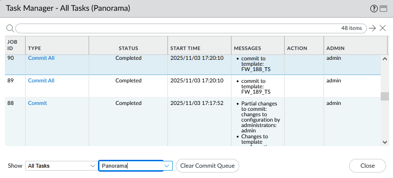
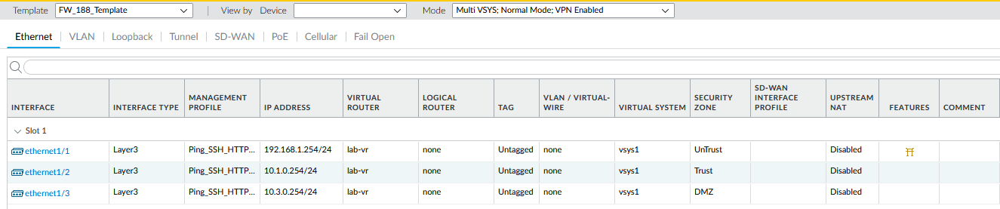
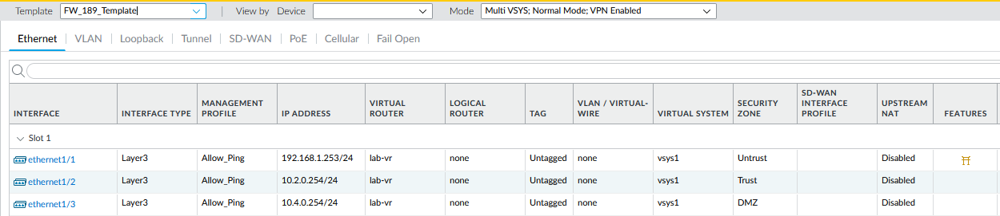
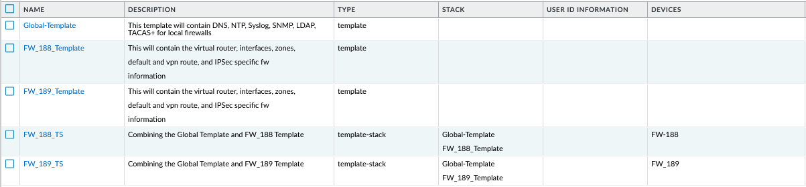
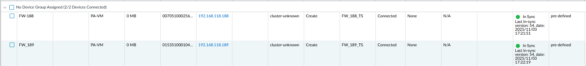
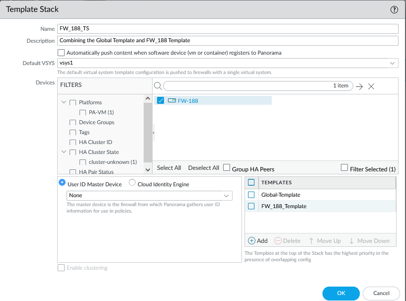
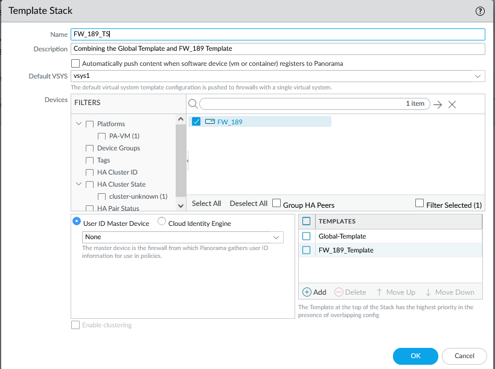
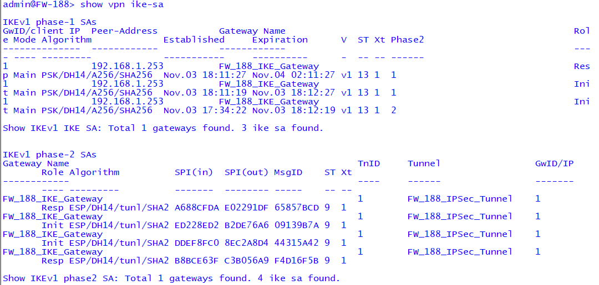
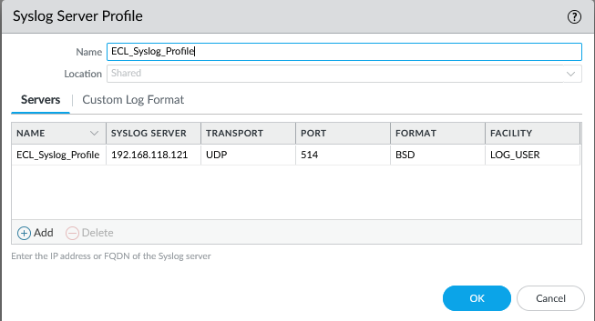

<a id="top"></a>

# 🧠 Palo Alto Panorama Centralized Management Lab

### 🌐 Part of the *Enterprise Cybersecurity Lab (ECL)* Series

This lab demonstrates **centralized management of multiple Palo Alto Networks firewalls** using **Panorama**, focusing on scalable configuration deployment, policy control, and VPN management across distributed sites.

The Panorama lab is structured into multiple phases that align with real enterprise workflows—from initial onboarding to full policy and logging integration.

---

## 📘 Table of Contents
- [Phase 1 – Template Creation & Onboarding](#phase1)
- [Phase 2 – Template Stack & VPN Validation](#phase2)
- [Phase 3 – Device Groups & Policy Push](#phase3)

---

<a id="phase1"></a>
## 🧱 Phase 1 – Template Creation & Onboarding

### 🎯 Objective
Create and apply **Global and Site-Specific Templates** in Panorama to onboard firewalls (**FW188**, **FW189**) and standardize system settings such as DNS, NTP, Syslog, and Panorama servers.

### 🧩 Implementation Steps
1. **Create Global Template** – add DNS, NTP, Syslog, and Panorama servers.  
2. **Create Site Templates** – configure zones, interfaces, routing.  
3. **Commit and Push** – push templates to both firewalls and verify sync.

### 🖼️ Screenshots
| Screenshot | Description |
|-------------|-------------|
|  | Panorama commit confirmation |
|  | FW188 interface configuration |
|  | FW189 interface configuration |
|  | Global vs Site Template hierarchy |
|  | Managed Devices Sync Summary |

### ✅ Verification Checklist
- [x] Templates created and applied  
- [x] Firewalls onboarded to Panorama  
- [x] Template stacks verified and committed successfully  

[⬆️ Back to Top](#top) | [➡️ Next Phase →](#phase2)

---

<a id="phase2"></a>
## 🧱 Phase 2 – Template Stack & VPN Validation ✅

### 🎯 Objective
Deploy **Template Stacks** that combine global and site-specific configurations, and validate **Site-to-Site VPN tunnels** between FW188 and FW189 through Panorama.

### 🧱 Configuration Overview
| Component | Description |
|------------|-------------|
| **Panorama Templates** | Centralized config objects (DNS, NTP, Syslog) |
| **Device Templates** | Site-specific configurations |
| **Template Stacks** | Combined Global + Site Templates |
| **Managed Devices** | FW188 and FW189 (Panorama-managed VM-Series) |

### 🧩 Implementation Steps
1. Build Template Stacks (Global + Site Templates).  
2. Assign each stack to FW188 and FW189.  
3. Configure Site-to-Site VPN (IKE Gateway + IPSec Tunnel).  
4. Commit to Panorama and Push to Devices.  
5. Validate VPN SAs:  

   ```
   > show vpn ike-sa
   > show vpn ipsec-sa
   ```

### 🖼️ Screenshots
| Screenshot | Description |
|-------------|-------------|
|  | FW188 Template Stack |
|  | FW189 Template Stack |
|  | Phase 1 IKE SA validation |
|  | Phase 2 IPSec SA validation |
|  | Global Syslog Profile |

### ✅ Verification Checklist
- [x] Template Stacks created and linked  
- [x] Configuration pushed successfully  
- [x] IKE/IPSec tunnels established and verified  

[⬆️ Back to Top](#top) | [➡️ Next Phase →](#phase3)

---

<a id="phase3"></a>
## 🧱 Phase 3 – Device Groups & Centralized Policy Push ✅

### 🎯 Objective
Establish **centralized Security and NAT policy management** in Panorama using **Device Groups** to deploy shared rules and profiles across multiple firewalls (**FW188**, **FW189**).

### 🧩 Configuration Summary
| Category | Description |
|-----------|-------------|
| **Device Groups** | Global_Device_Group (shared), FW188_Device_Group, FW189_Device_Group |
| **Policies** | `Trust_To_Untrust`, `Lan_To_VPN`, `VPN_To_Lan` |
| **NAT** | Source NAT for outbound Internet access |
| **Profiles** | Threat Prevention Group (AV, Spyware, URL Filter, Wildfire) |
| **Push Status** | ✅ Commit and Push successful to FW188 and FW189 |

### 🧠 Implementation Steps
1. Create Device Groups (Global → FW188 → FW189).  
2. Create NAT Policy (Trust → Untrust, Dynamic IP and Port).  
3. Create Security Policies (Trust→Untrust, Lan→VPN, VPN→Lan).  
4. Attach Threat Prevention Group.  
5. Commit and Push from Panorama.  
6. Validate on Firewalls:  

   ```
   > show running security-policy
   > show running nat-policy
   ```

### 🖼️ Screenshots
| Screenshot | Description |
|-------------|-------------|
|  | Security policies pushed via Panorama |
|  | Trust→Untrust Internet rule |
|  | SNAT configuration for Internet access |
|  | Commit to Panorama successful |
|  | Policy push to FW188 & FW189 succeeded |
|  | CLI verification on FW188 |
|  | CLI verification on FW189 |

### ✅ Verification Checklist
- [x] Device Groups created and assigned  
- [x] NAT and Security Policies configured  
- [x] Threat Profiles applied  
- [x] Commit and Push successful  
- [x] Policies verified via CLI  

[⬆️ Back to Top](#top)

