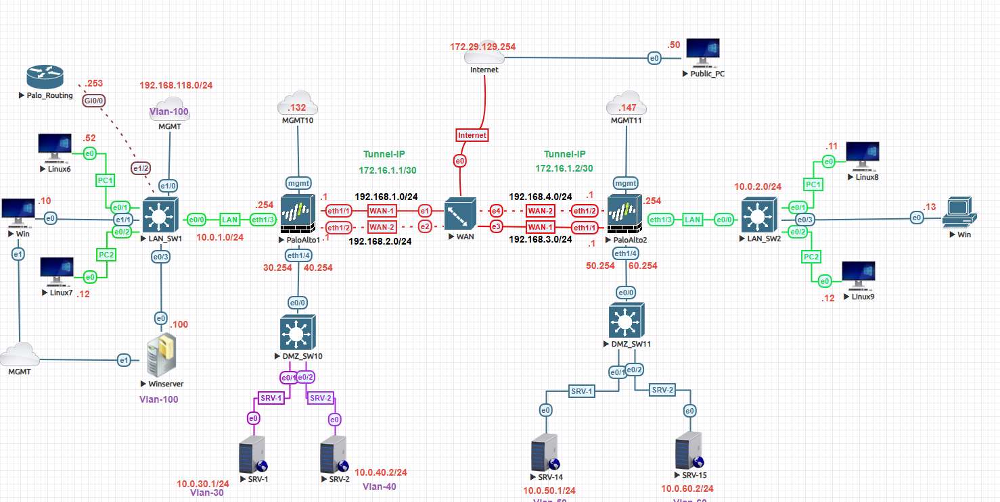
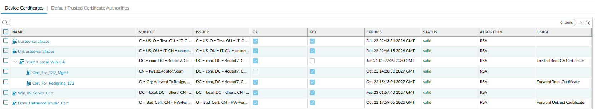
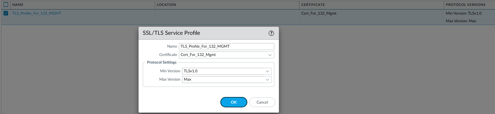
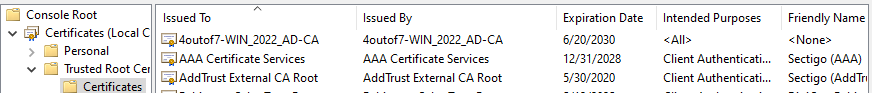
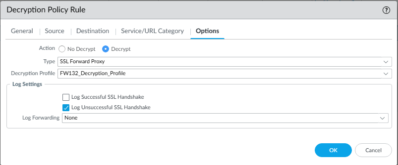
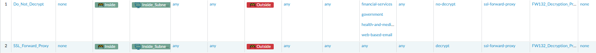
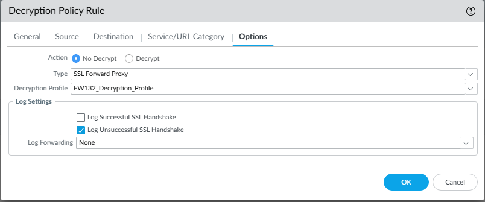
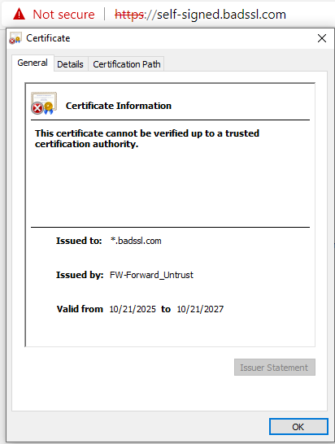
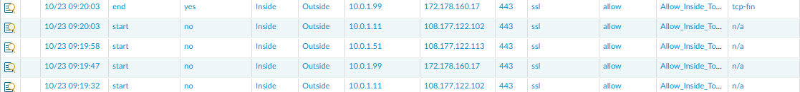
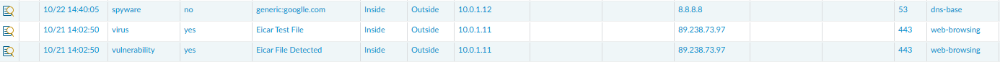

# Palo Alto SSL Forward Proxy Decryption Lab

## Overview
This lab demonstrates SSL Forward Proxy decryption on a Palo Alto Networks firewall.

The firewall intercepts outbound HTTPS traffic, decrypts it for inspection, and re-signs it using an internal certificate authority to maintain trusted client connections.

---

## Topology


---

## Environment

| Device | Role | IP Address | Description |
|--------|------|------------|-------------|
| PA-FW-01 | Palo Alto NGFW | 10.0.1.254 | Performs SSL decryption |
| WIN-CLIENT | Windows 10 | 10.0.1.10 | Generates HTTPS traffic |
| WIN-SRV-CA | Windows Server 2019 | 10.0.1.100 | Enterprise Root CA |
| Internet | External Sites | N/A | HTTPS destinations |

---

## Decryption Flow

When a client accesses an HTTPS site:

1. The firewall intercepts the TLS handshake  
2. The firewall presents a re-signed certificate to the client  
3. The client trusts the certificate because it is signed by the internal CA  
4. The firewall establishes a separate encrypted session to the destination  
5. Traffic is decrypted, inspected, and re-encrypted  

This enables full visibility into encrypted traffic while maintaining user trust.

---

## Certificate Configuration

### Firewall Certificates



| Certificate | Purpose |
|------------|--------|
| Trusted_Local_Win_CA | Trusted root certificate |
| Cert_For_132_Mgmt | Forward Trust certificate |
| Deny_Untrusted_Invalid_Cert | Forward Untrust certificate |

---

### SSL/TLS Service Profile

Defines certificates used for management-plane services.



---

### Client Trust Configuration

Install the internal CA certificate on client systems to ensure trust.



---

## Decryption Policy Configuration

### Forward Proxy Rule

Configure a decryption policy:

- Source Zone: Inside  
- Destination Zone: Outside  
- Service: service-https  
- Action: Decrypt  
- Type: SSL Forward Proxy  
- Forward Trust Certificate: Cert_For_132_Mgmt  



---

### Policy Verification



---

### Decryption Exceptions

Exclude sensitive categories such as:
- Financial Services  
- Health and Medicine  
- Government  



---

## Verification

### Trusted Site

Browse to a valid HTTPS site:

- Browser shows secure connection  
- Certificate is re-signed by firewall  
- Issuer reflects Forward Trust certificate  

This confirms successful decryption and re-signing.

---

### Untrusted Site

Browse to:
```
https://self-signed.badssl.com
```

- Browser displays certificate warning  
- Issuer reflects Forward Untrust certificate  



---

### Traffic Logs

Navigate to:
Monitor → Traffic  

Confirm:
- Application: web-browsing  
- Decrypted: yes  



---

### Threat Logs

Navigate to:
Monitor → Threat  

Confirm detection of:
- Malware  
- Vulnerabilities  

This verifies decrypted traffic is being inspected.



---

### CLI Verification

```
show session all filter ssl-decrypt yes
show running decryption-rule
```

---

## Key Takeaways

- SSL Forward Proxy enables inspection of encrypted traffic  
- Internal CA trust is required for seamless client experience  
- Forward Trust and Forward Untrust certificates control browser behavior  
- Decryption policies must be carefully scoped to avoid breaking applications  

---

## Summary

This lab demonstrates how Palo Alto firewalls decrypt, inspect, and re-encrypt HTTPS traffic using SSL Forward Proxy.

By combining certificate trust, decryption policies, and threat inspection, organizations gain visibility into encrypted traffic while maintaining secure client communication.

---

## Navigation

| Previous | Back to Index | Next |
|----------|--------------|------|
| [GlobalProtect VPN Lab](../palo-alto-globalprotect-lab/) | [Network Security Labs](../index.md) | — |
