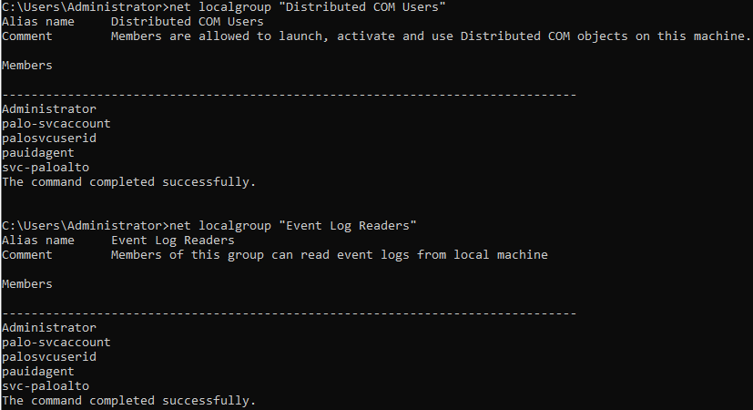
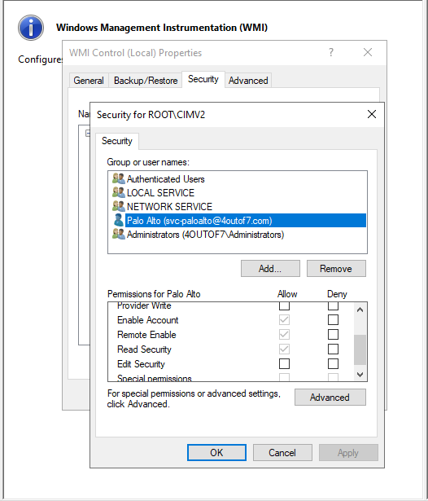
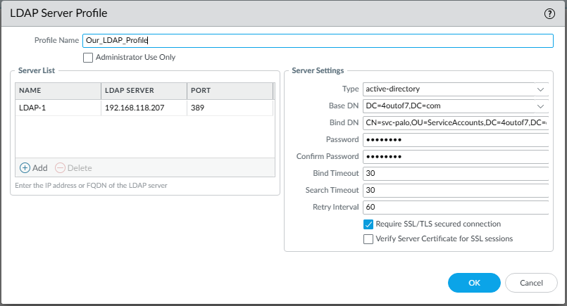
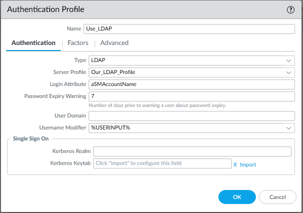
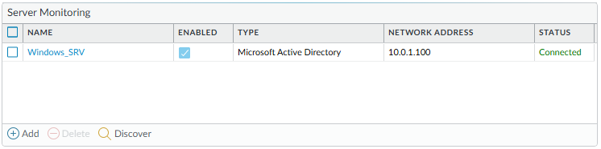

# Palo Alto User-ID Integration Lab

## Overview
This lab demonstrates how to integrate a Palo Alto Networks firewall with Active Directory using agentless User-ID.

The firewall retrieves user-to-IP mappings from domain controllers via WMI and LDAP, enabling user-based visibility, policy enforcement, and logging.

---

## Environment

| Component | IP Address | Description |
|------------|-------------|-------------|
| Firewall | 10.0.1.254 (Trust) / 192.168.1.254 (Untrust) / 192.168.118.132 (Mgmt) | Palo Alto NGFW |
| Domain Controller | 10.0.1.100 | AD, DNS, WMI |
| Domain | 4OUTOF7.COM | Active Directory domain |
| Service Account | svc-paloalto | Used for User-ID integration |

---

## User-ID Flow

1. A user logs into a domain-joined system  
2. The domain controller generates a logon event  
3. The firewall connects to the domain controller via WMI  
4. The firewall reads the security event logs  
5. The firewall maps IP address to username  
6. Policies and logs can now reference user identity  

---

## Configuration Steps

### 1. Create Service Account

Create a dedicated Active Directory account:

- Username: svc-paloalto  
- Password: non-expiring  

Add the account to:

- Distributed COM Users  
- Event Log Readers  
- Remote Management Users  



---

### 2. Configure WMI Permissions

On the domain controller:

- Open wmimgmt.msc  
- Navigate to: WMI Control → Properties → Security  
- Expand: Root → CIMV2  

Grant:
- Remote Enable  
- Execute Methods  

to svc-paloalto



---

### 3. Configure LDAP Server Profile

On the firewall:

Device → Server Profiles → LDAP

- Name: LDAP-Profile  
- Type: Active Directory  
- Base DN: dc=4OUTOF7,dc=com  
- Bind DN: svc-paloalto@4outof7.com  
- Server: 10.0.1.100  
- Port: 389  



---

### 4. Configure Authentication Profile

Device → Authentication Profile

- Type: LDAP  
- Server Profile: LDAP-Profile  
- Allow List: Domain Users  



---

### 5. Enable User-ID Mapping

Device → User Identification → User Mapping

- Enable User Identification  
- Add server:

  - Type: WMI  
  - Server: 10.0.1.100  
  - Username: 4OUTOF7\svc-paloalto  



---

## Verification

### User Mapping

Run:
```
show user ip-user-mapping all
```

Confirm:
- IP addresses are mapped to usernames  

---

### Server Monitor Status

Run:
```
show user server-monitor state all
```

Confirm:
- Domain controller is connected  
- Status shows "Connected"  

---

## Key Takeaways

- User-ID enables identity-based security policies  
- WMI retrieves login events from domain controllers  
- LDAP provides directory lookup and authentication  
- Proper permissions are required for successful integration  

---

## Summary

This lab demonstrates how Palo Alto firewalls integrate with Active Directory to map user identities to network activity.

By leveraging WMI and LDAP, the firewall gains visibility into user behavior and enables identity-based policy enforcement.

---

## Navigation

| Previous | Back to Index | Next |
|----------|--------------|------|
| [Overlapping Subnets VPN Lab](../palo-alto-overlapping-subnet-lab/) | [Network Security Labs](../) | [GlobalProtect VPN Lab →](../palo-alto-globalprotect-lab/) |
