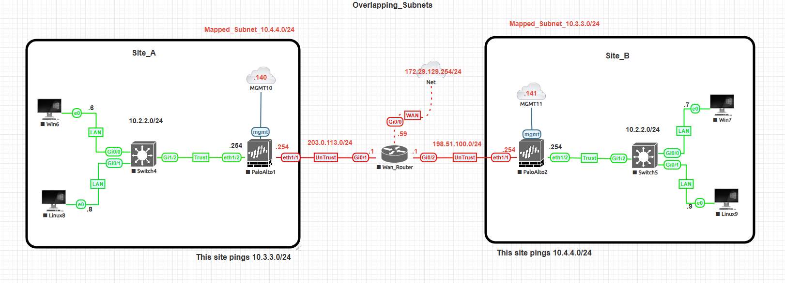

# 🧱 Palo Alto Site-to-Site VPN with Overlapping Subnets

This lab demonstrates how to configure a **site-to-site VPN** between two sites that share **identical internal subnets**.  
By using **NAT translation**, each site maps its internal network to a unique subnet for VPN traffic — solving overlapping IP challenges commonly found in M&A or multi-tenant environments.

---

## 🧩 Topology

| Component | IP/Subnet | Description |
|------------|------------|-------------|
| **Site A LANs** | 10.1.1.0/24 and 10.2.2.0/24 | Local subnets |
| **Site B LAN** | 10.2.2.0/24 | Overlapping subnet with Site A |
| **Mapped Subnet (Site A)** | 10.4.4.0/24 | Used for traffic sent to Site B |
| **Mapped Subnet (Site B)** | 10.3.3.0/24 | Used for traffic sent to Site A |
| **WAN Router** | 203.0.113.0/24 ↔ 198.51.100.0/24 | Simulated public WAN connection |
| **Management** | Site A: 172.29.129.140   Site B: 172.29.129.141 | For firewall GUI/CLI access |

---

## ⚙️ Configuration Steps

### 1. IKE Gateway
- **Version:** IKEv2  
- **Peer IPs:**  
  - Site A → 198.51.100.254  
  - Site B → 203.0.113.254  
- **Authentication:** Pre-shared key  
- **IKE Crypto Profile:** AES-256 / SHA256 / DH Group 14

### 2. IPSec Tunnel
- **Tunnel Interface:** `tunnel.1`  
- **IKE Gateway:** as configured above  
- **Auto Key IKE:** Enabled (default)  
- **Proxy IDs:** *Not manually configured — see note below.*

> ⚠️ **Note on Proxy IDs**  
> Manual Proxy IDs were **not used** in this lab because both peers are **Palo Alto firewalls** using Auto-Key IKEv2.  
> The firewalls automatically negotiated matching Proxy IDs based on the translated subnets (10.4.4.0/24 ↔ 10.3.3.0/24).

### 3. NAT Configuration
**Site A:**
| Type | Original | Translated | Notes |
|------|-----------|-------------|-------|
| Source NAT | 10.1.1.0/24 | 10.4.4.0/24 | Outbound VPN traffic |
| Destination NAT | 10.3.3.0/24 | 10.2.2.0/24 | For inbound VPN traffic |

**Site B:**
| Type | Original | Translated | Notes |
|------|-----------|-------------|-------|
| Source NAT | 10.2.2.0/24 | 10.3.3.0/24 | Outbound VPN traffic |
| Destination NAT | 10.4.4.0/24 | 10.2.2.0/24 | For inbound VPN traffic |

### 4. Security Policies
- Allow traffic between translated subnets via the VPN tunnel zone.  
- Allow intra-zone and untrust ↔ trust policies as needed for verification.

### 5. Routing
| Site | Destination | Next Hop |
|------|--------------|-----------|
| Site A | 10.3.3.0/24 | `tunnel.1` |
| Site B | 10.4.4.0/24 | `tunnel.1` |

---

## 🔍 Verification and Monitoring

| Screenshot | Description |
|-------------|-------------|
| `monitor-ike-sa.png` | **Network → IPSec Tunnels → Tunnel Info (IKE SA)** showing IKEv2 negotiation established. |
| `monitor-ipsec-sa.png` | **Network → IPSec Tunnels → Tunnel Info (IPSec SA)** showing Phase 2 active with byte counters. |
| `traffic-log-verification.png` | **Monitor → Logs → Traffic** filtered by `tunnel.1`, showing translated source/destination IPs and “allow” action. |
| `ping-success.png` | CLI ping from Site A (10.1.1.x → 10.3.3.x) and Site B (10.2.2.x → 10.4.4.x) confirming connectivity. |
| `show-vpn-cli.png` | Output of `show vpn ipsec-sa` showing active tunnel and encrypted byte counters. |

---

## 🧠 Learning Objectives
- Understand overlapping subnet challenges and NAT-based solutions.  
- Configure dual NAT (source/destination) for VPNs.  
- Validate and troubleshoot Phase 1/2 tunnel negotiation.  
- Analyze translated traffic flow in Palo Alto firewalls.

---

## 🪪 Suggested Screenshots
- `topology.png`
- `interfaces-siteA.png`
- `interfaces-siteB.png`
- `ike-gateway-siteA.png`
- `ike-gateway-siteB.png`
- `ipsec-tunnel-siteA.png`
- `ipsec-tunnel-siteB.png`
- `nat-policy-siteA.png`
- `nat-policy-siteB.png`
- `monitor-ike-sa.png`
- `monitor-ipsec-sa.png`
- `traffic-log-verification.png`
- `ping-success.png`
- `show-vpn-cli.png`

---

## 🏁 Summary
This lab demonstrates how **Palo Alto Networks** firewalls can connect two overlapping networks using **NAT-based translation across a site-to-site VPN**.  
This configuration mirrors real-world enterprise scenarios such as mergers, acquisitions, or service-provider environments.

---

### 🧷 Badges

