# 🧱 Palo Alto Site-to-Site VPN with Overlapping Subnets

This lab demonstrates how to configure a **site-to-site VPN** between two sites that share **identical internal subnets**.  
By using **NAT translation**, each site maps its internal network to a unique subnet for VPN traffic — solving overlapping IP challenges commonly found in M&A or multi-tenant environments.

---

## 🧩 Topology

| Component | IP/Subnet | Description |
|------------|------------|-------------|
| **Site A LAN** | 10.2.2.0/24 | Local subnet (overlaps with Site B) |
| **Site B LAN** | 10.2.2.0/24 | Overlapping subnet with Site A |
| **Mapped Subnet (Site A)** | 10.4.4.0/24 | Used for traffic sent to Site B |
| **Mapped Subnet (Site B)** | 10.3.3.0/24 | Used for traffic sent to Site A |
| **Test Host (Site A)** | 10.2.2.8 | Used to generate traffic toward Site B |
| **Test Host (Site B)** | 10.2.2.9 | Used to generate traffic toward Site A |
| **WAN Router** | 203.0.113.0/24 ↔ 198.51.100.0/24 | Simulated public WAN |
| **Management** | Site A 172.29.129.140                                                                                                                                                                                                                                                                                                                                                                                                                                                                                                                                                                                                                                                                                                                                                                                                                                                                                                                                                                                                                                                                                                                                                                                                                                                                                                                                                                                                                                                                                                                                                                                                                                                                                                                                                                                                                                                                                                                                                                                                                                                                                                                                                                                                                                                                                                                                                                                                                                                                                                                                                                                                                                                                                                                                                                                                                                                                                                                                                                                                                                                                                                                                                                                                                                                                                                                                                                                                                                                                                                                                                                                                                                                                                                                          Site B 172.29.129.141 | For firewall GUI/CLI access |

---

## ⚙️ Configuration Steps

### 🔹 Step 1: IKE Gateway Configuration
Configure IKEv2 gateways on both firewalls.

| Setting | Site A | Site B |
|----------|---------|--------|
| IKE Version | IKEv2 | IKEv2 |
| Peer IP | 198.51.100.254 | 203.0.113.254 |
| Authentication | Pre-shared key | Pre-shared key |
| IKE Crypto Profile | AES-256 / SHA256 / DH Group 14 | AES-256 / SHA256 / DH Group 14 |

**Screenshot:**  
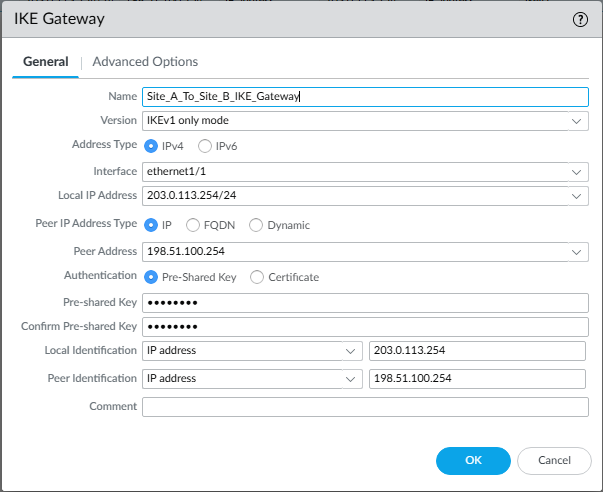  
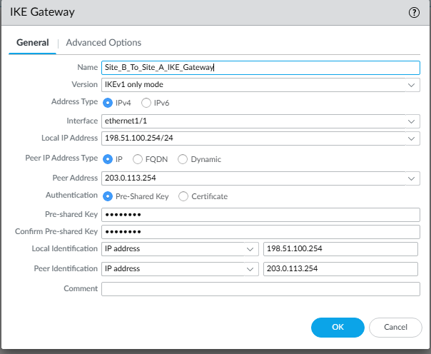

---

### 🔹 Step 2: IPSec Tunnel Configuration
Create an IPSec tunnel using the configured IKE Gateway.

| Setting | Value |
|----------|--------|
| Tunnel Interface | `tunnel.1` |
| IKE Gateway | As configured above |
| Auto Key IKE | Enabled |
| Proxy IDs | Not manually configured (see note below) |

> ⚠️ **Note on Proxy IDs**  
> Manual Proxy IDs were **not used** in this lab because both peers are **Palo Alto firewalls** using Auto-Key IKEv2.  
> The firewalls automatically negotiated matching Proxy IDs based on the translated subnets (10.4.4.0/24 ↔ 10.3.3.0/24).

**Screenshot:**  
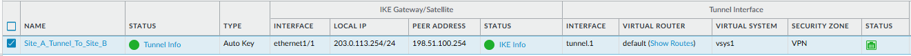  
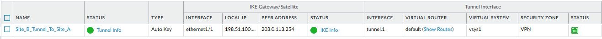

---

### 🔹 Step 3: NAT Configuration

| Site | Source NAT | Destination NAT |
|------|-------------|-----------------|
| **Site A** | 10.2.2.0/24 → 10.4.4.0/24 | 10.3.3.0/24 → 10.2.2.0/24 |
| **Site B** | 10.2.2.0/24 → 10.3.3.0/24 | 10.4.4.0/24 → 10.2.2.0/24 |

**Screenshot:**  
  
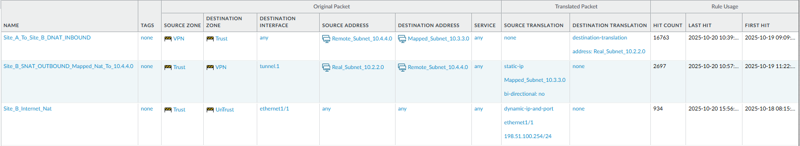

---

### 🔹 Step 4: Security Policies

Add security policies to allow VPN traffic between translated subnets.

| Source Zone | Destination Zone | Action |
|--------------|------------------|---------|
| Trust | VPN | Allow |
| VPN | Trust | Allow |

**Screenshot:**  
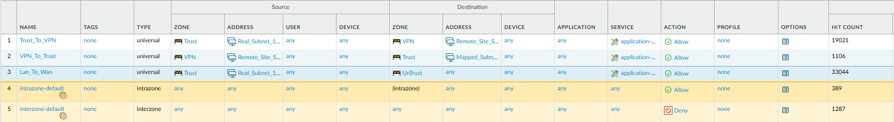

---

### 🔹 Step 5: Routing Configuration

Add static routes for translated subnets.

| Site | Destination | Next Hop |
|------|--------------|-----------|
| Site A | 10.3.3.0/24 | `tunnel.1` |
| Site B | 10.4.4.0/24 | `tunnel.1` |

**Screenshot:**  
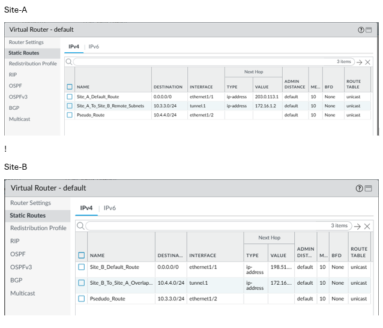

---

## 🔍 Verification and Monitoring

### 🔸 Verify IKE SA
**Path:** `Network → IPSec Tunnels → Tunnel Info (IKE SA)`  
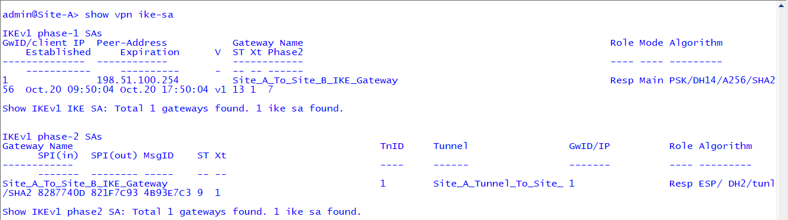

---

### 🔸 Verify IPsec SA
**Path:** `Network → IPSec Tunnels → Tunnel Info (IPSec SA)`  
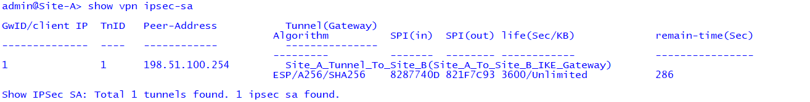

---

### 🔸 Verify Traffic Logs
**Path:** `Monitor → Logs → Traffic`  
Filter: `( interface eq tunnel.1 )`  
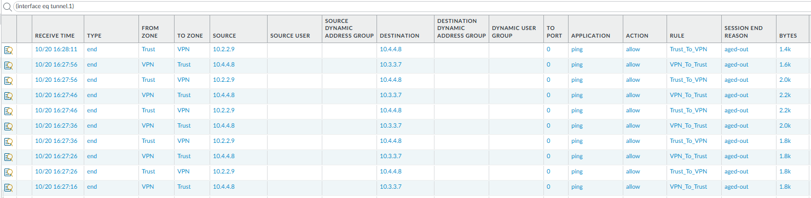

---

### 🔸 Ping Verification
From Site A (Host 10.2.2.8 behind the firewall):

ping source 10.2.2.8 host 10.3.3.7
**Screenshot:**  
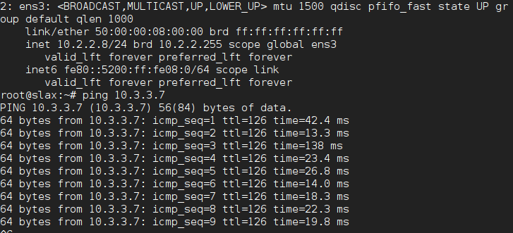

---

#### From Site B (Host 10.2.2.9 behind the firewall)
---
ping source 10.2.2.9 host 10.4.4.8
**Screenshot:**  

---

### 🔸 CLI Verification

show vpn ipsec-sa

**Screenshot:**  
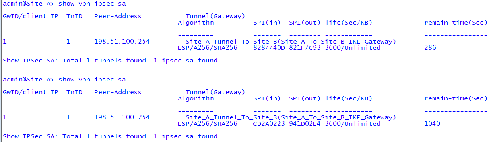

---

## 🧠 Learning Objectives
- Understand overlapping subnet challenges and NAT-based solutions.  
- Configure dual NAT (source/destination) for VPNs.  
- Validate and troubleshoot Phase 1/2 tunnel negotiation.  
- Analyze translated traffic flow in Palo Alto firewalls.

---

## 🏁 Summary
This lab demonstrates how **Palo Alto Networks** firewalls can connect two overlapping networks using **NAT-based translation across a site-to-site VPN**.  
This configuration mirrors real-world enterprise scenarios such as mergers, acquisitions, or service-provider environments.

---

### 🔁 Lab Navigation

| ⬅ Previous | 🏠 Back to Index | Next ➡ |
|------------|-----------------|---------|
| [Site-to-Site VPN Lab ←](/network-security/palo-alto-site-to-site-vpn/) | [Network Security Labs](/network-security/index.md) | [User-ID Integration Lab →](/network-security/palo-alto-user-id-lab/) |

