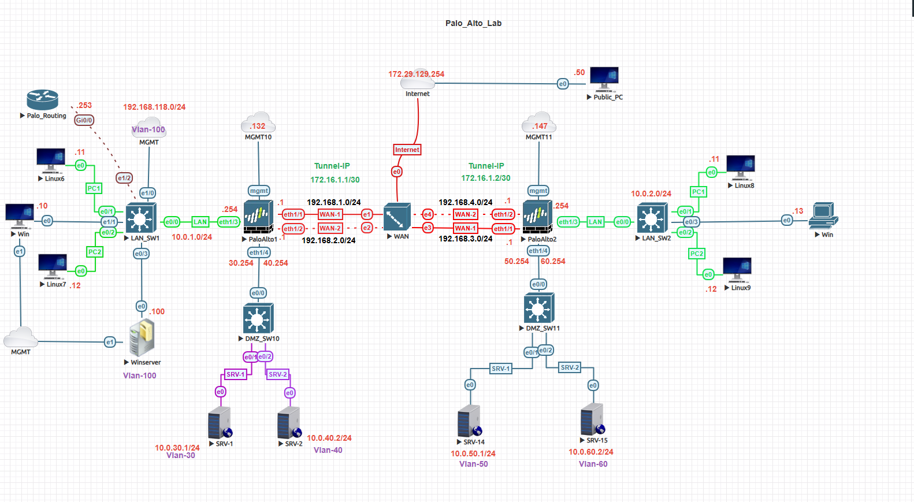
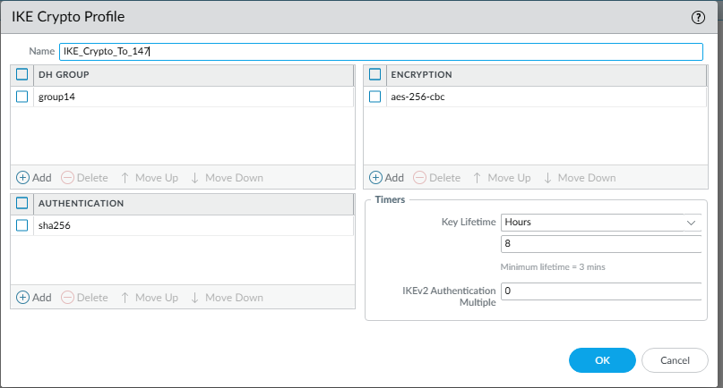
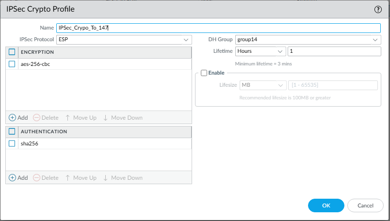
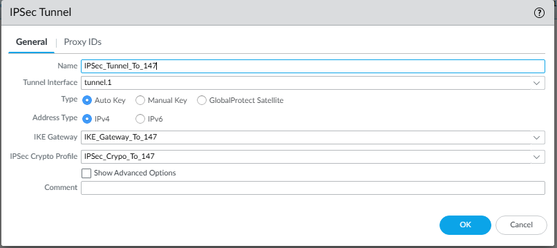
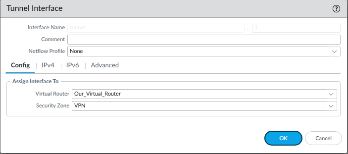
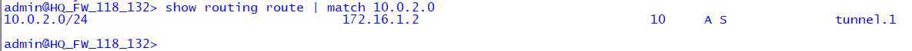
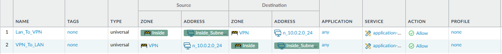

# 🔐 Palo Alto Site-to-Site VPN Lab

## 🎯 Objective
The goal of this lab is to configure and verify a **Site-to-Site IPsec VPN** between two Palo Alto firewalls, allowing secure communication between two private LAN networks over an untrusted WAN.

---

## 🧩 Topology


**Network Overview**
| Site | Firewall | Public IP | LAN Subnet | Tunnel Interface |
|-------|------------|------------|-------------|------------------|
| HQ | PaloAlto-1 | 192.168.1.1 | 10.0.1.0/24 | tunnel.1 |
| Branch | PaloAlto-2 | 192.168.3.1 | 10.0.2.0/24 | tunnel.1 |

---

## ⚙️ Configuration Steps

---

### 1️⃣ Create the IKE Gateway
**IKE Gateway Settings:**
- Version: **IKEv2**
- Authentication: **Pre-shared key**
- Local IP: `192.168.1.1` (HQ), `192.168.3.1` (Branch)
- Peer IP: Opposite firewall public IP
- Pre-shared key: `paloalto123`

This establishes Phase 1 of the IPsec tunnel for authentication and encryption negotiation.

📸 **Screenshot:**  


---

### 2️⃣ Configure the IPsec Tunnel
**IPsec Tunnel Settings:**
- IKE Gateway: `vpn-gw`
- IPsec Crypto Profile: AES-256 / SHA256 / DH Group 14
- Proxy IDs:
  - Local: `10.0.1.0/24`
  - Remote: `10.0.2.0/24`

This defines Phase 2 parameters for secure data transfer between the two networks.

📸 **Screenshot:**  


---

### 3️⃣ Create the Tunnel Interface
**Interface Configuration:**
- Name: `tunnel.1`
- Virtual Router: **default**
- Security Zone: **VPN**

This interface carries encrypted VPN traffic.

📸 **Screenshot:**  


📸 **Screenshot:**  


---

### 4️⃣ Configure Static Routes
**Static Route Example (HQ):**
- Destination: `10.0.2.0/24`
- Next Hop: `tunnel.1`

**Static Route Example (Branch):**
- Destination: `10.0.1.0/24`
- Next Hop: `tunnel.1`

These routes ensure LAN-to-LAN reachability across the tunnel.

📸 **Screenshot:**  


---

### 5️⃣ Create Security Policies
**Policy Rules:**
- Allow **Trust → VPN**
- Allow **VPN → Trust**

These policies permit bidirectional communication over the tunnel.

📸 **Screenshot:**  


---

## 🧪 Verification

### 🔹 CLI Validation
Use the following commands to verify the tunnel and routes:

```bash
> show vpn ike-sa
> show vpn ipsec-sa
> show routing route | match 10.0
> test security-policy-match source 10.0.1.13 destination 10.0.2.13 protocol 6 destination-port 80
> ping source 10.0.1.13 host 10.0.2.13

---

### 🔁 Lab Navigation

| ⬅ Previous | 🏠 Back to Index | Next ➡ |
|-------------|-----------------|---------|
| [← L2 NAT Interface Lab](../palo-alto-l2-nat-interface-lab/) | [Network Security Labs](../index.md) | [User-ID Integration Lab →](../palo-alto-user-id-lab/) |


