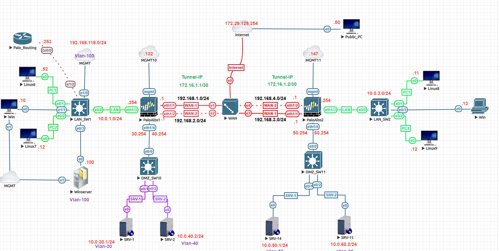
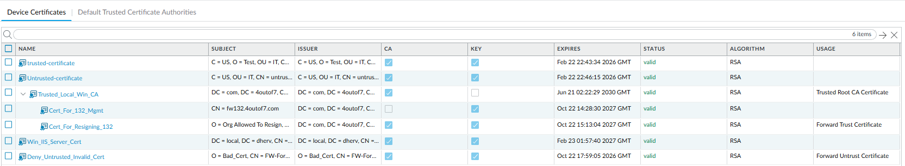
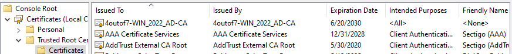
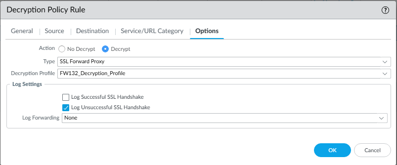
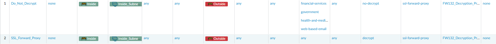
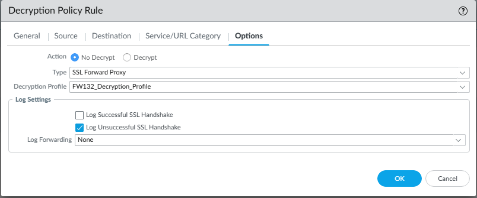
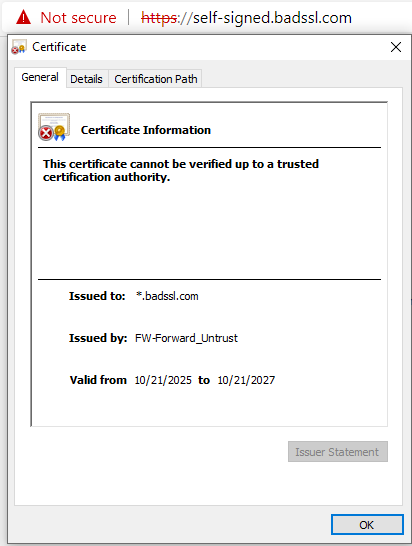
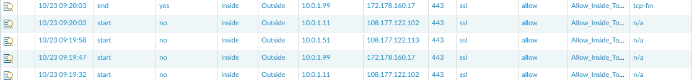

# 🔐 Palo Alto SSL Forward Proxy Decryption Lab

## 🎯 Objective
This lab demonstrates how to configure **SSL Forward Proxy Decryption** on a Palo Alto Networks firewall.  
The goal is to inspect and secure outbound HTTPS traffic by re-signing trusted certificates and blocking or alerting on untrusted ones.

---

## 🧩 Topology


| Device | Role | IP Address | Notes |
|:-------|:-----|:-----------|:------|
| **PA-FW-01** | Palo Alto NGFW | 10.0.1.254 | Performs SSL Forward Proxy Decryption |
| **WIN-CLIENT** | Windows 10 | 10.0.1.10 | Used to test HTTPS traffic through the firewall |
| **WIN-SRV-CA** | Windows Server 2019 | 10.0.1.100 | Enterprise Root CA used to issue certificates |
| **Internet** | Public Sites | N/A | Used for HTTPS validation and threat testing |

---

## 🏗️ Lab Components
- **PAN-OS Version:** 10.1  
- **Windows Server:** Active Directory Certificate Services (Enterprise CA)  
- **Client Browser:** Edge or Chrome  
- **Test Sites:**  
  - `https://example.com` (trusted site)  
  - `https://self-signed.badssl.com` (untrusted site)  

---

## 🪪 Certificates and Trust Setup

### 1️⃣ Certificates on the Firewall


| Certificate Name | Description | Usage |
|:------------------|:-------------|:------|
| **Trusted_Local_Win_CA** | Root CA issued by Windows Server 2019 | Trusted Root CA |
| **Cert_For_132_Mgmt** | Used by the firewall to re-sign valid SSL certificates | Forward Trust Certificate |
| **Deny_Untrusted_Invalid_Cert** | Used when destination certificate is invalid or expired | Forward Untrust Certificate |

---

### 2️⃣ SSL/TLS Service Profile
The firewall uses an SSL/TLS Service Profile to define which certificate is used for management-plane SSL services (Web UI, GlobalProtect, etc.).


---

### 3️⃣ Distribute CA to Clients
Install the internal CA certificate (`Trusted_Local_Win_CA`) into the Windows client’s Trusted Root store.  
This ensures browsers trust re-signed certificates from the firewall.



---

## ⚙️ Decryption Policy Configuration

### 1️⃣ Create Forward Proxy Policy
**Policies → Decryption → Add**

- **Name:** SSL_Forward_Proxy  
- **Source Zone:** Inside  
- **Destination Zone:** Outside  
- **Service:** `service-https`  
- **Action:** Decrypt  
- **Type:** SSL Forward Proxy  
- **Certificate:** `Cert_For_132_Mgmt`



---

### 2️⃣ Verify Policy List


---

### 3️⃣ Configure Decryption Exceptions
Create a **No Decrypt** rule for sensitive categories such as:
- Financial Services  
- Health and Medicine  
- Government  



---

## 🔍 Verification & Testing

### 1️⃣ Trusted Site (Valid Certificate)
Browse to `https://paloaltonetworks.com` or `https://example.com`.

- The browser should display a **secure** lock icon.
- The certificate will show **Issued by: 132resign.4outof7.com** — this is the Forward Trust certificate used by the firewall to re-sign valid HTTPS sites.
- The Forward Trust certificate is itself issued by the internal Root CA (**Trusted_Local_Win_CA**), which the client trusts.

✅ This behavior confirms SSL Forward Proxy is functioning correctly — the firewall is decrypting and re-signing traffic using its Forward Trust certificate, and the client trusts it via the internal CA.


---

### 2️⃣ Untrusted Site (Invalid Certificate)
Browse to `https://self-signed.badssl.com`.  
The browser should display **Not Secure**, and the certificate should show **Issued by: Deny_Untrusted_Invalid_Cert**.



---

### 3️⃣ Traffic Log Verification
Under **Monitor → Logs → Traffic**, confirm:
- Application = `web-browsing`  
- Decrypted = `yes`  



---

### 4️⃣ Threat Log Verification
Under **Monitor → Logs → Threat**, verify detections of:
- **Virus**
- **Vulnerability**

These confirm that SSL traffic is being decrypted and inspected by Threat Prevention profiles.


---

## 🧰 CLI Verification
Run the following commands from the Palo Alto CLI:

```bash
> show session all filter ssl-decrypt yes
> show running decryption-rule
> show session id <session-id> | match decrypt
